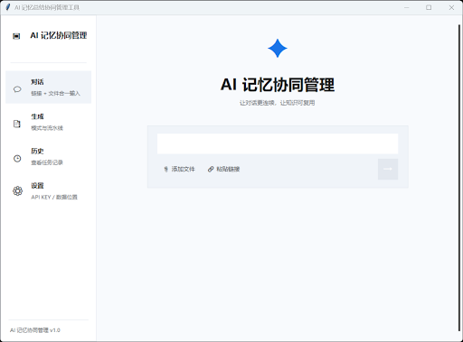
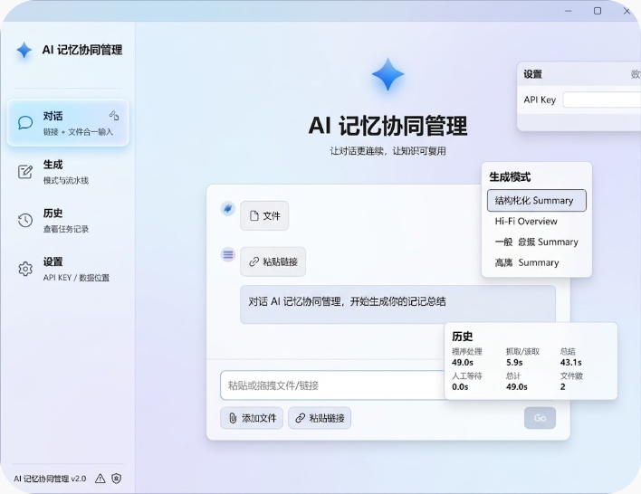
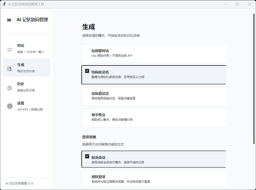
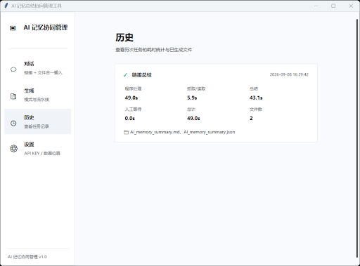
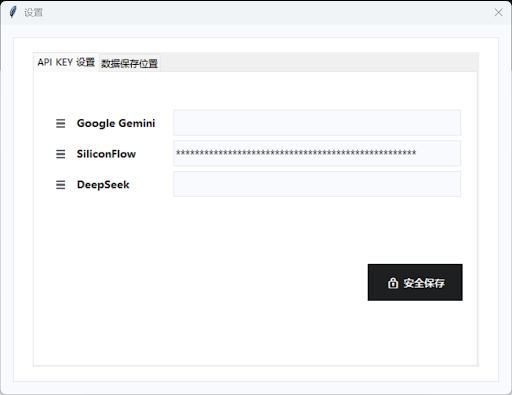
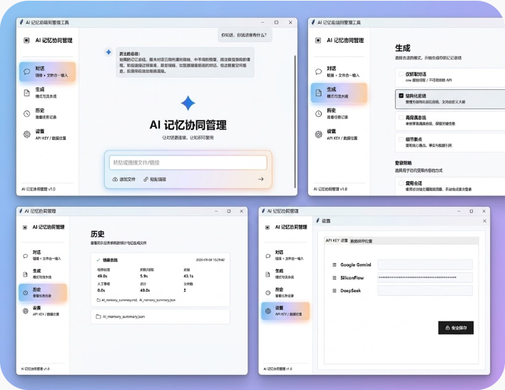
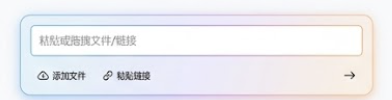
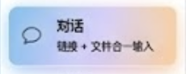
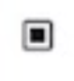
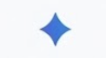

# AI 对话记忆导出

## 🔵 👤 用户提问

我上传的四张图片分别对应导航栏中的四个部分，我现在需要你进一步设计这个前端，让这个前端变得更好看，可以模仿Gemini的风格，给我生成一下图片

## 🟣 🤖 AI 回答

## 🔵 👤 用户提问

不是啊，你不要把导航栏中的四个部分放进同一个界面啊

## 🟣 🤖 AI 回答

## 🔵 👤 用户提问

我现在很满意你这个部分的设计，我现在需要你给我拟写一份提示词，将我原来的这个部分修改成你这样

## 🟣 🤖 AI 回答

这里是为您拟写的详细提示词，旨在将您原来的基础界面（如 image\_6.png）中的输入框和操作区域，修改为您满意的 image\_12.png 的高级设计。

### 功能界面修改提示词：对话输入与操作区域增强

**应用场景：** AI 记忆协同管理软件（桌面端或 Web 端）的“对话”主界面。

**参考来源：** 核心设计参考 `image_12.png`。原界面参考 `image_6.png`。

**设计目标：**
在 `image_6.png` 的整体布局（左侧导航，右侧内容区）基础上，将右侧内容区底部的“对话输入框”和“文件/链接添加按钮”区域，从单一、基础的列表样式，替换为一个高度集成、采用现代化“玻璃拟态”（Glassmorphism）和渐变光效的高级组件。

**核心组件：高级对话输入与文件集成面板**

**1. 面板容器 (The Outer Panel)**

* **主体：** 替换现有的基础框和按钮列表。创建一个单一的、圆角（大圆角，如 24px-30px）的矩形面板。
* **材质与背景：** 采用一种高透明度的“玻璃”材质（Glassmorphism）。其内部背景具有非常柔和、微妙的彩色渐变：从左侧的淡蓝色/淡紫色过渡到右侧的淡橙色/淡粉色。
* **边框与发光：** 面板应有一个极细（e.g., 1px）的浅色半透明边框，并具有微妙的外部阴影（drop shadow）和更深层次的半透明“辉光”（glow）效果，强化悬浮和玻璃质感。
* **整体感觉：** 像一个精致、悬浮的半透明水晶控制板，集成在界面底部。

**2. 内部布局 (Internal Elements)**
面板内部应有上下两层结构：

* **上层：文本输入区 (Text Input Area)**

  + **位置：** 面板的上部。
  + **主体：** 一个圆角矩形输入框（与面板圆角匹配，如 16px）。输入框本身应保持干净、不透明（白色或极浅灰），以确保文字清晰度。
  + **边框：** 极细的半透明边框，当聚焦时可增加微妙的发光。
  + **占位文字：** 输入框内显示精确、清晰的文本：`粘贴或拖拽文件/链接`。
  + **功能提示：** 这个输入框必须视觉上暗示同时支持文本输入和拖拽操作。
* **下层：操作按钮与导航 (Action Buttons)**

  + **位置：** 面板的下部，与文本框平行排列。
  + **左侧功能按钮：** 重新设计并排列两个原有的功能按钮。

    - **按钮 1：** `添加文件`

      * **图标：** 使用一个精致、极简、半透明的云端上传图标（或圆角文件夹图标）。
      * **文本：** 紧随图标后的文本 `添加文件`。
    - **按钮 2：** `粘贴链接`

      * **图标：** 使用一个精致、极简、半透明的链条连接图标。
      * **文本：** 紧随图标后的文本 `粘贴链接`。
    - **按钮样式：** 这两个按钮不应有硬背景框，而是作为文本加图标的组合，采用半透明颜色（如深灰色），悬浮时可有微妙的高亮。
  + **右侧导航按钮：**

    - **位置：** 与添加按钮完全对齐，位于面板底部的最右侧。
    - **图标：** 一个极简、半透明的右指向箭头图标 `→`（如向右的 chevron）。
    - **功能：** 代表提交或导航到下一步。

**3. 界面上下文集成**

* 将这个新的集成面板，放置在 `image_6.png` 右侧内容区域的底部中央位置，取代旧的文本框和按钮。
* 确保其在视觉上“悬浮”在淡蓝色的背景之上，其玻璃材质和渐变光效与背景形成高级的对比。
* 将软件名称和标题移到更上方，保持界面的呼吸感。

**4. 视觉与光影规范**

* 所有新元素的图标、文本和边框，都应采用半透明或柔和的颜色，以与玻璃和渐变光效完美融合。
* 文本和图标的对比度要足够高，确保可读性。
* 渐变光效（蓝色到橙色）要非常微妙，避免过于刺眼。

通过使用这些提示词，您可以向您的 UI 设计师、前端团队或 AI 生成工具清晰地传达您的需求，将现有的功能界面，提升为您所满意的 image\_12.png 的高级、现代化设计。

## 🔵 👤 用户提问

我是要给ai智能体拟写提示词

## 🟣 🤖 AI 回答

为了让你的 AI 编程/设计智能体（如 Cursor、Claude、v0 或 Copilot）准确无误地还原这个组件，可以直接复制以下针对前端代码实现的结构化提示词：

**任务需求：重构“对话”主界面的输入控制台组件**

请帮我修改现有的对话输入区域，将其重组成一个现代、高质感的集成式毛玻璃（Glassmorphism）胶囊面板，具体样式规范与代码实现要求如下：

**1. 整体容器规范 (Container)**

* **布局**：居中悬浮卡片，内部分为上下两层结构，内边距 `padding: 16px 20px`。
* **圆角**：大圆角矩形，`border-radius: 24px`。
* **背景材质**：采用 Gemini 风格的毛玻璃光效，背景为轻微渐变半透明高斯模糊：

  + 背景渐变：`linear-gradient(135deg, rgba(255, 255, 255, 0.85) 0%, rgba(240, 245, 255, 0.6) 40%, rgba(255, 242, 235, 0.6) 100%)`
  + 模糊滤镜：`backdrop-filter: blur(16px)`
* **边框与阴影**：

  + 边框：`1px solid rgba(255, 255, 255, 0.8)`，带有微弱的内外高光。
  + 投影：柔和弥散阴影 `box-shadow: 0 8px 32px rgba(100, 115, 150, 0.12), 0 2px 8px rgba(0, 0, 0, 0.04)`。

**2. 上层：输入与拖拽区 (Input Area)**

* **结构**：一个独立的圆角文本框，占满卡片上层宽度。
* **样式**：

  + 背景：纯白或极浅背景 `background: rgba(255, 255, 255, 0.95)`。
  + 圆角：`border-radius: 12px`。
  + 边框：`1px solid rgba(220, 226, 235, 0.8)`；获得焦点（focus）时带有淡蓝光晕效果。
  + 占位文字（Placeholder）：`"粘贴或拖拽文件/链接"`，字号 14px，颜色 `#9CA3AF`。
  + 交互：除普通打字外，支持原生 Drag & Drop 拖入文件/链接。

**3. 下层：工具栏与发送控制 (Bottom Actions)**

* **布局**：Flex 布局，`justify-content: space-between`，`align-items: center`，顶部预留 `margin-top: 12px`。
* **左侧操作项**（并排横向排列，间距 16px）：

  + **添加文件**：图标（极简云上传/上传图标）+ 文字“添加文件”。
  + **粘贴链接**：图标（链条/Link 图标）+ 文字“粘贴链接”。
  + **样式表现**：纯文本按钮样式（无实体底色），文字颜色中灰 `#4B5563`，字号 13px。悬浮（hover）时文字变为主题深色 `#1E293B`，附带微交互过度。
* **右侧提交按钮**：

  + 图标：向右的极简箭头 `→`（如 Lucide 的 `ArrowRight`）。
  + 样式：轻量无边框图标按钮，垂直居中对齐，支持 hover 动画（箭头向右微移 2px）。

**交付要求：**
请直接输出对应的组件代码（如 React/Vue + Tailwind CSS 或纯 CSS），保持类名语义化并预留对应点击事件的 handler 函数。

## 🔵 👤 用户提问

我想让智能体改成这种效果，为我提供提示词

## 🟣 🤖 AI 回答

可以直接复制以下提示词发给你的 AI 编程智能体：

**任务需求：优化左侧侧边栏“当前激活选中态（Active Tab）”的视觉样式**

请重构导航栏中选中项的样式，将其从原本生硬的纯灰色背景块，修改为高质感、轻盈柔和的 **Gemini 风格毛玻璃渐变胶囊卡片**。具体规范如下：

**1. 容器与形状 (Container & Geometry)**

* **形状**：胶囊圆角矩形，`border-radius: 16px`（或略大的圆角）。
* **尺寸与间距**：内边距设置为 `padding: 12px 16px`，卡片与侧边栏左右两侧保留 8px–12px 的呼吸边距，不要完全顶格。

**2. 背景渐变与毛玻璃质感 (Background & Glassmorphism)**

* **多色柔和渐变**：背景采用从浅冰蓝过渡到浅暖橙粉的弥散渐变：

  + CSS 示例：`background: linear-gradient(135deg, rgba(191, 219, 254, 0.7) 0%, rgba(224, 231, 255, 0.5) 45%, rgba(254, 215, 170, 0.6) 100%)`
* **模糊滤镜**：添加毛玻璃磨砂效果 `backdrop-filter: blur(12px)`。
* **边框与投影**：

  + 边框：极细微高光边框 `border: 1px solid rgba(255, 255, 255, 0.6)`。
  + 阴影：添加极轻的弥散柔光阴影，例如 `box-shadow: 0 4px 16px rgba(147, 197, 253, 0.15), 0 2px 4px rgba(0, 0, 0, 0.02)`。

**3. 图标与文字排版 (Icon & Typography)**

* **布局方式**：Flex 布局，图标与文字组呈横向对齐（`display: flex; align-items: center; gap: 12px;`）。
* **左侧图标**：

  + 使用极简细线条气泡图标（如 Lucide 的 `MessageSquare` 或 `MessageCircle`）。
  + 描边粗细设为 `1.5px`–`1.75px`，颜色使用深冷灰 `#1E293B`，保持轻巧通透。
* **右侧文本组**（垂直上下排列）：

  + **主标题（“对话”）**：字号 `14px`，加粗 `font-weight: 600`，字色 `#0F172A`。
  + **副标题（“链接 + 文件合一输入”）**：字号 `11px`–`12px`，正常字重 `font-weight: 400`，字色使用柔和中灰 `#475569`。

**4. 交互效果 (Transition)**

* 增加平滑的过渡动画 `transition: all 0.25s cubic-bezier(0.4, 0, 0.2, 1)`，确保从未选中项切换到当前激活项时，色彩和阴影淡入自然不生硬。

**交付要求：**
请输出适配当前技术栈（如 Tailwind CSS 类名或原生 CSS/SCSS）的代码片段，并说明如何绑定到 `active` 激活类名上。

## 🔵 👤 用户提问

我现在需要你帮我拟写一份提示词给我的agent，将前端页面中的两个图标（图一 和图二），改为第三张图片中的图标

## 🟣 🤖 AI 回答

这是一个非常明确的任务。你可以将以下提示词（包含中文和英文版本，以确保不同Agent都能准确理解）直接发送给你的Agent。

### 方法一：最简练的直接替换提示词（推荐）

如果你的Agent具有很强的文件处理和界面定位能力，可以使用这个最直接的版本。

**提示词：**

> **任务：** 请替换当前前端页面上的两个特定图标。
>
> **操作细节：**
>
> 1. **定位旧图标：** 请在页面上找到以下两个图标：
>
>    * 图一：那个带有黑色方块的扁平化复选框/列表图标（参考图片：`image_15.png`）。
>    * 图二：那个蓝色的四角星（Gemini风格）图标（参考图片：`image_16.png`）。
> 2. **执行替换：** 将这两个旧图标**全部**替换为第三张图片中的图标（一个灰色的立体堆叠层图标，参考图片：`image_17.png`）。
> 3. **最终检查：** 请确保替换后的新图标保持与原页面一致的大小、位置和对齐方式，使其看起来自然融入现有界面。

### 方法二：结构化的编程（API/Asset）提示词（更适用于代码 Agent）

如果你的Agent是一个编程工具（例如Cursor或Claude Engineer），并且你需要修改代码库中的静态资源或API引用，可以使用这个版本。

**提示词：**

> **Role:** Senior Frontend Engineer
>
> **Task:** Replace two existing interface icons with a single new icon.
>
> **Context:** The frontend codebase currently uses two distinct icon assets that need to be synchronized with a single, updated design.
>
> **Assets Reference:**
>
> * **Old Icon 1 to replace:** The flat list/checkbox icon with a black square (reference: `image_15.png`).
> * **Old Icon 2 to replace:** The blue four-pointed star (Gemini-style) icon (reference: `image_16.png`).
> * **New Replacement Icon:** The grey, stacked volumetric layer icon (reference: `image_17.png`).
>
> **Action Plan:**
>
> 1. **Analyze** the codebase to find all instances where `image_15.png` and `image_16.png` are referenced in the UI components.
> 2. **Replace** all references to these two old icons with the reference to the new icon `image_17.png`.
> 3. **Ensure** the new icon retains the appropriate CSS styling (dimensions, padding, and alignment) that was applied to the original icons, maintaining a cohesive UI.
> 4. (Optional) If those two files are no longer used elsewhere, suggest deleting them from the assets folder.

## 🔵 👤 用户提问

给我生成一个像素高一点的，清晰一点的，一模一样的图片

## 🟣 🤖 AI 回答

