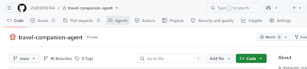
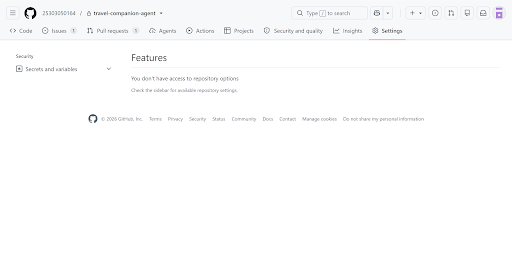
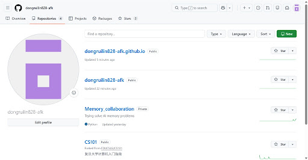

# AI 对话记忆导出

## 🔵 👤 用户提问

我该怎么退出这个仓库？

## 🟣 🤖 AI 回答

**作为协作者（Collaborator）退出：**

1. 点击顶部导航栏最右侧的 **Settings**（设置）。
2. 在左侧菜单栏中，点击 **Collaborators**（或 **Access** 下的协作者管理）。
3. 在协作者列表中找到你的用户名，点击右侧的 **Leave**（离开）或垃圾桶图标（**Remove**），确认即可。

**作为仓库所有者（Owner）：**

如果你是该仓库的创建者/拥有者，不能直接“退出”，可以选择以下两种方式之一：

* **彻底删除仓库**：进入 **Settings** $\rightarrow$ 页面滑到最底部的 **Danger Zone** $\rightarrow$ 点击 **Delete this repository** 并按提示确认。
* **转让仓库所有权**：进入 **Settings** $\rightarrow$ **Danger Zone** $\rightarrow$ 点击 **Transfer ownership** 转让给其他账号或组织。

## 🔵 👤 用户提问

## 🟣 🤖 AI 回答

因为你的权限只有普通读/写权限，无法在仓库的 Settings 中管理协作者。请通过**个人账号设置**来退出该仓库：

* 点击网页最右上角你的**个人头像**，选择 **Settings**（个人全局设置）。
* 在左侧菜单栏中找到并点击 **Repositories**。
* 在列表中切换到 **Repositories you collaborate on**（你作为协作者参与的仓库）。
* 找到 `25303050164/travel-companion-agent`，点击右侧的 **Leave** 按钮并确认即可退出。

## 🔵 👤 用户提问

从哪里切换到Repositories you collaborate on

## 🟣 🤖 AI 回答

你当前处于个人公开主页（Profile），这里无法进行退出操作。请按照以下步骤进入**全局设置**：

1. 点击网页**最右上角的紫色方块头像**。
2. 在弹出的下拉菜单中点击 **Settings**（或者直接在浏览器地址栏访问 `[https://github.com/settings/repositories](https://github.com/settings/repositories)`）。
3. 进入设置页后，点击左侧边栏的 **Repositories**。
4. 在该页面中找到 `25303050164/travel-companion-agent`，点击其右侧的 **Leave** 按钮即可成功退出。

