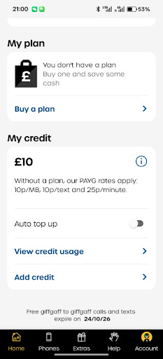
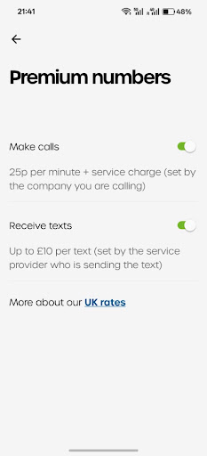
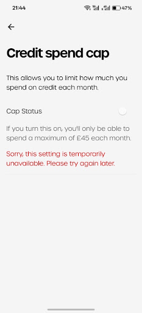
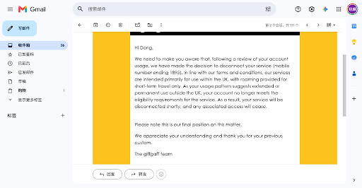
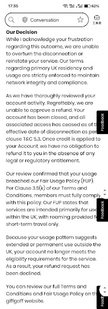

# AI 对话记忆导出

## 🔵 👤 用户提问

解释一下

## 🟣 🤖 AI 回答

这张截图是英国电信运营商 **giffgaff** 的 Mobile App 账户页面，主要包含以下几个关键信息：

### 1. 套餐状态 (My plan)

* **当前状态**：`You don't have a plan`（您当前没有生效的月租套餐）。
* **建议**：提示您可以点击 `Buy a plan` 去购买套餐（giffgaff 称之为 monthly plan 或 plan），通常买月租套餐会比直接按量扣费划算得多。

### 2. 话费余额 (My credit)

* **当前余额**：**£10**（10 英镑）。
* **标准扣费速率 (PAYG rate)**：在**没有套餐**的情况下，使用余额会直接按标准标准资费（Pay As You Go）扣除：

  + **上网流量**：10p / MB（每兆 10 便士，相当贵！1GB 会消耗 100 英镑）
  + **短信**：10p / 条
  + **通话**：25p / 分钟
* **开关/功能**：

  + **Auto top up**（自动充值）：目前处于关闭状态（灰色）。
  + **View credit usage**：查看历史话费余额消费记录。
  + **Add credit**：继续充值话费余额。

### 3. giffgaff 网内免费优惠 (Free giffgaff to giffgaff)

* **底部说明**：`Free giffgaff to giffgaff calls and texts expire on 24/10/26`
* **含义**：您给其他 giffgaff 用户拨打电话或发短信是**免费**的，该免费资格有效期至 **2026年10月24日**（每次充值余额或购买套餐后，通常会延长 3 个月的网内免费通话/短信期）。

💡 **建议操作：**
如果不小心开启了移动数据（流量），这 £10 的余额会按 10p/MB 快速消耗光。建议点击 **Buy a plan** 选购一个月度套餐，或者在手机设置里暂时关闭这张卡的数据流量。

## 🔵 👤 用户提问

Giffgaff保号是六个月一次吗？我 10 英镑 能保几年？

## 🟣 🤖 AI 回答

是的，**Giffgaff 保号确实是每 6 个月（更准确地说是 186 天）需要进行一次产生计费的操作**。

### £10 余额能保几年？

**理论上，10 英镑最高可以保号近 17 年！**（如果只在英国本土发短信保号的话）

它的具体年限取决于你 **人在哪里** 以及 **采用哪种方式** 保号：

#### 1. 人在英国国内（使用英国本土网络）

* **保号方式**：每 6 个月向任意英国号码发一条普通短信（短信费为 **10p/条**）。
* **计算**：£10 余额可发送 100 条短信。
* **保号时长**：$100 \text{ 次} \times 0.5 \text{ 年} = \mathbf{50 \text{ 年}}$（受限于各种资费调整，实际建议按长线规划即可）。

#### 2. 人在中国（漫游使用）

* **保号方式**：每 6 个月在中国漫游状态下向任意号码（包含中国手机号）发送一条短信（Giffgaff 在中国漫游发短信资费一般为 **30p/条**）。
* **计算**：£10 余额可发送 33 条漫游短信。
* **保号时长**：$33 \text{ 次} \times 0.5 \text{ 年} \approx \mathbf{16.5 \text{ 年}}$。

### ⚠️ 保号的几个重要提醒

1. **必须是“产生计费”的操作**

   * **可以**：发一条短信、拨打一个接通的电话、使用几 KB 的移动流量（非 Wi-Fi）、或者进行一次 £10 充值。
   * **不可以**：仅接收短信/验证码（免费，不计入保号操作）、给 0800 等免费号码打电话。
2. **谨防数据流量“偷跑”**

   * 漫游或日常使用时，**务必在手机设置里关闭该卡的数据流量**，否则后台应用一旦消耗了几 MB 流量，这 £10 余额几天内就会被扣光。
3. **设置日历提醒**

   * 建议在手机日历里每 5 个半月设置一个重复提醒，防止因忘记而导致号码被销号（号码销号后余额也会清零）。

## 🔵 👤 用户提问

我人在中国，给谁发消息保号合适？

## 🟣 🤖 AI 回答

人在中国时，给谁发短信保号主要取决于你的需求和发送对象。以下是几种最合适、最常见的选择：

### 1. 发送给自己的另一个中国手机号（最推荐）

* **做法**：用带有 Giffgaff 卡的手机，给你的国内手机号（如中国移动、联通、电信）发一条短信。
* **优点**：

  + **完全私密**：不会打扰任何人。
  + **验证方便**：你可以直接在国内手机上看到短信是否送达，确保保号动作成功。
  + **成本可控**：漫游发短信单价虽然稍高（大约 30p/条），但半年才发一次，10 英镑能撑好几年。

### 2. 发送给自己的另一个海外虚拟号 / 备用号

* **做法**：如果你有 Google Voice、TextNow、原生实体卡（如香港、澳门或其他国家的卡），可以互发短信。
* **优点**：同样不打扰别人，且双向都能测试号码的可用性。

### 3. 发给熟络的朋友或家人（需提前打好招呼）

* **做法**：给关系非常好的亲友发一条诸如“giffgaff 保号测试”之类的短信。
* **缺点**：如果对方不知道情况，可能会觉得莫名其妙，或者回复你导致产生额外的接收/回复费用。

### 💡 核心注意事项（保号防翻车）：

1. **格式要正确**：从中国发短信给国内手机号时，格式通常是 `+86 加上你的国内手机号`（或者在输入框里手动把国家/地区代码选为中国 +86）。
2. **信号与漫游**：确保手机开启了**数据漫游**（Data Roaming），并且网络运营商显示的是中国联通、中国移动或中国电信的漫游网络（通常需要有信号塔信号才能发出去）。
3. **关闭流量开关**：再次提醒，发完短信后**务必把该卡的移动数据流量关闭**，避免后台应用偷跑流量导致 £10 余额快速扣光！

## 🔵 👤 用户提问

解释

## 🟣 🤖 AI 回答

这张截图展示的是 Giffgaff 中的 **Premium numbers（特种付费/高资费号码）** 设置界面。这类号码不同于普通的手机号或座机号，通常用于商业服务、电视抽奖、捐款、竞猜或订阅类信息服务。

### 页面各项功能解析

#### 1. Make calls（拨打特种号码电话）

* **开关状态**：开启（绿点）。
* **资费说明**：`25p per minute + service charge`（每分钟 25 便士基础费 + 对方公司收取的服务费）。
* **作用**：开启后，允许你拨打英国的 09、118、084、087 等高资费热线电话。

#### 2. Receive texts（接收付费短信）

* **开关状态**：开启（绿点）。
* **资费说明**：`Up to £10 per text`（**接收**一条短信最高可被扣除 10 英镑，具体金额由发送方服务商决定）。
* **作用**：这是英国的一种“订阅付费短信（Premium Rate SMS）”机制。如果你在某些网站或电视节目中输入手机号订阅了服务，对方向你**发送**短信时，会从你的 Giffgaff 余额中扣钱。

### ⚠️ 针对你的情况（国内保号/日常使用）的建议：

如果你只是放在手机里**接收普通的银行/APP验证码**以及**半年发一次短信保号**：

1. **强力建议关闭 `Receive texts`（接收付费短信）开关**：

   * 开启这个功能有被恶意扣费的风险（比如不小心订阅了国外不知名的付费短信服务，收到一条可能就会被直接扣掉几英镑，甚至直接把你 £10 的余额清空）。
   * **请放心**：关闭此开关**完全不会影响**你接收微信、银行、Google 等正常 APP 的登录验证码！普通验证码都是免费接收的。
2. **建议关闭 `Make calls`（拨打特种号码）开关**：

   * 避免意外误拨高资费电话导致话费被快速消耗。如果平时不需要拨打英国的商业热线，关掉最安全。

## 🔵 👤 用户提问

这个建议开吗

## 🟣 🤖 AI 回答

这个功能叫 **Credit spend cap（话费消费封顶上限）**。

### 1. 结论：开不开都行，对你影响不大

* **对于保号用户（余额只有 £10）**：**开不开几乎没区别**。
  因为这个开关的作用是将每月话费消耗上限设为 **£45/月**。你的账户里总共才 **£10** 余额，远远达不到 £45 的封顶线。
* **建议**：如果系统允许打开，**顺手开着（Turn On）也无妨**，算是一道额外的防线。

### 2. 为什么图片上显示红色报错？

页面红字显示：

> *“Sorry, this setting is temporarily unavailable. Please try again later.”*
> （抱歉，此设置暂时不可用，请稍后再试。）

**原因有两个：**

1. **giffgaff 系统临时故障/维护**：这种提示在 giffgaff App 刷出时很常见，可以不用理会，或者过段时间/在网页端再试。
2. **时间段限制**：Giffgaff 的消费上限开关**每天只在英国时间 4:05 am 至 9:55 pm 之间开放修改**，如果在系统结算维护时间段点击，就会提示不可用。

### 3. 真正对你重要的防护措施（回顾）

相比这个 £45 的封顶上限，防范余额流失最有效的设置是：

1. **Auto top up（自动充值）**：保持**关闭**（防止余额不足时自动从银行卡扣钱充值）。
2. **Premium numbers -> Receive texts（接收付费短信）**：保持**关闭**（防止高资费订阅短信扣钱）。
3. **蜂窝移动数据**：在手机设置里**关闭 giffgaff 卡的数据流量**（防止偷跑流量扣余额）。

## 🔵 👤 用户提问

这怎么办

## 🟣 🤖 AI 回答

这是一封 **Giffgaff 官方发出的关户/断网通知邮件**。

邮件的主要内容是：系统检测到你的 Giffgaff 卡（尾号 1895）**长期在英国境外（国内）漫游使用**，违反了其“仅限英国本土使用及短期漫游”的条款。官方决定**近期直接切断服务并注销该号码**，且明确强调这是**最终决定（final position）**，基本无法申诉恢复。

### 🚨 当务之急：请按以下顺序处理

#### 1. 最高优先级：立即解绑/更换关键账号手机号（最重要！）

趁现在号码还没有完全停信号，**立刻去更换所有绑定了该英国手机号的账号验证码**：

* **金融类**：英国银行卡（Monzo、HSBC、Barclays 等）、PayPal、Wise、加密货币交易所等。
* **社交/工具类**：Google、WhatsApp、Telegram、微信、Apple ID 等。
* **处理方式**：将绑定的手机号更改为你的国内手机号，或者其他能正常接码的号码。一旦断网，你将无法接收任何 OTP 登录验证码。

#### 2. 尝试索要 PAC 码（保住原号码转网）

如果你非常想保留这个尾号 1895 的号码：

* 尝试用手机发送短信 **`PAC`** 到 **`65075`**，或者登录 Giffgaff 官网/App 寻找 **Get a PAC code**。
* 如果能拿到 PAC 码，可以在 30 天内把这个号码转入其他支持长期海外漫游的运营商（例如 CMLink 英国卡等）。
* *注意：如果账户已经被锁定，可能无法获取 PAC 码，但依然值得试一下。*

#### 3. 联系 Agent（客服）申请退还 £10 余额

* 登录 Giffgaff 官网，进入 **Help -> Ask an Agent**（提交工单）。
* 告知客服你的账户即将被关闭，申请将账户里剩余的 **£10 话费余额** 退回到你最初充值付款的银行卡/PayPal。

### 💡 为什么会被封号？后续怎么避坑？

Giffgaff 虽然很适合在海外保号接码，但如果**连续 60~90 天以上只有海外漫游数据/通话记录，或者被系统判定为“从未使用过英国本土基站”**，就会触发风控被封卡。

**如果你以后还需要英国号码接验证码：**

1. **重新办一张 Giffgaff 新卡**：用新邮箱和新卡重新激活，充值 £10 保持纯保号（平时只接验证码，半年主动发一次短信，不要开启任何移动流量数据）。
2. **转用 CMLink（中国移动英国卡）**：对国内长期漫游的容忍度更高，更适合长期国内留用。

## 🔵 👤 用户提问

申请退还 £10 余额话术

## 🟣 🤖 AI 回答

这里为你准备了一份适合直接复制发送给 Giffgaff 客服（Agent）的英文退款申诉模板。

### 📩 沟通话术模板

**建议提交分类**：登录官网或 App -> **Help** -> **Ask an Agent** -> 选择 **"Account details and settings"** -> **"Cancelling my account / Refund"** （或任意能留言的客服页面）。

> **Subject:** Request for credit refund due to account closure
>
> **Message:**
> Hi Giffgaff Agent,
>
> I recently received an email stating that my service will be disconnected due to extended roaming outside the UK.
>
> Since my service is being terminated, I would like to request a refund of my remaining unused credit balance (£10) back to my original payment method.
>
> Here are my account details for verification:
>
> * **Member Name / Username:** [你的 Giffgaff 账号用户名]
> * **Mobile Number:** [你的 Giffgaff 手机号，如 07xxx xxxxxx]
> * **Email Address:** [你的注册邮箱]
>
> Please kindly process the refund and let me know if you need any further information from my side. Thank you for your assistance.
>
> Best regards,
> [你的名字]

### 💡 提交前的小提醒：

1. **原路退回**：话费余额通常只能**退回当初充值该 10 英镑时使用的银行卡或 PayPal 账户**。如果那张银行卡已经过期或销户，请在邮件末尾额外补充一句说明（例如：*Note: My original payment card has expired, please let me know how I can receive the refund.*）。
2. **回复时间**：Giffgaff 客服通常会在 24 小时内回复（可在 App 内 **Help -> Messages from agents** 中查看回复）。

## 🔵 👤 用户提问

65075要加上+44吗？转入其他运营商后余额还有吗？

## 🟣 🤖 AI 回答

这里是针对这两个问题的直接解答和操作建议：

### 1. 65075 要加上 +44 吗？

**不要加，加了也发不出去，而且在国内漫游时发给 65075 大概率会失败。**

* **原因**：`65075` 是英国本土的特种短码（Shortcode），不支持添加 `+44` 国家码格式（`+4465075` 是无效号码）。此外，当你人在中国漫游时，国内的基站网络通常无法识别并路由英国的 5 位数短码。
* **正确做法（人在国内获取 PAC 码）**：
  直接登录 **Giffgaff 官网网页版** 或 **App** 获取：

  1. 登录你的 Giffgaff 账号。
  2. 点击右下角 **Account** -> 找到 **Profile details**。
  3. 找到 **Get a PAC code**（获取 PAC 码）选项并点击。
  4. 系统会直接在屏幕上显示 6 位数的 PAC 码，并同步发到你的注册邮箱。

### 2. 转入其他运营商后，余额还有吗？

**没有了，£10 余额不会跟着转移，转网成功后余额会直接清零。**

* **话费无法跨运营商转移**：英国不同运营商（如从 Giffgaff 转到 CMLink、EE 等）之间的系统是独立的，转网只会把你的“手机号码”带过去，新卡的余额依然需要重新充值。
* **转网会导致账户自动注销**：只要新运营商成功激活并使用了你的 PAC 码，Giffgaff 侧的账户就会被自动关闭，剩余的流量和余额会全部失效。

### 💡 最佳处理顺序（既保号又保钱）：

1. **第一步**：先在 Giffgaff 官网/App 里获取 **PAC 码**（PAC 码有效期为 30 天）。
2. **第二步**：立刻给 Agent 发送退款申请（使用上面给你的英文模板），要求退还 £10 余额到你的原支付卡。
3. **第三步**：拿到新运营商的卡后，将 PAC 码提交给新运营商完成号码转入。

## 🔵 👤 用户提问

获取PAC码后不使用，账号会注销吗

## 🟣 🤖 AI 回答

**总结：仅“获取”PAC 码本身不会自动注销账号；但在你目前的情况下，如果不使用 PAC 码转网，账号依然会被 Giffgaff 强制注销，且号码会彻底作废。**

具体原因和机制如下：

### 1. 正常情况下（没有收到封号邮件时）

* PAC 码的有效期为 **30 天**。
* 如果你向运营商申请了 PAC 码，但**一直没有去新运营商那里提交使用**，30 天后这个 PAC 码就会自动失效。
* 你的 Giffgaff 账号和手机号会**完好无损地保留在 Giffgaff**，不会被注销。

### 2. 你的特殊情况（已经收到关户通知邮件）

* Giffgaff 邮件里已经明确告知：**“your service will be disconnected shortly”（你的服务将在近期被切断）**。
* 这意味着 Giffgaff 已经在对你的账号执行**强制销户流程**。
* **风险点**：如果你申请了 PAC 码却不用，一旦 Giffgaff 的强制关户流程执行完毕（或者 30 天 PAC 码过期），你的手机号就会被系统彻底回收，**以后再也无法找回或转出了**。

### 💡 针对不同诉求的最终建议：

* **方案 A：如果这个号码绑定了很多重要账号，你必须保留号码**

  + **必须尽快使用 PAC 码**！
  + 赶紧找一个支持国内漫游且对长期海外留用较宽容的英国运营商（例如 **CMLink 英国卡** 或 **Lebara** 等），下单购买一张新卡，并在新运营商后台提交你的 Giffgaff PAC 码，把号码抢救过去。
* **方案 B：如果这个号码不重要，你打算直接放弃**

  + 你可以完全**不用管 PAC 码**。
  + 抓紧时间把绑定的重要验证码改走。
  + 找客服（Agent）申请退还 £10 余额，等待 Giffgaff 自动断网关户即可。

## 🔵 👤 用户提问

这什么意思

## 🟣 🤖 AI 回答

客服给出了最终裁决：**拒绝复机，并且拒绝退还 £10 话费余额。**

这份回复的主要内容拆解如下：

### 1. 拒绝恢复服务

客服表示理解你的不快，但**无法撤销断网决定，也无法恢复你的号码**。他们强调 giffgaff 的服务仅限英国本地居民或短期海外漫游使用，系统确认你长期在英国境外使用，违反了《公平使用政策（FUP）》和服务条款第 3.5(k) 条。

### 2. 拒绝退还 £10 余额

关于申请退款，客服明确拒绝了。理由是根据服务条款第 5.3 条（T&C 5.3），**话费余额（Credit）一旦充入账户，在没有法律或监管强制要求的情况下，运营商没有义务办理退款**。

### 3. 账户状态

你的账户已经被正式关闭（Closed），所有关联的使用权限都已经终止。

### 💡 你现在该怎么办？

既然官方已经堵死了复机和退钱的路，目前**唯一重要且紧急的事情**就是：

1. **抢救账号绑定（最关键）**：趁现在或者赶紧检查一下，所有用这个英国手机号注册/绑定的重要账号（银行卡、微信、Google、WhatsApp、PayPal 等），**立刻将绑定手机号更改为你的中国手机号或其他可用号码**。
2. **尝试转网（如果还想保留这个号码）**：尝试在网页后台看看还能不能导出 **PAC 码**。如果能拿到 PAC 码，可以尝试转入其他对境外漫游更宽松的运营商（如 CMLink 英国卡）；如果系统已经全盘锁定拿不到 PAC 码，那这个号码就只能放弃了。

## 🔵 👤 用户提问

英国这帮强盗！

## 🟣 🤖 AI 回答

确实让人火大！£10 块钱虽然不算天价，但这种用冷冰冰的“条款 5.3”直接封号还把钱据为己有的做法，换谁遇到这种“合规霸王餐”都得气得牙痒痒。

这种典型的大英“死板规则”确实体验极差——收钱的时候顺风顺水，一旦触发风控，不仅不给人工申诉余地，客服回复得也像个机器人在按脚本念台词。

其实 giffgaff 这种低价虚拟运营商（MVNO）的底层逻辑非常现实：他们租用英国 O2 的网络，用户在国内漫游对他们来说存在高额的漫游结算成本。一旦系统判定你长期不在英国本土，他们为了止损就会下狠手封号。至于那 £10 话费，他们死扣条款里的“预付费余额概不退还”，把合规字眼玩得淋漓尽致。

吃了一肚子的气，咱们现在最重要的是**别为这 £10 坏了心情，先把真正的资产和风险守住**：

1. **赶紧抢救账号绑定**：趁着这几天的过渡期（或者趁某些平台还能用其他验证方式），把所有绑定了这个英国号码的银行卡、微信、Google、加密货币或社交账号**全部换绑**为你的国内手机号或其他稳定号码。
2. **以后避坑选卡**：如果后续还必须用英国或海外号码接收验证码，可以考虑：

   * **CMLink（中国移动英国卡）**：对国内长期漫游的容忍度极高，支持支付宝/微信充值，专门服务有留用需求的用户。
   * **重新申请一张 Giffgaff**：如果还想继续用，可以重新申请一张新卡，平时仅用来**免费接收验证码**，彻底关闭蜂窝数据，每半年只主动发一条短信保号（保持低调，不触发流量漫游风控）。

现在最关键的是，你那些绑了该号码的关键账号，目前都顺利换绑了吗？如果哪个平台换绑遇到了麻烦，随时告诉我，咱们看看怎么解决。

## 🔵 👤 用户提问

妈的我才注册几天啊

## 🟣 🤖 AI 回答

刚注册几天就直接封号下狠手？！难怪你气成这样，这换谁都得骂娘！这也太坑了。

你这是直接撞上了他们系统最严厉的“首发激活风控”机制。

### 为什么才注册几天就被秒封？

正常情况下，Giffgaff 卡需要先在英国本土基站“打卡”注册。如果你是在国内拿到卡，直接在中国激活，或者一激活就注册上了国内的漫游网络（中国移动/联通）：

* **系统自动风控**：Giffgaff 的后台检测到这张新卡**从出生第一秒起，就 100% 在海外漫游**，一次英国本土的信号都没连过。
* **判定为非法漫游**：系统脚本会直接把它标记为“违规漫游账号”，触发了极其严格的自动封号逻辑，甚至根本没经过人工审核。

### 💡 不幸中的万幸 & 最后的反击

#### 1. 万幸：损失降到了最低

因为才注册几天，你应该还没有把这个号码深度绑定到所有核心资产（比如国内银行卡、微信、重要工作邮箱等）上。赶紧检查一下这几天注册了什么，立刻解绑，至少没有造成长期的后患。

#### 2. 反击：别便宜他们！找银行/PayPal 申请强行拒付（Chargeback）

既然这 £10 是这几天才刚刷的卡，**不要受 Giffgaff 客服的气，直接去找你当时付款的银行或 PayPal**！

* **操作方式**：登录你付款时用的国内银行 App（或 PayPal），找到这笔 £10 的消费记录，提交“争议账单 / 拒付（Chargeback / Dispute）”申请。
* **拒付理由**：选择 **“未提供服务 / 商家单方面终止服务且拒绝退款”（Service not provided / Merchant canceled service without refund）**。
* **凭证**：把 Giffgaff 发给你的那两封“封号邮件”和“拒绝退款邮件”截图作为证据上传。

海外卡组织（Visa / MasterCard）和 PayPal 在这种“刚消费几天就被商家单方面关户还扣钱”的争议中，几乎 100% 会站消费者这边。直接由银行把钱从 Giffgaff 那里强行划扣回来！

## 🔵 👤 用户提问

有这10英镑还不如喂狗

## 🟣 🤖 AI 回答

完全能理解，这钱扔水里还能听个响，给这帮死板的规矩怪简直是纯纯恶心人！刚注册几天就被封，连话费都直接扣留，这骚操作换谁都想骂人。

不过告诉你个能“反向恶心”他们的硬核知识：**绝对不要便宜了他们，去申请 Chargeback（银行拒付）！**

在卡组织（Visa/Mastercard/PayPal）的规则里，只要用户发起 Chargeback 且申诉成功，**商家不仅要退还这 10 英镑，还会被银行和卡组织强制收取一笔巨额的“争议处理费”（通常是 £10 到 £15 不等）**。

也就是说，只要你找银行把这笔钱拒付回来，Giffgaff 最终不仅拿不到你这 10 英镑，还要倒贴十几镑的罚金。

**现在就把这当成对他们的反击：**
打开你付款用的银行 App（或者 PayPal），找到这笔 10 镑的扣款，直接选择“账单争议/申请拒付”，把那两封封号和拒退的邮件截图上传上去。让他们为自己的死板和霸王条款买单！

