# AI 对话记忆导出


<hr style="border: 0; border-top: 5px solid #2563EB; margin: 48px 0 24px 0;">

## 🔵 👤 用户提问

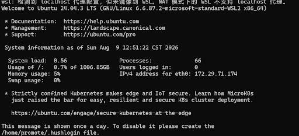

这是何意味啊


<hr style="border: 0; border-top: 5px solid #9333EA; margin: 48px 0 24px 0;">

## 🟣 🤖 AI 回答

这段提示的意思是：**你在 Windows 主机上开启了代理软件（比如 Clash、V2Ray、科学上网工具等），但 WSL（Linux 子系统）目前无法直接共享使用 Windows 的 `localhost` 代理。**

### 为什么会出现这个提示？

WSL 2 默认使用 **NAT 模式** 运行，本质上相当于在 Windows 内部运行了一个独立的虚拟机：

* Windows 的 `localhost`（`127.0.0.1`）是指向 **Windows 主机** 的。
* WSL 里的 `localhost` 指向的是 **WSL 自己**（比如图中显示的 `172.29.71.174`）。

因为网络隔离，WSL 检测到了 Windows 设置了代理，但没办法自动把 Windows 的 `localhost` 代理镜像映射进 Linux 环境里，所以弹出了这条**友情提醒**。

### 这会有什么影响？

* **基本使用无影响**：WSL 可以正常启动和运行，一般的网络也是通的。
* **代理不生效**：你在 Linux 命令行里运行 `apt update`、`git clone` 或下载国外资源时，**不会自动走 Windows 的代理网络**。

### 解决方案

如果你想解决或关掉这个提示，可以根据你的需求选择以下方法：

#### 方案一：开启 WSL 的“镜像网络模式”（推荐，一劳永逸）

如果你使用的是 **Windows 11** 且 WSL 保持最新，可以将 WSL 改为“镜像网络”，这样 WSL 和 Windows 将共享同一个网络环境，代理也可以完美共享。

1. 在 Windows 中按下 `Win + R`，输入 `%userprofile%` 并回车，打开你的用户根目录。
2. 在该目录下新建或修改名为 `.wslconfig` 的文件。
3. 写入以下内容并保存：

```Ini,
[wsl2]
networkingMode=mirrored
autoProxy=true
```

4. 打开 Windows PowerShell，运行 `wsl --shutdown` 重启 WSL 即可。

#### 方案二：仅关闭这个警告提示（如果你不需要 WSL 走代理）

如果你根本不需要 WSL 走 Windows 的代理，只是觉得这行警告看着烦，可以在 `.wslconfig` 文件中加上：

```Ini,
[wsl2]
autoProxy=false
```

然后运行 `wsl --shutdown` 重启即可。

#### 方案三：直接忽略

如果不影响你日常在 WSL 里敲代码或拉取资源，完全**可以不管它**，直接正常使用即可。


<hr style="border: 0; border-top: 5px solid #2563EB; margin: 48px 0 24px 0;">

## 🔵 👤 用户提问

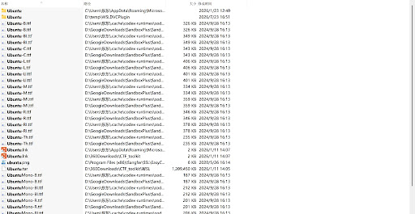

我按哪个才能启动Linux程序？


<hr style="border: 0; border-top: 5px solid #9333EA; margin: 48px 0 24px 0;">

## 🟣 🤖 AI 回答

在这份搜索列表中，双击 **带有橙色图标的 `Ubuntu.lnk`** 快捷方式即可启动：

* 路径为 `C:\Users\东东\AppData\Roaming\Microsoft...` 下的那个 **`Ubuntu.lnk`** 就是 Ubuntu 的桌面启动快捷方式。

### 💡 为什么其他文件不行？

* **`.ttf`**：这些是 Ubuntu 字体文件，不是程序。
* **`.tar`**：这是压缩包镜像文件，用于安装或备份 WSL，双击不会运行系统。
* **文件夹**：只是系统或软件保存数据的目录。

### 🚀 比翻文件更快捷的 2 种启动方式

你其实**不需要在文件夹里找它**，用下面任意一种方式会快得多：

1. **组合键启动（最快）**：

   * 按下键盘 `Win + R` 键，输入 `wsl` 或 `ubuntu`，按下回车即可直接打开 Linux 终端。
2. **开始菜单搜索**：

   * 按下键盘上的 `Win` 键（或点击左下角 Windows 图标），直接键盘输入 `Ubuntu`，点击出现的 Ubuntu 图标即可。


<hr style="border: 0; border-top: 5px solid #2563EB; margin: 48px 0 24px 0;">

## 🔵 👤 用户提问

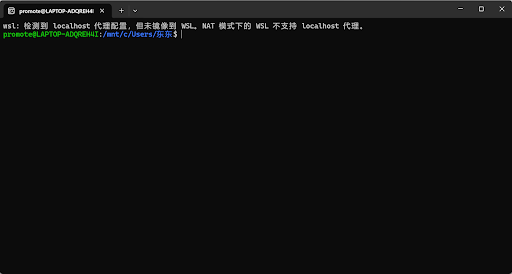

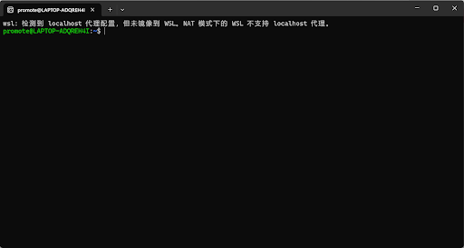

为什么路径不一样？（前者是用 Win+R，后者是用双击 lnk）


<hr style="border: 0; border-top: 5px solid #9333EA; margin: 48px 0 24px 0;">

## 🟣 🤖 AI 回答

这是因为两种启动方式**默认进入的初始工作目录（起始路径）不同**：

### 1. 用 `Win + R` 启动（路径显示 `/mnt/c/Users/东东`）

* **原理**：用 `Win + R` 输入 `wsl` 启动时，WSL 会**继承 Windows 当前的操作上下文**。
* **原因**：在 Windows 里，快捷运行命令的默认起始路径就是你当前的 Windows 用户文件夹 `C:\Users\东东`。WSL 启动后自动将这个 Windows 路径转换为了 Linux 映射路径 `/mnt/c/Users/东东`。
* **本质**：你此时处于 **Windows 文件系统** 里面（可以访问你在 Windows 里的桌面、下载、文档等）。

### 2. 双击 `Ubuntu.lnk` 启动（路径显示 `~`）

* **原理**：直接双击 Ubuntu 应用图标时，它是以 Linux 发行版自身的独立应用形式启动的。
* **原因**：Linux 系统的默认规范是让用户直接进入自己的原生**家目录（Home Directory）**。这里的波浪号 `~` 代表的就是 Linux 的原生主目录（实际路径是 `/home/promote`）。
* **本质**：你此时处于 **Linux 内部的独立文件系统** 里面（文件读写性能比 `/mnt/c/` 更高，适合存放代码和项目）。

### 💡 实用小技巧

无论用哪种方式打开，你都可以通过命令随时在这两个目录之间切换：

* **想回到 Linux 原生家目录**：运行 `cd ~`
* **想切到 Windows 用户文件夹**：运行 `cd /mnt/c/Users/东东`


<hr style="border: 0; border-top: 5px solid #2563EB; margin: 48px 0 24px 0;">

## 🔵 👤 用户提问


不同颜色分别代表什么？


<hr style="border: 0; border-top: 5px solid #9333EA; margin: 48px 0 24px 0;">

## 🟣 🤖 AI 回答

在 Linux 终端中，系统通过不同颜色帮助你快速区分**命令提示符**与**文件类型**。

针对你截图中的内容，各个颜色代表的含义如下：

## 1. 截图中的颜色含义

* **绿色（`promote@LAPTOP-ADQREH4I`）**：

  + **命令提示符的前半部分**：代表当前登录的用户账号（`promote`）和电脑主机名（`LAPTOP-ADQREH4I`）。
* **蓝色（`~` 以及 `ls` 列出的蓝色名称）**：

  + **路径中的 `~`**：代表你当前处于 Linux 的原生主目录（Home 目录）。
  + **`ls` 结果中的名称**：代表**文件夹（目录）**。图中像 `LibcSearcher`、`dirsearch`、`pwndbg` 等全部都是文件夹。
* **白色 / 灰色（`Miniforge3-Linux-x86_64.sh`）**：

  + 代表**普通文件**（如未赋予执行权限的脚本文件、文本文件或普通数据包）。

## 2. Linux 终端常见的其他颜色（快速参考）

| 颜色 | 代表类型 | 示例 |
| --- | --- | --- |
| **蓝色** | 文件夹 / 目录 | `dirsearch` |
| **白色 / 灰色** | 普通文件 | `notes.txt`, `file.sh` |
| **绿色** | 可执行文件（已赋予运行权限） | `a.out`, `run.sh` |
| **青色（浅蓝）** | 软链接（类似 Windows 快捷方式） | `link_to_file` |
| **红色 / 亮红** | 压缩包或已损坏的链接 | `.tar.gz`, `.zip` |

> 💡 **实用技巧**：如果你不想只靠颜色判断，可以输入 **`ls -l`**（或简写 **`ll`**）。以 `d` 开头的一行即为文件夹，以 `-` 开头的一行即为普通文件。


<hr style="border: 0; border-top: 5px solid #2563EB; margin: 48px 0 24px 0;">

## 🔵 👤 用户提问

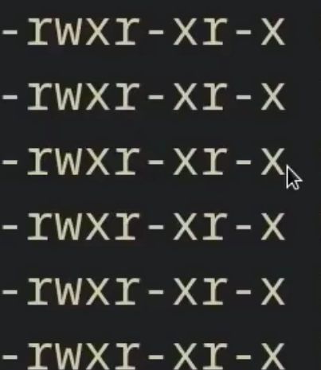

这里如果出现l、s、t代表什么？


<hr style="border: 0; border-top: 5px solid #9333EA; margin: 48px 0 24px 0;">

## 🟣 🤖 AI 回答

在 Linux 的这串 10 位权限字符中，`l`、`s`、`t` 出现的位置和代表的含义各不相同：

### 1. `l`（小写 L）—— 出现在第 1 位（文件类型）

* **位置**：最左侧的第一位（即 `-rwxr-xr-x` 中第一个 `-` 的位置）。
* **含义**：代表 **软链接 / 符号链接（Symbolic Link）**。
* **作用**：相当于 Windows 中的“快捷方式”，指向系统中的另一个文件或目录。

### 2. `s`（或大写 `S`）—— 替代执行权限 `x`（特殊权限）

`s` 可以出现在 **所有者（User）** 或 **所属组（Group）** 的第 3 个位置（即整个字符串的第 4 位或第 7 位）：

* **在 User 的 `x` 位（第 4 位）**：**SUID (Set User ID)**

  + **作用**：当任何用户执行这个程序时，该程序都会**以文件所有者的身份运行**。最典型的例子是 `/usr/bin/passwd` 命令，允许普通用户通过该命令以 root 身份修改自己的密码。
* **在 Group 的 `x` 位（第 7 位）**：**SGID (Set Group ID)**

  + **作用**：运行程序时继承该文件所属组的权限；若作用于目录，则任何人在该目录下新建的文件，所属组都会自动继承该目录的组。

> 💡 **大小写区别**：
>
> * **小写 `s`**：代表既设置了 SUID/SGID，**且拥有** `x` 可执行权限。
> * **大写 `S`**：代表设置了 SUID/SGID，但**没有** `x` 可执行权限（属于无效/有问题的设置）。

### 3. `t`（或大写 `T`）—— 替代 Others 的 `x`（粘滞位 Sticky Bit）

* **位置**：出现在**其他用户（Others）**的 `x` 位置（即**第 10 位**，正好是你截图中鼠标箭头指向的位置）。
* **含义**：代表 **粘滞位（Sticky Bit）**。
* **作用**：常用于公共共享目录（例如 Linux 的 `/tmp` 临时文件夹）。

  + 设为 `t` 后，即使其他用户对这个目录有写入（修改）权限，**也只能删除或重命名属于自己的文件**，无法删除别人的文件。

> 💡 **大小写区别**：
>
> * **小写 `t`**：代表设置了 Sticky Bit，**且拥有** `x` 可执行权限（`rwx` $\rightarrow$ `rwt`）。
> * **大写 `T`**：代表设置了 Sticky Bit，但**没有** `x` 可执行权限（`rw-` $\rightarrow$ `rwT`）。

### 总结对照表

| 字母 | 出现位置 | 代表功能 | 常见场景 |
| --- | --- | --- | --- |
| **`l`** | 第 1 位 | 软链接（快捷方式） | `lrwxrwxrwx ...` |
| **`s`** | 第 4 位 / 第 7 位 | SUID / SGID（提权运行/组继承） | `-rwsr-xr-x`（如 `passwd` 命令） |
| **`t`** | 第 10 位（鼠标所在位） | Sticky Bit（防止误删他人文件） | `drwxrwxrwt`（如 `/tmp` 目录） |


<hr style="border: 0; border-top: 5px solid #2563EB; margin: 48px 0 24px 0;">

## 🔵 👤 用户提问

rm .. 会发生什么？


<hr style="border: 0; border-top: 5px solid #9333EA; margin: 48px 0 24px 0;">

## 🟣 🤖 AI 回答

**结论：什么都不会被删，你的文件是安全的！** Linux 系统内置了安全保护机制，会直接拒绝执行并报错。

具体会发生什么，取决于你是否加了参数：

### 1. 直接输入 `rm ..`

因为 `..` 代表上一级**目录**，而不加任何参数的 `rm` 只能用来删除**普通文件**。

系统会直接返回提示：

```Plaintext
rm: cannot remove '..': Is a directory
（rm: 无法删除 '..': 是一个目录）
```

### 2. 加了递归/强制参数（如 `rm -r ..` 或 `rm -rf ..`）

即使你加上了专门用来删除目录的 `-r`（递归）或 `-f`（强制）参数，现代 Linux（GNU `rm` 工具）针对 `.`（当前目录）和 `..`（上一级目录）做了**强制拦截**。

系统会直接拒绝执行并警告：

```Plaintext
rm: refusing to remove '.' or '..' directory: skipping '..'
（rm: 拒绝删除 '.' 或 '..' 目录：已跳过 '..'）
```

> **💡 补充小知识**
>
> 在 Linux 中：
>
> * `.` 代表**当前目录**
> * `..` 代表**上一级目录**
>
> 如果你**真的**想删除上一级目录，正确的做法是：
>
> 1. 先退回到更上一层：`cd ../..`
> 2. 再按名称删除那个文件夹：`rm -r 目标文件夹名`


<hr style="border: 0; border-top: 5px solid #2563EB; margin: 48px 0 24px 0;">

## 🔵 👤 用户提问

```text
xdg-open testing.py
WARNING: You don't seem to have any mimeinfo.cache files.
Try running the update-desktop-database command. If you
don't have this command you should install the
desktop-file-utils package. This package is available from
http://freedesktop.org/wiki/Software/desktop-file-utils/
No applications found for mimetype: text/x-python
./usr/bin/xdg-open: 882: x-www-browser: Permission denied
/usr/bin/xdg-open: 882: firefox: Permission denied
/usr/bin/xdg-open: 882: iceweasel: Permission denied
/usr/bin/xdg-open: 882: seamonkey: Permission denied
/usr/bin/xdg-open: 882: mozilla: Permission denied
/usr/bin/xdg-open: 882: epiphany: Permission denied
/usr/bin/xdg-open: 882: konqueror: Permission denied
/usr/bin/xdg-open: 882: chromium: Permission denied
/usr/bin/xdg-open: 882: chromium-browser: Permission denied
/usr/bin/xdg-open: 882: google-chrome: Permission denied
/usr/bin/xdg-open: 882: www-browser: Permission denied
/usr/bin/xdg-open: 882: links2: Permission denied
/usr/bin/xdg-open: 882: elinks: Permission denied
/usr/bin/xdg-open: 882: links: Permission denied
/usr/bin/xdg-open: 882: lynx: Permission denied
/usr/bin/xdg-open: 882: w3m: Permission denied
xdg-open: no method available for opening 'testing.py'
这是什么意思
```


<hr style="border: 0; border-top: 5px solid #9333EA; margin: 48px 0 24px 0;">

## 🟣 🤖 AI 回答

### 核心意思

`xdg-open` 是 Linux 中用来“用默认的图形界面软件打开文件”的命令（相当于你在 Windows 里双击文件）。

这个报错的意思是：**你的系统里没有配置用于打开 `.py`（Python 源码）文件的图形界面软件**，导致文件打开失败。

### 详细报错过程拆解

1. **`No applications found for mimetype: text/x-python`**

   系统识别出 `testing.py` 是 Python 文本文件，但在当前 Linux 环境（WSL 纯终端模式）中，并没有注册诸如 VS Code、PyCharm 或 Gedit 等图形化代码编辑器。
2. **`Permission denied`（一连串浏览器名称）**

   因为找不到专用的代码编辑器，`xdg-open` 尝试退而求次，用各种网页浏览器（Firefox、Chrome、Lynx 等）去读取这个文件，但由于 WSL 终端环境的权限和限制，全都启动失败了。
3. **`no method available for opening 'testing.py'`**

   尝试了所有可能的方式后，系统最终宣布放弃。

### 根据你的需求，推荐正确的命令

在 WSL 或 Linux 终端中，一般不建议使用 `xdg-open`。请根据你当前的具体需求选择以下命令：

#### 1. 如果你是想 **运行** 这个脚本：

```Bash
python3 testing.py
```

#### 2. 如果你是想 **查看 / 编辑** 代码：

* **在命令行里直接编辑**（简单轻量）：

  ```Bash
  nano testing.py
  ```
* **调用 Windows 的 VS Code 打开**（体验最好，需 Windows 已安装 VS Code）：

  ```Bash
  code testing.py
  ```
* **直接调用 Windows 记事本打开**：

  ```Bash
  notepad.exe testing.py
  ```


<hr style="border: 0; border-top: 5px solid #2563EB; margin: 48px 0 24px 0;">

## 🔵 👤 用户提问

Windows 和 Mac 替换 xdg-open 的指令是什么？


<hr style="border: 0; border-top: 5px solid #9333EA; margin: 48px 0 24px 0;">

## 🟣 🤖 AI 回答

在 Windows 和 macOS 中，用来实现与 Linux 下 `xdg-open` 相同功能（即“用系统默认关联的程序直接打开文件/链接”）的命令分别是：

### 1. Windows: `start`

在 Windows 的 CMD 或 PowerShell 中，使用 `start` 命令：

```DOS
start testing.py
```

* **打开网页**：`start [https://www.google.com](https://www.google.com)`
* **打开当前文件夹**：`start .`
* **注意点**：如果文件名或路径中**带有空格**，Windows 的 `start` 会把第一个双引号里的内容识别为“窗口标题”，因此需要空出一个引号位：

  ```DOS
  start "" "my testing script.py"
  ```

### 2. macOS: `open`

在 Mac 的 Terminal（终端）中，使用 `open` 命令：

```Bash
open testing.py
```

* **打开网页**：`open [https://www.google.com](https://www.google.com)`
* **在 Finder 中打开当前目录**：`open .`
* **指定软件打开**（例如强制用 VS Code 打开）：

  ```Bash
  open -a "Visual Studio Code" testing.py
  ```

### 📊 三平台对照表

| 操作系统 | 用默认软件打开文件命令 | 终端中在文件夹/Finder 中打开当前目录 |
| --- | --- | --- |
| **Linux (WSL)** | `xdg-open testing.py` | `xdg-open .` |
| **Windows** | `start testing.py` | `start .` |
| **macOS** | `open testing.py` | `open .` |


<hr style="border: 0; border-top: 5px solid #2563EB; margin: 48px 0 24px 0;">

## 🔵 👤 用户提问

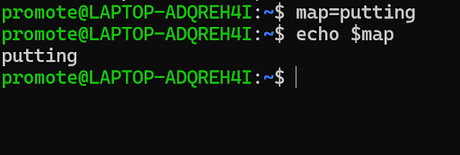

map 存储到哪了？怎么消除索引？


<hr style="border: 0; border-top: 5px solid #9333EA; margin: 48px 0 24px 0;">

## 🟣 🤖 AI 回答

### 1. `map` 存储到哪了？

它存储在**当前 Bash 终端进程的内存（RAM）中**。

* **作用域**：它是一个**普通的 Shell 变量**。
* **生命周期**：仅在当前打开的这一个终端窗口里有效。它并没有写入硬盘，也没有导出为系统环境变量（如果没加 `export`）。
* **失效条件**：一旦你关掉这个终端窗口、运行 `exit`，或者重新打开一个新的终端，这个变量就会在内存中随进程自动销毁。

### 2. 怎么取消 / 清除这个变量？

使用 Linux 的 **`unset`** 命令即可清除（取消定义）：

```Bash
unset map
```

**验证是否清除成功：**

```Bash
echo $map
```

*(此时按下回车，如果没有任何内容输出，就说明该变量已经被彻底清空/删除了)*


<hr style="border: 0; border-top: 5px solid #2563EB; margin: 48px 0 24px 0;">

## 🔵 👤 用户提问

shell 中的 vim 怎么用？


<hr style="border: 0; border-top: 5px solid #9333EA; margin: 48px 0 24px 0;">

## 🟣 🤖 AI 回答

Vim 的核心机制是“模式切换”**。刚接触 Vim 时最容易卡住，是因为它默认处于**命令模式（不能直接打字），需要切换到**插入模式**才能编辑文本。

掌握以下 **3 个基本模式** 和 **核心流程**，就能满足 90% 的日常修改配置文件或写脚本需求：

## 核心 3 大模式

* **命令模式（Normal Mode）**：默认模式。按键代表命令（如移动光标、删除、复制），不能直接打字。
* **插入模式（Insert Mode）**：真正的编辑模式。左下角会显示 `-- INSERT --`，可以正常打字输入。
* **底行模式（Command-line Mode）**：用于保存、退出、查找等操作，以 `:` 开头。

## 4 步完成一次文件编辑

在 Shell 终端运行：

```Bash
vim testing.py
```

刚进入时处于**命令模式**。

按下键盘上的字母 **`i`**（代表 insert）。

此时左下角出现 `-- INSERT --`，你就可以正常输入或修改文本了。

编辑完成后，按下键盘左上角的 **`Esc`** 键，退回到**命令模式**（左下角的 `-- INSERT --` 会消失）。

在命令模式下，依次输入以下字符并按回车：

* **`:wq`**：保存（Write）并退出（Quit）。
* **`:q!`**：不保存，强制退出（丢弃本次修改）。

## 常用高频快捷键速查表

在**命令模式**（按下 `Esc` 后的状态）下，你可以直接使用以下快捷键：

| 分类 | 快捷键 | 作用 |
| --- | --- | --- |
| **退出** | `:wq` | 保存并退出 |
|  | `:q!` | 不保存强制退出 |
| **删除** | `dd` | 删除（剪切）当前整行 |
|  | `x` | 删除光标所在位置的单个字符 |
| **复制/粘贴** | `yy` | 复制当前整行 |
|  | `p` | 在当前行下方粘贴 |
| **撤销/重做** | `u` | 撤销上一步操作（Undo） |
|  | `Ctrl + r` | 重做 / 恢复撤销（Redo） |
| **快速移动** | `G` | 直接跳转到文件最后一行 |
|  | `gg` | 直接跳转到文件第一行 |
| **查找** | `/关键词` | 向下查找文本（按 `n` 跳到下一个匹配项） |

> 💡 **防卡死救急法则**
>
> 如果在 Vim 里不知道按到了什么命令导致界面混乱，不用慌：
> 连续连按几下 **`Esc`** 键（确保回到命令模式），然后输入 **`:q!`** 按回车，即可安全强制退出。


<hr style="border: 0; border-top: 5px solid #2563EB; margin: 48px 0 24px 0;">

## 🔵 👤 用户提问

shell 中如何定义函数


<hr style="border: 0; border-top: 5px solid #9333EA; margin: 48px 0 24px 0;">

## 🟣 🤖 AI 回答

在 Shell（如 Bash）中定义函数非常简单，主要有 **基本语法**、**传递参数**、**获取返回值** 和 **作用域控制** 四个核心要点：

## 1. 基本语法

在 Shell 中定义函数有两种常见格式，**推荐使用语法 1**（符合 POSIX 标准，兼容性最好）：

```Bash
# 语法 1：标准写法（推荐）
my_func() {
    echo "Hello World"
}

# 语法 2：带有 function 关键字（Bash 特有）
function my_func {
    echo "Hello World"
}
```

> ⚠️ **注意**：定义函数时，括号 `()` 里面**不要写任何参数**。参数是在函数内部直接通过位置变量（如 `$1`, `$2`）来接收的。

## 2. 调用函数与传递参数

调用函数时，直接输入**函数名 + 参数**即可（不需要加括号）：

```Bash
my_func() {
    echo "第一个参数是：$1"
    echo "第二个参数是：$2"
    echo "所有参数列表：$@"
    echo "传入的参数个数：$#"
}

# 调用函数并传入两个参数
my_func "hello" "world"
```

### 常用参数接收变量：

| 变量 | 含义 |
| --- | --- |
| **`$1`, `$2`, `$3`** | 代表传入函数的第 1、第 2、第 3 个参数 |
| **`$#`** | 传入函数的**参数总个数** |
| **`$@`** | 传入函数的**所有参数列表** |
| **`$0`** | **注意**：代表脚本自身的名称，而不是函数名 |

## 3. 函数返回值

Shell 函数的返回值与常规编程语言不同，主要分为两种情况：

### ① 使用 `return`（只能返回数字状态码：0 ~ 255）

`return` 用来表示函数的**执行状态**（`0` 代表成功，非 `0` 代表失败）。调用后可以通过 `$?` 获取：

```Bash
check_file() {
    if [ -f "$1" ]; then
        return 0  # 成功/文件存在
    else
        return 1  # 失败/文件不存在
    fi
}

check_file "/etc/passwd"
echo "状态码是: $?"  # 输出 0
```

### ② 使用 `echo` / `printf`（返回字符串或复杂结果）

如果需要从函数中获取计算好的字符串或数据，使用 `echo` 打印，并在调用时通过命令替换 `$()` 接收：

```Bash
add() {
    local sum=$(($1 + $2))
    echo "$sum"  # 通过标准输出传回结果
}

# 使用 $(...) 捕获函数的输出
result=$(add 10 20)
echo "计算结果是: $result"  # 输出 30
```

## 4. 局部变量与全局变量（`local` 关键字）

默认情况下，在 Shell 函数内定义的变量都是**全局变量**。为了避免污染外部变量，建议在函数内部使用 **`local`** 关键字声明局部变量：

```Bash
name="Windows"

test_func() {
    local name="Linux"  # 仅在函数内部生效
    echo "函数内部 name: $name"
}

test_func
echo "函数外部 name: $name"
```

**输出：**

```Plaintext
函数内部 name: Linux
函数外部 name: Windows
```

## 💡 综合完整示例

将以上点结合起来的规范 Shell 函数编写范例：

```Bash
#!/bin/bash

# 1. 定义函数：计算两数之和并检查范围
calculate_sum() {
    # 检查参数个数
    if [ $# -ne 2 ]; then
        echo "错误：必须传入 2 个数字！" >&2
        return 1  # 返回失败状态码
    fi

    # 使用 local 局部变量
    local num1=$1
    local num2=$2
    local total=$((num1 + num2))

    # 输出结果
    echo "$total"
    return 0  # 返回成功状态码
}

# 2. 调用函数并获取输出
sum_result=$(calculate_sum 15 25)

# 3. 检查函数执行状态
if [ $? -eq 0 ]; then
    echo "最终计算成功，结果为: $sum_result"
else
    echo "计算失败！"
fi
```


<hr style="border: 0; border-top: 5px solid #2563EB; margin: 48px 0 24px 0;">

## 🔵 👤 用户提问

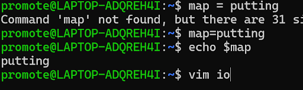

我现在直接执行这一步会怎样？


<hr style="border: 0; border-top: 5px solid #9333EA; margin: 48px 0 24px 0;">

## 🟣 🤖 AI 回答

按回车执行 `vim io` 后，系统会启动 Vim 编辑器，具体取决于当前目录下有没有叫 `io` 的文件：

* **如果当前目录下已存在 `io` 文件**：
  Vim 会直接**打开该文件**，并显示文件里的内容供你查看或修改。
* **如果当前目录下不存在 `io` 文件**：
  Vim 会打开一个全新的空白页面，并在底部标注 `[New File]`（新文件）。此时文件**尚未写入硬盘**，只有当你后续在 Vim 里按 `Esc` 输入 `:w` 或 `:wq` 保存时，才会真正创建出名为 `io` 的文件。

### 💡 进退提醒（防卡住）

进入 Vim 后的基本操作：

1. 按 **`i`** 键进入输入模式（左下角出现 `-- INSERT --`）才能开始打字。
2. 编辑完成后按 **`Esc`** 键退出输入模式。
3. 输入 **`:wq`** 保存退出；如果写错了不想保存，输入 **`:q!`** 强制退出即可。


<hr style="border: 0; border-top: 5px solid #2563EB; margin: 48px 0 24px 0;">

## 🔵 👤 用户提问

那我可以不输入这一行指令，直接在这里定义函数吗


<hr style="border: 0; border-top: 5px solid #9333EA; margin: 48px 0 24px 0;">

## 🟣 🤖 AI 回答

**完全可以！** 你不需要打开 Vim 文件，可以直接在当前终端命令行里定义函数并立刻调用。

### 1. 方式一：多行直接输入（最直观）

在终端按回车输入时，Shell 会识别到函数尚未结束，自动变成 `>` 提示符，等待你输完：

```Bash
my_func() {
    echo "这是直接在终端定义的函数！"
    echo "当前用户是: $USER"
}
```

输入完毕后，直接敲函数名执行：

```Bash
my_func
```

### 2. 方式二：单行简洁写法（最快）

你也可以把整个函数写在一行里：

```Bash
my_func() { echo "这是直接在终端定义的函数！"; }
```

> ⚠️ **单行写法的注意事项**：
>
> 1. `{` 后面必须有**空格**。
> 2. 最后一个命令结尾必须加上**分号 `;`**（或回车），才能写最后的 `}`。

### 💡 直接定义 vs 写进 Vim 文件的区别

| 比较维度 | 直接在终端定义 | 写进 Vim 文件（脚本） |
| --- | --- | --- |
| **生效速度** | **即时生效**，敲完就能用 | 需要保存后运行 `bash 文件名` 或 `source 文件名` |
| **适合场景** | 临时调试、执行一次性的快捷任务 | 长期保存、复杂代码、自动化脚本 |
| **生命周期** | **临时性**：一旦关闭终端窗口或重新打开 WSL，函数就会自动消失 | **永久性**：保存在硬盘上，随时可以调用 |


<hr style="border: 0; border-top: 5px solid #2563EB; margin: 48px 0 24px 0;">

## 🔵 👤 用户提问

直接定义的函数可以用 vim 吗


<hr style="border: 0; border-top: 5px solid #9333EA; margin: 48px 0 24px 0;">

## 🟣 🤖 AI 回答

**不能直接用 `vim` 打开并修改**刚刚在命令行里临时定义的函数。

### 为什么不行？

因为直接在终端输入的函数只存在于**当前终端进程的内存（RAM）中**，并没有在硬盘上生成对应的文件。`vim` 是用来编辑**物理文件**的，由于找不到对应的文件，你无法通过 `vim 函数名` 的方式去修改它。

### 如果你想用 Vim 来写和修改函数，应该怎么做？

如果你习惯用 Vim 编辑代码，正确的做法是**直接把函数写进文件中**，而不是在命令行直接敲：

1. **用 Vim 新建或打开一个脚本文件**：

   ```Bash
   vim myscript.sh
   ```
2. **在 Vim 中写入你的函数**：

   ```Bash
   my_func() {
       echo "这是写在文件里的函数"
   }

   # 调用函数
   my_func
   ```
3. **保存并退出**（按 `Esc`，输入 `:wq`）。
4. **运行脚本**：

   ```Bash
   bash myscript.sh
   ```

### 💡 附：如果你想查看刚才临时定义的函数内容

如果你不小心在终端敲了很多行函数，想看看它长什么样，可以用 **`declare -f`** 命令打印出来：

```Bash
declare -f 函数名
```


<hr style="border: 0; border-top: 5px solid #2563EB; margin: 48px 0 24px 0;">

## 🔵 👤 用户提问

为什么要加 -f，这还需要强制？


<hr style="border: 0; border-top: 5px solid #9333EA; margin: 48px 0 24px 0;">

## 🟣 🤖 AI 回答

这里的 **`-f` 并不是“强制”（force）的意思**，而是 **`function`（函数）** 的首字母缩写！

### 为什么必须加 `-f`？

在 Shell 中，`declare` 命令既可以用来查看/声明**变量**，也可以用来查看/声明**函数**。

默认情况下，`declare` 查找的是**变量**：

* **不加 `-f`**：`declare map` $\rightarrow$ Bash 会去找名为 `map` 的**变量**。
* **加了 `-f`**：`declare -f my_func` $\rightarrow$ 明确告诉 Bash：“请帮我找到名为 `my_func` 的 **F**unction（函数）”。

如果你不加 `-f` 直接运行 `declare my_func`，Bash 会以为你在找一个叫 `my_func` 的变量，结果自然是什么都打印不出来。

### 💡 为什么容易误会？

在很多常见的 Linux 命令里，`-f` 确实经常代表 **force（强制）**（比如 `rm -f` 强制删除、`git push -f` 强制推送）。

但在 Linux 中，参数字母的具体含义是由每个命令自己决定的。在 `declare` 命令家族里，字母代表的是**类型**：

| 参数 | 代表单词 | 作用 |
| --- | --- | --- |
| **`-f`** | **f**unction | 操作/查看**函数** |
| **`-i`** | **i**nteger | 将变量声明为**整数** |
| **`-a`** | **a**rray | 将变量声明为**普通数组** |
| **`-A`** | **A**ssociative array | 将变量声明为**关联数组（字典/Map）** |
| **`-r`** | **r**eadonly | 将变量设置为**只读** |


<hr style="border: 0; border-top: 5px solid #2563EB; margin: 48px 0 24px 0;">

## 🔵 👤 用户提问

```text
declare $mep
BASH=/bin/bash
BASHOPTS=checkwinsize:cmdhist:complete_fullquote:expand_aliases:extglob:extquote:force_fignore:globasciiranges:globskipdots:histappend:interactive_comments:login_shell:patsub_replacement:progcomp:promptvars:sourcepath
BASH_ALIASES=()
BASH_ARGC=([0]="0")
BASH_ARGV=()
BASH_CMDS=()
BASH_COMPLETION_VERSINFO=([0]="2" [1]="11")
BASH_LINENO=()
BASH_LOADABLES_PATH=/usr/local/lib/bash:/usr/lib/bash:/opt/local/lib/bash:/usr/pkg/lib/bash:/opt/pkg/lib/bash:.
BASH_REMATCH=([0]="\$" [1]="\$" [2]="" [3]="")
BASH_SOURCE=()
BASH_VERSINFO=([0]="5" [1]="2" [2]="21" [3]="1" [4]="release" [5]="x86_64-pc-linux-gnu")
BASH_VERSION='5.2.21(1)-release'
COLUMNS=120
COMP_WORDBREAKS=$' \t\n"\'><=;|&(:'
CONDA_SHLVL=0
DBUS_SESSION_BUS_ADDRESS=unix:path=/run/user/1000/bus
DEBUGINFOD_URLS='https://debuginfod.ubuntu.com '
DIRSTACK=()
DISPLAY=:0
EUID=1000
GROUPS=()
HISTCONTROL=ignoreboth
HISTFILE=/home/promote/.bash_history
HISTFILESIZE=2000
HISTSIZE=1000
HOME=/home/promote
HOSTNAME=LAPTOP-ADQREH4I
HOSTTYPE=x86_64
IFS=$' \t\n'
LANG=C.UTF-8
LESSCLOSE='/usr/bin/lesspipe %s %s'
LESSOPEN='| /usr/bin/lesspipe %s'
LINES=30
LOGNAME=promote
LS_COLORS='rs=0:di=01;34:ln=01;36:mh=00:pi=40;33:so=01;35:do=01;35:bd=40;33;01:cd=40;33;01:or=40;31;01:mi=00:su=37;41:sg=30;43:ca=00:tw=30;42:ow=34;42:st=37;44:ex=01;32:*.tar=01;31:*.tgz=01;31:*.arc=01;31:*.arj=01;31:*.taz=01;31:*.lha=01;31:*.lz4=01;31:*.lzh=01;31:*.lzma=01;31:*.tlz=01;31:*.txz=01;31:*.tzo=01;31:*.t7z=01;31:*.zip=01;31:*.z=01;31:*.dz=01;31:*.gz=01;31:*.lrz=01;31:*.lz=01;31:*.lzo=01;31:*.xz=01;31:*.zst=01;31:*.tzst=01;31:*.bz2=01;31:*.bz=01;31:*.tbz=01;31:*.tbz2=01;31:*.tz=01;31:*.deb=01;31:*.rpm=01;31:*.jar=01;31:*.war=01;31:*.ear=01;31:*.sar=01;31:*.rar=01;31:*.alz=01;31:*.ace=01;31:*.zoo=01;31:*.cpio=01;31:*.7z=01;31:*.rz=01;31:*.cab=01;31:*.wim=01;31:*.swm=01;31:*.dwm=01;31:*.esd=01;31:*.avif=01;35:*.jpg=01;35:*.jpeg=01;35:*.mjpg=01;35:*.mjpeg=01;35:*.gif=01;35:*.bmp=01;35:*.pbm=01;35:*.pgm=01;35:*.ppm=01;35:*.tga=01;35:*.xbm=01;35:*.xpm=01;35:*.tif=01;35:*.tiff=01;35:*.png=01;35:*.svg=01;35:*.svgz=01;35:*.mng=01;35:*.pcx=01;35:*.mov=01;35:*.mpg=01;35:*.mpeg=01;35:*.m2v=01;35:*.mkv=01;35:*.webm=01;35:*.webp=01;35:*.ogm=01;35:*.mp4=01;35:*.m4v=01;35:*.mp4v=01;35:*.vob=01;35:*.qt=01;35:*.nuv=01;35:*.wmv=01;35:*.asf=01;35:*.rm=01;35:*.rmvb=01;35:*.flc=01;35:*.avi=01;35:*.fli=01;35:*.flv=01;35:*.gl=01;35:*.dl=01;35:*.xcf=01;35:*.xwd=01;35:*.yuv=01;35:*.cgm=01;35:*.emf=01;35:*.ogv=01;35:*.ogx=01;35:*.aac=00;36:*.au=00;36:*.flac=00;36:*.m4a=00;36:*.mid=00;36:*.midi=00;36:*.mka=00;36:*.mp3=00;36:*.mpc=00;36:*.ogg=00;36:*.ra=00;36:*.wav=00;36:*.oga=00;36:*.opus=00;36:*.spx=00;36:*.xspf=00;36:*~=00;90:*#=00;90:*.bak=00;90:*.crdownload=00;90:*.dpkg-dist=00;90:*.dpkg-new=00;90:*.dpkg-old=00;90:*.dpkg-tmp=00;90:*.old=00;90:*.orig=00;90:*.part=00;90:*.rej=00;90:*.rpmnew=00;90:*.rpmorig=00;90:*.rpmsave=00;90:*.swp=00;90:*.tmp=00;90:*.ucf-dist=00;90:*.ucf-new=00;90:*.ucf-old=00;90:'
MACHTYPE=x86_64-pc-linux-gnu
MAILCHECK=60
MAMBA_EXE=/home/promote/miniforge3/bin/mamba
MAMBA_ROOT_PREFIX=/home/promote/.local/share/mamba
NAME=LAPTOP-ADQREH4I
OLDPWD=/home/promote/dirsearch
OPTERR=1
OPTIND=1
OSTYPE=linux-gnu
PATH='/home/promote/.local/share/mamba/condabin:/home/promote/miniforge3/bin:/usr/local/sbin:/usr/local/bin:/usr/sbin:/usr/bin:/sbin:/bin:/usr/games:/usr/local/games:/usr/lib/wsl/lib:/mnt/c/Program Files/WindowsApps/MicrosoftCorporationII.WindowsSubsystemForLinux_2.6.3.0_x64__8wekyb3d8bbwe:/mnt/d/pyD/Scripts/:/mnt/d/pyD/:/mnt/c/Program Files/Common Files/Oracle/Java/javapath:/mnt/c/Program Files (x86)/NVIDIA Corporation/PhysX/Common:/mnt/c/WINDOWS/system32:/mnt/c/WINDOWS:/mnt/c/WINDOWS/System32/Wbem:/mnt/c/WINDOWS/System32/WindowsPowerShell/v1.0/:/mnt/c/WINDOWS/System32/OpenSSH/:/mnt/d/360Downloads/matlab/bin:/mnt/c/Program Files (x86)/Windows Kits/8.1/Windows Performance Toolkit/:/mnt/c/Program Files/mingw64/bin:/mnt/d/360Downloads/CTF_toolkit/010Editor/010 Editor:/mnt/c/WINDOWS/system32/config/systemprofile/AppData/Local/Muse Hub/lib:/mnt/d/GoogleDownloads/Graphviz/bin:/mnt/c/Program Files/dotnet/:/mnt/d/360Downloads/Nodejs/:/mnt/d/GoogleDownloads/Git/cmd:/mnt/c/Users/东东/AppData/Local/Programs/cursor/resources/app/codeBin:/mnt/c/Users/东东/AppData/Local/Microsoft/WindowsApps:/mnt/d/360Downloads/Microsoft VS Code/bin:/mnt/c/Users/东东/AppData/Local/Programs/cursor/resources/app/bin:/mnt/d/GoogleDownloads/Ollama:/mnt/d/大学/复旦大学/软件/PyCharm/PyCharm 2025.3.4/bin:/mnt/c/Users/东东/AppData/Roaming/npm:/mnt/c/Users/东东/AppData/Local/Microsoft/WinGet/Packages/astral-sh.uv_Microsoft.Winget.Source_8wekyb3d8bbwe:/snap/bin'
PIPESTATUS=([0]="0")
PPID=658
PS1='\[\e]0;\u@\h: \w\a\]${debian_chroot:+($debian_chroot)}\[\033[01;32m\]\u@\h\[\033[00m\]:\[\033[01;34m\]\w\[\033[00m\]\$ '
PS2='> '
PS4='+ '
PULSE_SERVER=unix:/mnt/wslg/PulseServer
PWD=/home/promote
SHELL=/bin/bash
SHELLOPTS=braceexpand:emacs:hashall:histexpand:history:interactive-comments:monitor
SHLVL=1
TERM=xterm-256color
UID=1000
USER=promote
WAYLAND_DISPLAY=wayland-0
WSL2_GUI_APPS_ENABLED=1
WSLENV=
WSL_DISTRO_NAME=Ubuntu
WSL_INTEROP=/run/WSL/658_interop
XDG_DATA_DIRS=/usr/local/share:/usr/share:/var/lib/snapd/desktop
XDG_RUNTIME_DIR=/run/user/1000/
_=fuck
__exe_name=mamba
__git_printf_supports_v=yes
_backup_glob='@(#*#|*@(~|.@(bak|orig|rej|swp|dpkg*|rpm@(orig|new|save))))'
_xspecs=([tex]="!*.@(?(la)tex|texi|dtx|ins|ltx|dbj)" [freeamp]="!*.@(mp3|og[ag]|pls|m3u)" [gqmpeg]="!*.@(mp3|og[ag]|pls|m3u)" [texi2html]="!*.texi*" [hbpp]="!*.@([Pp][Rr][Gg]|[Cc][Ll][Pp])" [lowriter]="!*.@(sxw|stw|sxg|sgl|doc?([mx])|dot?([mx])|rtf|txt|htm|html|?(f)odt|ott|odm|pdf)" [rpm2cpio]="!*.[rs]pm" [localc]="!*.@(sxc|stc|xls?([bmx])|xlw|xlt?([mx])|[ct]sv|?(f)ods|ots)" [hbrun]="!*.[Hh][Rr][Bb]" [vi]="*.@([ao]|so|so.!(conf|*/*)|[rs]pm|gif|jp?(e)g|mp3|mp?(e)g|avi|asf|ogg|class)" [latex]="!*.@(?(la)tex|texi|dtx|ins|ltx|dbj)" [view]="*.@([ao]|so|so.!(conf|*/*)|[rs]pm|gif|jp?(e)g|mp3|mp?(e)g|avi|asf|ogg|class)" [madplay]="!*.mp3" [compress]="*.Z" [pdfjadetex]="!*.@(?(la)tex|texi|dtx|ins|ltx|dbj)" [pbunzip2]="!*.?(t)bz?(2)" [lrunzip]="!*.lrz" [gunzip]="!*.@(Z|[gGd]z|t[ag]z)" [oowriter]="!*.@(sxw|stw|sxg|sgl|doc?([mx])|dot?([mx])|rtf|txt|htm|html|?(f)odt|ott|odm|pdf)" [epiphany]="!*.@(?([xX]|[sS])[hH][tT][mM]?([lL]))" [acroread]="!*.[pf]df" [znew]="*.Z" [kwrite]="*.@([ao]|so|so.!(conf|*/*)|[rs]pm|gif|jp?(e)g|mp3|mp?(e)g|avi|asf|ogg|class)" [xemacs]="*.@([ao]|so|so.!(conf|*/*)|[rs]pm|gif|jp?(e)g|mp3|mp?(e)g|avi|asf|ogg|class)" [gview]="*.@([ao]|so|so.!(conf|*/*)|[rs]pm|gif|jp?(e)g|mp3|mp?(e)g|avi|asf|ogg|class)" [lzfgrep]="!*.@(tlz|lzma)" [lzless]="!*.@(tlz|lzma)" [cdiff]="!*.@(dif?(f)|?(d)patch)?(.@([gx]z|bz2|lzma))" [zipinfo]="!*.@(zip|[aegjswx]ar|exe|pk3|wsz|zargo|xpi|s[tx][cdiw]|sx[gm]|o[dt][tspgfc]|od[bm]|oxt|epub|apk|aab|ipa|do[ct][xm]|p[op]t[mx]|xl[st][xm]|pyz|whl|[Ff][Cc][Ss]td)" [pdflatex]="!*.@(?(la)tex|texi|dtx|ins|ltx|dbj)" [portecle]="!@(*.@(ks|jks|jceks|p12|pfx|bks|ubr|gkr|cer|crt|cert|p7b|pkipath|pem|p10|csr|crl)|cacerts)" [modplugplay]="!*.@(669|abc|am[fs]|d[bs]m|dmf|far|it|mdl|m[eo]d|mid?(i)|mt[2m]|oct|okt?(a)|p[st]m|s[3t]m|ult|umx|wav|xm)" [lokalize]="!*.po" [lbzcat]="!*.?(t)bz?(2)" [qiv]="!*.@(gif|jp?(e)g|tif?(f)|png|p[bgp]m|bmp|x[bp]m|rle|rgb|pcx|fits|pm|svg)" [totem]="!*@(.@(mp?(e)g|MP?(E)G|wm[av]|WM[AV]|avi|AVI|asf|vob|VOB|bin|dat|divx|DIVX|vcd|ps|pes|fli|flv|FLV|fxm|FXM|viv|rm|ram|yuv|mov|MOV|qt|QT|web[am]|WEB[AM]|mp[234]|MP[234]|m?(p)4[av]|M?(P)4[AV]|mkv|MKV|og[agmvx]|OG[AGMVX]|t[ps]|T[PS]|m2t?(s)|M2T?(S)|mts|MTS|wav|WAV|flac|FLAC|asx|ASX|mng|MNG|srt|m[eo]d|M[EO]D|s[3t]m|S[3T]M|it|IT|xm|XM|iso|ISO)|+([0-9]).@(vdr|VDR))?(.@(crdownload|part))" [ps2pdfwr]="!*.@(?(e)ps|pdf)" [dvitype]="!*.dvi" [unpigz]="!*.@(Z|[gGdz]z|t[ag]z)" [mozilla]="!*.@(?([xX]|[sS])[hH][tT][mM]?([lL]))" [pdfunite]="!*.pdf" [gpdf]="!*.[pf]df" [texi2dvi]="!*.@(?(la)tex|texi|dtx|ins|ltx|dbj)" [bunzip2]="!*.?(t)bz?(2)" [zathura]="!*.@(cb[rz7t]|djv?(u)|?(e)ps|pdf)" [kaffeine]="!*@(.@(mp?(e)g|MP?(E)G|wm[av]|WM[AV]|avi|AVI|asf|vob|VOB|bin|dat|divx|DIVX|vcd|ps|pes|fli|flv|FLV|fxm|FXM|viv|rm|ram|yuv|mov|MOV|qt|QT|web[am]|WEB[AM]|mp[234]|MP[234]|m?(p)4[av]|M?(P)4[AV]|mkv|MKV|og[agmvx]|OG[AGMVX]|t[ps]|T[PS]|m2t?(s)|M2T?(S)|mts|MTS|wav|WAV|flac|FLAC|asx|ASX|mng|MNG|srt|m[eo]d|M[EO]D|s[3t]m|S[3T]M|it|IT|xm|XM|iso|ISO)|+([0-9]).@(vdr|VDR))?(.@(crdownload|part))" [mpg123]="!*.mp3" [lzegrep]="!*.@(tlz|lzma)" [xv]="!*.@(gif|jp?(e)g?(2)|j2[ck]|jp[2f]|tif?(f)|png|p[bgp]m|bmp|x[bp]m|rle|rgb|pcx|fits|pm|?(e)ps)" [xdvi]="!*.@(dvi|DVI)?(.@(gz|Z|bz2))" [xfig]="!*.fig" [xpdf]="!*.@(pdf|fdf)?(.@(gz|GZ|bz2|BZ2|Z))" [oobase]="!*.odb" [xelatex]="!*.@(?(la)tex|texi|dtx|ins|ltx|dbj)" [gharbour]="!*.@([Pp][Rr][Gg]|[Cc][Ll][Pp])" [bzcat]="!*.?(t)bz?(2)" [dragon]="!*@(.@(mp?(e)g|MP?(E)G|wm[av]|WM[AV]|avi|AVI|asf|vob|VOB|bin|dat|divx|DIVX|vcd|ps|pes|fli|flv|FLV|fxm|FXM|viv|rm|ram|yuv|mov|MOV|qt|QT|web[am]|WEB[AM]|mp[234]|MP[234]|m?(p)4[av]|M?(P)4[AV]|mkv|MKV|og[agmvx]|OG[AGMVX]|t[ps]|T[PS]|m2t?(s)|M2T?(S)|mts|MTS|wav|WAV|flac|FLAC|asx|ASX|mng|MNG|srt|m[eo]d|M[EO]D|s[3t]m|S[3T]M|it|IT|xm|XM|iso|ISO)|+([0-9]).@(vdr|VDR))?(.@(crdownload|part))" [xanim]="!*.@(mpg|mpeg|avi|mov|qt)" [lualatex]="!*.@(?(la)tex|texi|dtx|ins|ltx|dbj)" [rgview]="*.@([ao]|so|so.!(conf|*/*)|[rs]pm|gif|jp?(e)g|mp3|mp?(e)g|avi|asf|ogg|class)" [rvim]="*.@([ao]|so|so.!(conf|*/*)|[rs]pm|gif|jp?(e)g|mp3|mp?(e)g|avi|asf|ogg|class)" [xetex]="!*.@(?(la)tex|texi|dtx|ins|ltx|dbj)" [lomath]="!*.@(sxm|smf|mml|odf)" [zcat]="!*.@(Z|[gGd]z|t[ag]z)" [lynx]="!*.@(?([xX]|[sS])[hH][tT][mM]?([lL]))" [uncompress]="!*.Z" [xzcat]="!*.@(?(t)xz|tlz|lzma)" [vim]="*.@([ao]|so|so.!(conf|*/*)|[rs]pm|gif|jp?(e)g|mp3|mp?(e)g|avi|asf|ogg|class)" [loimpress]="!*.@(sxi|sti|pps?(x)|ppt?([mx])|pot?([mx])|?(f)odp|otp)" [dvipdf]="!*.dvi" [mpg321]="!*.mp3" [jadetex]="!*.@(?(la)tex|texi|dtx|ins|ltx|dbj)" [lobase]="!*.odb" [epdfview]="!*.pdf" [ps2pdf14]="!*.@(?(e)ps|pdf)" [ps2pdf13]="!*.@(?(e)ps|pdf)" [ps2pdf12]="!*.@(?(e)ps|pdf)" [poedit]="!*.po" [luatex]="!*.@(?(la)tex|texi|dtx|ins|ltx|dbj)" [kbabel]="!*.po" [bzme]="!*.@(zip|z|gz|tgz)" [dviselect]="!*.dvi" [realplay]="!*.@(rm?(j)|ra?(m)|smi?(l))" [kdvi]="!*.@(dvi|DVI)?(.@(gz|Z|bz2))" [elinks]="!*.@(?([xX]|[sS])[hH][tT][mM]?([lL]))" [kghostview]="!*.@(@(?(e)ps|?(E)PS|pdf|PDF)?(.gz|.GZ|.bz2|.BZ2|.Z))" [gtranslator]="!*.po" [unzip]="!*.@(zip|[aegjswx]ar|exe|pk3|wsz|zargo|xpi|s[tx][cdiw]|sx[gm]|o[dt][tspgfc]|od[bm]|oxt|epub|apk|aab|ipa|do[ct][xm]|p[op]t[mx]|xl[st][xm]|pyz|whl|[Ff][Cc][Ss]td)" [ggv]="!*.@(@(?(e)ps|?(E)PS|pdf|PDF)?(.gz|.GZ|.bz2|.BZ2|.Z))" [oomath]="!*.@(sxm|smf|mml|odf)" [dvipdfmx]="!*.dvi" [makeinfo]="!*.texi*" [okular]="!*.@(okular|@(?(e|x)ps|?(E|X)PS|[pf]df|[PF]DF|dvi|DVI|cb[rz]|CB[RZ]|djv?(u)|DJV?(U)|dvi|DVI|gif|jp?(e)g|miff|tif?(f)|pn[gm]|p[bgp]m|bmp|xpm|ico|xwd|tga|pcx|GIF|JP?(E)G|MIFF|TIF?(F)|PN[GM]|P[BGP]M|BMP|XPM|ICO|XWD|TGA|PCX|epub|EPUB|odt|ODT|fb?(2)|FB?(2)|mobi|MOBI|g3|G3|chm|CHM)?(.?(gz|GZ|bz2|BZ2|xz|XZ)))" [sxemacs]="*.@([ao]|so|so.!(conf|*/*)|[rs]pm|gif|jp?(e)g|mp3|mp?(e)g|avi|asf|ogg|class)" [aviplay]="!*.@(avi|asf|wmv)" [rgvim]="*.@([ao]|so|so.!(conf|*/*)|[rs]pm|gif|jp?(e)g|mp3|mp?(e)g|avi|asf|ogg|class)" [dvipdfm]="!*.dvi" [ly2dvi]="!*.ly" [oodraw]="!*.@(sxd|std|sda|sdd|?(f)odg|otg)" [kpdf]="!*.@(?(e)ps|pdf)" [bibtex]="!*.aux" [netscape]="!*.@(?([xX]|[sS])[hH][tT][mM]?([lL]))" [emacs]="*.@([ao]|so|so.!(conf|*/*)|[rs]pm|gif|jp?(e)g|mp3|mp?(e)g|avi|asf|ogg|class)" [rview]="*.@([ao]|so|so.!(conf|*/*)|[rs]pm|gif|jp?(e)g|mp3|mp?(e)g|avi|asf|ogg|class)" [galeon]="!*.@(?([xX]|[sS])[hH][tT][mM]?([lL]))" [dillo]="!*.@(?([xX]|[sS])[hH][tT][mM]?([lL]))" [fbxine]="!*@(.@(mp?(e)g|MP?(E)G|wm[av]|WM[AV]|avi|AVI|asf|vob|VOB|bin|dat|divx|DIVX|vcd|ps|pes|fli|flv|FLV|fxm|FXM|viv|rm|ram|yuv|mov|MOV|qt|QT|web[am]|WEB[AM]|mp[234]|MP[234]|m?(p)4[av]|M?(P)4[AV]|mkv|MKV|og[agmvx]|OG[AGMVX]|t[ps]|T[PS]|m2t?(s)|M2T?(S)|mts|MTS|wav|WAV|flac|FLAC|asx|ASX|mng|MNG|srt|m[eo]d|M[EO]D|s[3t]m|S[3T]M|it|IT|xm|XM)|+([0-9]).@(vdr|VDR))?(.@(crdownload|part))" [oocalc]="!*.@(sxc|stc|xls?([bmx])|xlw|xlt?([mx])|[ct]sv|?(f)ods|ots)" [harbour]="!*.@([Pp][Rr][Gg]|[Cc][Ll][Pp])" [lodraw]="!*.@(sxd|std|sda|sdd|?(f)odg|otg)" [dvips]="!*.dvi" [ps2pdf]="!*.@(?(e)ps|pdf)" [kate]="*.@([ao]|so|so.!(conf|*/*)|[rs]pm|gif|jp?(e)g|mp3|mp?(e)g|avi|asf|ogg|class)" [kid3-qt]="!*.@(mp[234c]|og[ag]|@(fl|a)ac|m4[abp]|spx|tta|w?(a)v|wma|aif?(f)|asf|ape)" [pdftex]="!*.@(?(la)tex|texi|dtx|ins|ltx|dbj)" [gvim]="*.@([ao]|so|so.!(conf|*/*)|[rs]pm|gif|jp?(e)g|mp3|mp?(e)g|avi|asf|ogg|class)" [timidity]="!*.@(mid?(i)|rmi|rcp|[gr]36|g18|mod|xm|it|x3m|s[3t]m|kar)" [ogg123]="!*.@(og[ag]|m3u|flac|spx)" [lzgrep]="!*.@(tlz|lzma)" [ee]="!*.@(gif|jp?(e)g|miff|tif?(f)|pn[gm]|p[bgp]m|bmp|xpm|ico|xwd|tga|pcx)" [unlzma]="!*.@(tlz|lzma)" [lbunzip2]="!*.?(t)bz?(2)" [ooimpress]="!*.@(sxi|sti|pps?(x)|ppt?([mx])|pot?([mx])|?(f)odp|otp)" [xine]="!*@(.@(mp?(e)g|MP?(E)G|wm[av]|WM[AV]|avi|AVI|asf|vob|VOB|bin|dat|divx|DIVX|vcd|ps|pes|fli|flv|FLV|fxm|FXM|viv|rm|ram|yuv|mov|MOV|qt|QT|web[am]|WEB[AM]|mp[234]|MP[234]|m?(p)4[av]|M?(P)4[AV]|mkv|MKV|og[agmvx]|OG[AGMVX]|t[ps]|T[PS]|m2t?(s)|M2T?(S)|mts|MTS|wav|WAV|flac|FLAC|asx|ASX|mng|MNG|srt|m[eo]d|M[EO]D|s[3t]m|S[3T]M|it|IT|xm|XM)|+([0-9]).@(vdr|VDR))?(.@(crdownload|part))" [amaya]="!*.@(?([xX]|[sS])[hH][tT][mM]?([lL]))" [gv]="!*.@(@(?(e)ps|?(E)PS|pdf|PDF)?(.gz|.GZ|.bz2|.BZ2|.Z))" [kid3]="!*.@(mp[234c]|og[ag]|@(fl|a)ac|m4[abp]|spx|tta|w?(a)v|wma|aif?(f)|asf|ape)" [lilypond]="!*.ly" [modplug123]="!*.@(669|abc|am[fs]|d[bs]m|dmf|far|it|mdl|m[eo]d|mid?(i)|mt[2m]|oct|okt?(a)|p[st]m|s[3t]m|ult|umx|wav|xm)" [pbzcat]="!*.?(t)bz?(2)" [unxz]="!*.@(?(t)xz|tlz|lzma)" [playmidi]="!*.@(mid?(i)|cmf)" [lzcat]="!*.@(tlz|lzma)" [slitex]="!*.@(?(la)tex|texi|dtx|ins|ltx|dbj)" [aaxine]="!*@(.@(mp?(e)g|MP?(E)G|wm[av]|WM[AV]|avi|AVI|asf|vob|VOB|bin|dat|divx|DIVX|vcd|ps|pes|fli|flv|FLV|fxm|FXM|viv|rm|ram|yuv|mov|MOV|qt|QT|web[am]|WEB[AM]|mp[234]|MP[234]|m?(p)4[av]|M?(P)4[AV]|mkv|MKV|og[agmvx]|OG[AGMVX]|t[ps]|T[PS]|m2t?(s)|M2T?(S)|mts|MTS|wav|WAV|flac|FLAC|asx|ASX|mng|MNG|srt|m[eo]d|M[EO]D|s[3t]m|S[3T]M|it|IT|xm|XM)|+([0-9]).@(vdr|VDR))?(.@(crdownload|part))" [advi]="!*.dvi" [lzmore]="!*.@(tlz|lzma)" )
map=putting
snap_bin_path=/snap/bin
snap_xdg_path=/var/lib/snapd/desktop
__expand_tilde_by_ref ()
{
    if [[ ${!1-} == \~* ]]; then
        eval $1="$(printf ~%q "${!1#\~}")";
    fi
}
__get_cword_at_cursor_by_ref ()
{
    local cword words=();
    __reassemble_comp_words_by_ref "$1" words cword;
    local i cur="" index=$COMP_POINT lead=${COMP_LINE:0:COMP_POINT};
    if [[ $index -gt 0 && ( -n $lead && -n ${lead//[[:space:]]/} ) ]]; then
        cur=$COMP_LINE;
        for ((i = 0; i <= cword; ++i))
        do
            while [[ ${#cur} -ge ${#words[i]} && ${cur:0:${#words[i]}} != "${words[i]-}" ]]; do
                cur="${cur:1}";
                ((index > 0)) && ((index--));
            done;
            if ((i < cword)); then
                local old_size=${#cur};
                cur="${cur#"${words[i]}"}";
                local new_size=${#cur};
                ((index -= old_size - new_size));
            fi;
        done;
        [[ -n $cur && ! -n ${cur//[[:space:]]/} ]] && cur=;
        ((index < 0)) && index=0;
    fi;
    local "$2" "$3" "$4" && _upvars -a${#words[@]} $2 ${words+"${words[@]}"} -v $3 "$cword" -v $4 "${cur:0:index}"
}
__git_eread ()
{
    test -r "$1" && IFS='
' read -r "$2" < "$1"
}
__git_ps1 ()
{
    local exit=$?;
    local pcmode=no;
    local detached=no;
    local ps1pc_start='\u@\h:\w ';
    local ps1pc_end='\$ ';
    local printf_format=' (%s)';
    case "$#" in
        2 | 3)
            pcmode=yes;
            ps1pc_start="$1";
            ps1pc_end="$2";
            printf_format="${3:-$printf_format}";
            PS1="$ps1pc_start$ps1pc_end"
        ;;
        0 | 1)
            printf_format="${1:-$printf_format}"
        ;;
        *)
            return $exit
        ;;
    esac;
    local ps1_expanded=yes;
    [ -z "${ZSH_VERSION-}" ] || [[ -o PROMPT_SUBST ]] || ps1_expanded=no;
    [ -z "${BASH_VERSION-}" ] || shopt -q promptvars || ps1_expanded=no;
    local repo_info rev_parse_exit_code;
    repo_info="$(git rev-parse --git-dir --is-inside-git-dir --is-bare-repository --is-inside-work-tree --short HEAD 2> /dev/null)";
    rev_parse_exit_code="$?";
    if [ -z "$repo_info" ]; then
        return $exit;
    fi;
    local short_sha="";
    if [ "$rev_parse_exit_code" = "0" ]; then
        short_sha="${repo_info##*'
'}";
        repo_info="${repo_info%'
'*}";
    fi;
    local inside_worktree="${repo_info##*'
'}";
    repo_info="${repo_info%'
'*}";
    local bare_repo="${repo_info##*'
'}";
    repo_info="${repo_info%'
'*}";
    local inside_gitdir="${repo_info##*'
'}";
    local g="${repo_info%'
'*}";
    if [ "true" = "$inside_worktree" ] && [ -n "${GIT_PS1_HIDE_IF_PWD_IGNORED-}" ] && [ "$(git config --bool bash.hideIfPwdIgnored)" != "false" ] && git check-ignore -q .; then
        return $exit;
    fi;
    local sparse="";
    if [ -z "${GIT_PS1_COMPRESSSPARSESTATE-}" ] && [ -z "${GIT_PS1_OMITSPARSESTATE-}" ] && [ "$(git config --bool core.sparseCheckout)" = "true" ]; then
        sparse="|SPARSE";
    fi;
    local r="";
    local b="";
    local step="";
    local total="";
    if [ -d "$g/rebase-merge" ]; then
        __git_eread "$g/rebase-merge/head-name" b;
        __git_eread "$g/rebase-merge/msgnum" step;
        __git_eread "$g/rebase-merge/end" total;
        r="|REBASE";
    else
        if [ -d "$g/rebase-apply" ]; then
            __git_eread "$g/rebase-apply/next" step;
            __git_eread "$g/rebase-apply/last" total;
            if [ -f "$g/rebase-apply/rebasing" ]; then
                __git_eread "$g/rebase-apply/head-name" b;
                r="|REBASE";
            else
                if [ -f "$g/rebase-apply/applying" ]; then
                    r="|AM";
                else
                    r="|AM/REBASE";
                fi;
            fi;
        else
            if [ -f "$g/MERGE_HEAD" ]; then
                r="|MERGING";
            else
                if __git_sequencer_status; then
                    :;
                else
                    if [ -f "$g/BISECT_LOG" ]; then
                        r="|BISECTING";
                    fi;
                fi;
            fi;
        fi;
        if [ -n "$b" ]; then
            :;
        else
            if [ -h "$g/HEAD" ]; then
                b="$(git symbolic-ref HEAD 2> /dev/null)";
            else
                local head="";
                if ! __git_eread "$g/HEAD" head; then
                    return $exit;
                fi;
                b="${head#ref: }";
                if [ "$head" = "$b" ]; then
                    detached=yes;
                    b="$(case "${GIT_PS1_DESCRIBE_STYLE-}" in
    contains)
        git describe --contains HEAD
    ;;
    branch)
        git describe --contains --all HEAD
    ;;
    tag)
        git describe --tags HEAD
    ;;
    describe)
        git describe HEAD
    ;;
    * | default)
        git describe --tags --exact-match HEAD
    ;;
esac 2> /dev/null)" || b="$short_sha...";
                    b="($b)";
                fi;
            fi;
        fi;
    fi;
    if [ -n "$step" ] && [ -n "$total" ]; then
        r="$r $step/$total";
    fi;
    local conflict="";
    if [[ "${GIT_PS1_SHOWCONFLICTSTATE}" == "yes" ]] && [[ -n $(git ls-files --unmerged 2> /dev/null) ]]; then
        conflict="|CONFLICT";
    fi;
    local w="";
    local i="";
    local s="";
    local u="";
    local h="";
    local c="";
    local p="";
    local upstream="";
    if [ "true" = "$inside_gitdir" ]; then
        if [ "true" = "$bare_repo" ]; then
            c="BARE:";
        else
            b="GIT_DIR!";
        fi;
    else
        if [ "true" = "$inside_worktree" ]; then
            if [ -n "${GIT_PS1_SHOWDIRTYSTATE-}" ] && [ "$(git config --bool bash.showDirtyState)" != "false" ]; then
                git diff --no-ext-diff --quiet || w="*";
                git diff --no-ext-diff --cached --quiet || i="+";
                if [ -z "$short_sha" ] && [ -z "$i" ]; then
                    i="#";
                fi;
            fi;
            if [ -n "${GIT_PS1_SHOWSTASHSTATE-}" ] && git rev-parse --verify --quiet refs/stash > /dev/null; then
                s="$";
            fi;
            if [ -n "${GIT_PS1_SHOWUNTRACKEDFILES-}" ] && [ "$(git config --bool bash.showUntrackedFiles)" != "false" ] && git ls-files --others --exclude-standard --directory --no-empty-directory --error-unmatch -- ':/*' > /dev/null 2> /dev/null; then
                u="%${ZSH_VERSION+%}";
            fi;
            if [ -n "${GIT_PS1_COMPRESSSPARSESTATE-}" ] && [ "$(git config --bool core.sparseCheckout)" = "true" ]; then
                h="?";
            fi;
            if [ -n "${GIT_PS1_SHOWUPSTREAM-}" ]; then
                __git_ps1_show_upstream;
            fi;
        fi;
    fi;
    local z="${GIT_PS1_STATESEPARATOR-" "}";
    b=${b##refs/heads/};
    if [ $pcmode = yes ] && [ $ps1_expanded = yes ]; then
        __git_ps1_branch_name=$b;
        b="\${__git_ps1_branch_name}";
    fi;
    if [ -n "${GIT_PS1_SHOWCOLORHINTS-}" ]; then
        __git_ps1_colorize_gitstring;
    fi;
    local f="$h$w$i$s$u$p";
    local gitstring="$c$b${f:+$z$f}${sparse}$r${upstream}${conflict}";
    if [ $pcmode = yes ]; then
        if [ "${__git_printf_supports_v-}" != yes ]; then
            gitstring=$(printf -- "$printf_format" "$gitstring");
        else
            printf -v gitstring -- "$printf_format" "$gitstring";
        fi;
        PS1="$ps1pc_start$gitstring$ps1pc_end";
    else
        printf -- "$printf_format" "$gitstring";
    fi;
    return $exit
}
__git_ps1_colorize_gitstring ()
{
    if [[ -n ${ZSH_VERSION-} ]]; then
        local c_red='%F{red}';
        local c_green='%F{green}';
        local c_lblue='%F{blue}';
        local c_clear='%f';
    else
        local c_red='';
        local c_green='';
        local c_lblue='';
        local c_clear='';
    fi;
    local bad_color=$c_red;
    local ok_color=$c_green;
    local flags_color="$c_lblue";
    local branch_color="";
    if [ $detached = no ]; then
        branch_color="$ok_color";
    else
        branch_color="$bad_color";
    fi;
    if [ -n "$c" ]; then
        c="$branch_color$c$c_clear";
    fi;
    b="$branch_color$b$c_clear";
    if [ -n "$w" ]; then
        w="$bad_color$w$c_clear";
    fi;
    if [ -n "$i" ]; then
        i="$ok_color$i$c_clear";
    fi;
    if [ -n "$s" ]; then
        s="$flags_color$s$c_clear";
    fi;
    if [ -n "$u" ]; then
        u="$bad_color$u$c_clear";
    fi
}
__git_ps1_show_upstream ()
{
    local key value;
    local svn_remote svn_url_pattern count n;
    local upstream_type=git legacy="" verbose="" name="";
    svn_remote=();
    local output="$(git config -z --get-regexp '^(svn-remote\..*\.url|bash\.showupstream)$' 2> /dev/null | tr '\0\n' '\n ')";
    while read -r key value; do
        case "$key" in
            bash.showupstream)
                GIT_PS1_SHOWUPSTREAM="$value";
                if [[ -z "${GIT_PS1_SHOWUPSTREAM}" ]]; then
                    p="";
                    return;
                fi
            ;;
            svn-remote.*.url)
                svn_remote[$((${#svn_remote[@]} + 1))]="$value";
                svn_url_pattern="$svn_url_pattern\\|$value";
                upstream_type=svn+git
            ;;
        esac;
    done <<< "$output";
    local option;
    for option in ${GIT_PS1_SHOWUPSTREAM};
    do
        case "$option" in
            git | svn)
                upstream_type="$option"
            ;;
            verbose)
                verbose=1
            ;;
            legacy)
                legacy=1
            ;;
            name)
                name=1
            ;;
        esac;
    done;
    case "$upstream_type" in
        git)
            upstream_type="@{upstream}"
        ;;
        svn*)
            local -a svn_upstream;
            svn_upstream=($(git log --first-parent -1 --grep="^git-svn-id: \(${svn_url_pattern#??}\)" 2> /dev/null));
            if [[ 0 -ne ${#svn_upstream[@]} ]]; then
                svn_upstream=${svn_upstream[${#svn_upstream[@]} - 2]};
                svn_upstream=${svn_upstream%@*};
                local n_stop="${#svn_remote[@]}";
                for ((n=1; n <= n_stop; n++))
                do
                    svn_upstream=${svn_upstream#${svn_remote[$n]}};
                done;
                if [[ -z "$svn_upstream" ]]; then
                    upstream_type=${GIT_SVN_ID:-git-svn};
                else
                    upstream_type=${svn_upstream#/};
                fi;
            else
                if [[ "svn+git" = "$upstream_type" ]]; then
                    upstream_type="@{upstream}";
                fi;
            fi
        ;;
    esac;
    if [[ -z "$legacy" ]]; then
        count="$(git rev-list --count --left-right "$upstream_type"...HEAD 2> /dev/null)";
    else
        local commits;
        if commits="$(git rev-list --left-right "$upstream_type"...HEAD 2> /dev/null)"; then
            local commit behind=0 ahead=0;
            for commit in $commits;
            do
                case "$commit" in
                    "<"*)
                        ((behind++))
                    ;;
                    *)
                        ((ahead++))
                    ;;
                esac;
            done;
            count="$behind      $ahead";
        else
            count="";
        fi;
    fi;
    if [[ -z "$verbose" ]]; then
        case "$count" in
            "")
                p=""
            ;;
            "0  0")
                p="="
            ;;
            "0  "*)
                p=">"
            ;;
            *"  0")
                p="<"
            ;;
            *)
                p="<>"
            ;;
        esac;
    else
        case "$count" in
            "")
                upstream=""
            ;;
            "0  0")
                upstream="|u="
            ;;
            "0  "*)
                upstream="|u+${count#0  }"
            ;;
            *"  0")
                upstream="|u-${count%   0}"
            ;;
            *)
                upstream="|u+${count#*  }-${count%      *}"
            ;;
        esac;
        if [[ -n "$count" && -n "$name" ]]; then
            __git_ps1_upstream_name=$(git rev-parse --abbrev-ref "$upstream_type" 2> /dev/null);
            if [ $pcmode = yes ] && [ $ps1_expanded = yes ]; then
                upstream="$upstream \${__git_ps1_upstream_name}";
            else
                upstream="$upstream ${__git_ps1_upstream_name}";
                unset __git_ps1_upstream_name;
            fi;
        fi;
    fi
}
__git_sequencer_status ()
{
    local todo;
    if test -f "$g/CHERRY_PICK_HEAD"; then
        r="|CHERRY-PICKING";
        return 0;
    else
        if test -f "$g/REVERT_HEAD"; then
            r="|REVERTING";
            return 0;
        else
            if __git_eread "$g/sequencer/todo" todo; then
                case "$todo" in
                    p[\ \       ] | pick[\ \    ]*)
                        r="|CHERRY-PICKING";
                        return 0
                    ;;
                    revert[\ \  ]*)
                        r="|REVERTING";
                        return 0
                    ;;
                esac;
            fi;
        fi;
    fi;
    return 1
}
__load_completion ()
{
    local -a dirs=(${BASH_COMPLETION_USER_DIR:-${XDG_DATA_HOME:-$HOME/.local/share}/bash-completion}/completions);
    local ifs=$IFS IFS=: dir cmd="${1##*/}" compfile;
    [[ -n $cmd ]] || return 1;
    for dir in ${XDG_DATA_DIRS:-/usr/local/share:/usr/share};
    do
        dirs+=($dir/bash-completion/completions);
    done;
    IFS=$ifs;
    if [[ $BASH_SOURCE == */* ]]; then
        dirs+=("${BASH_SOURCE%/*}/completions");
    else
        dirs+=(./completions);
    fi;
    local backslash=;
    if [[ $cmd == \\* ]]; then
        cmd="${cmd:1}";
        $(complete -p "$cmd" 2> /dev/null || echo false) "\\$cmd" && return 0;
        backslash=\\;
    fi;
    for dir in "${dirs[@]}";
    do
        [[ -d $dir ]] || continue;
        for compfile in "$cmd" "$cmd.bash" "_$cmd";
        do
            compfile="$dir/$compfile";
            if [[ -f $compfile ]] && . "$compfile" &> /dev/null; then
                [[ -n $backslash ]] && $(complete -p "$cmd") "\\$cmd";
                return 0;
            fi;
        done;
    done;
    [[ -v _xspecs[$cmd] ]] && complete -F _filedir_xspec "$cmd" "$backslash$cmd" && return 0;
    return 1
}
__ltrim_colon_completions ()
{
    if [[ $1 == *:* && $COMP_WORDBREAKS == *:* ]]; then
        local colon_word=${1%"${1##*:}"};
        local i=${#COMPREPLY[*]};
        while ((i-- > 0)); do
            COMPREPLY[i]=${COMPREPLY[i]#"$colon_word"};
        done;
    fi
}
__mamba_exe ()
{
    ( "/home/promote/miniforge3/bin/mamba" "${@}" )
}
__mamba_hashr ()
{
    if [ -n "${ZSH_VERSION:+x}" ]; then
        \rehash;
    else
        if [ -n "${POSH_VERSION:+x}" ]; then
            :;
        else
            \hash -r;
        fi;
    fi
}
__mamba_wrap ()
{
    \local cmd="${1-__missing__}";
    case "${cmd}" in
        activate | reactivate | deactivate)
            __mamba_xctivate "${@}"
        ;;
        install | update | upgrade | remove | uninstall)
            __mamba_exe "${@}" || \return;
            __mamba_xctivate reactivate
        ;;
        self-update)
            __mamba_exe "${@}" || \return;
            if [ -f "/home/promote/miniforge3/bin/mamba.bkup" ]; then
                rm -f "/home/promote/miniforge3/bin/mamba.bkup";
            fi
        ;;
        *)
            __mamba_exe "${@}"
        ;;
    esac
}
__mamba_xctivate ()
{
    \local ask_mamba;
    ask_mamba="$(PS1="${PS1:-}" __mamba_exe shell "${@}" --shell bash)" || \return;
    \eval "${ask_mamba}";
    __mamba_hashr
}
__parse_options ()
{
    local option option2 i IFS='
,/|';
    option=;
    local -a array=($1);
    for i in "${array[@]}";
    do
        case "$i" in
            ---*)
                break
            ;;
            --?*)
                option=$i;
                break
            ;;
            -?*)
                [[ -n $option ]] || option=$i
            ;;
            *)
                break
            ;;
        esac;
    done;
    [[ -n $option ]] || return 0;
    IFS='
';
    if [[ $option =~ (\[((no|dont)-?)\]). ]]; then
        option2=${option/"${BASH_REMATCH[1]}"/};
        option2=${option2%%[<{().[]*};
        printf '%s\n' "${option2/=*/=}";
        option=${option/"${BASH_REMATCH[1]}"/"${BASH_REMATCH[2]}"};
    fi;
    option=${option%%[<{().[]*};
    printf '%s\n' "${option/=*/=}"
}
__reassemble_comp_words_by_ref ()
{
    local exclude i j line ref;
    if [[ -n $1 ]]; then
        exclude="[${1//[^$COMP_WORDBREAKS]/}]";
    fi;
    printf -v "$3" %s "$COMP_CWORD";
    if [[ -v exclude ]]; then
        line=$COMP_LINE;
        for ((i = 0, j = 0; i < ${#COMP_WORDS[@]}; i++, j++))
        do
            while [[ $i -gt 0 && ${COMP_WORDS[i]} == +($exclude) ]]; do
                [[ $line != [[:blank:]]* ]] && ((j >= 2)) && ((j--));
                ref="$2[$j]";
                printf -v "$ref" %s "${!ref-}${COMP_WORDS[i]}";
                ((i == COMP_CWORD)) && printf -v "$3" %s "$j";
                line=${line#*"${COMP_WORDS[i]}"};
                [[ $line == [[:blank:]]* ]] && ((j++));
                ((i < ${#COMP_WORDS[@]} - 1)) && ((i++)) || break 2;
            done;
            ref="$2[$j]";
            printf -v "$ref" %s "${!ref-}${COMP_WORDS[i]}";
            line=${line#*"${COMP_WORDS[i]}"};
            ((i == COMP_CWORD)) && printf -v "$3" %s "$j";
        done;
        ((i == COMP_CWORD)) && printf -v "$3" %s "$j";
    else
        for i in "${!COMP_WORDS[@]}";
        do
            printf -v "$2[i]" %s "${COMP_WORDS[i]}";
        done;
    fi
}
_allowed_groups ()
{
    if _complete_as_root; then
        local IFS='
';
        COMPREPLY=($(compgen -g -- "$1"));
    else
        local IFS='
 ';
        COMPREPLY=($(compgen -W "$(id -Gn 2> /dev/null || groups 2> /dev/null)" -- "$1"));
    fi
}
_allowed_users ()
{
    if _complete_as_root; then
        local IFS='
';
        COMPREPLY=($(compgen -u -- "${1:-$cur}"));
    else
        local IFS='
 ';
        COMPREPLY=($(compgen -W "$(id -un 2> /dev/null || whoami 2> /dev/null)" -- "${1:-$cur}"));
    fi
}
_available_interfaces ()
{
    local PATH=$PATH:/sbin;
    COMPREPLY=($({ if [[ ${1:-} == -w ]]; then
    iwconfig;
else
    if [[ ${1:-} == -a ]]; then
        ifconfig || ip link show up;
    else
        ifconfig -a || ip link show;
    fi;
fi; } 2> /dev/null | awk '/^[^ \t]/ { if ($1 ~ /^[0-9]+:/) { print $2 } else { print $1 } }'));
    COMPREPLY=($(compgen -W '${COMPREPLY[@]/%[[:punct:]]/}' -- "$cur"))
}
_bashcomp_try_faketty ()
{
    if type unbuffer &> /dev/null; then
        unbuffer -p "$@";
    else
        if script --version 2>&1 | command grep -qF util-linux; then
            script -qaefc "$*" /dev/null;
        else
            "$@";
        fi;
    fi
}
_cd ()
{
    local cur prev words cword;
    _init_completion || return;
    local IFS='
' i j k;
    compopt -o filenames;
    if [[ -z ${CDPATH:-} || $cur == ?(.)?(.)/* ]]; then
        _filedir -d;
        return;
    fi;
    local -r mark_dirs=$(_rl_enabled mark-directories && echo y);
    local -r mark_symdirs=$(_rl_enabled mark-symlinked-directories && echo y);
    for i in ${CDPATH//:/'
'};
    do
        k="${#COMPREPLY[@]}";
        for j in $(compgen -d -- $i/$cur);
        do
            if [[ ( -n $mark_symdirs && -L $j || -n $mark_dirs && ! -L $j ) && ! -d ${j#$i/} ]]; then
                j+="/";
            fi;
            COMPREPLY[k++]=${j#$i/};
        done;
    done;
    _filedir -d;
    if ((${#COMPREPLY[@]} == 1)); then
        i=${COMPREPLY[0]};
        if [[ $i == "$cur" && $i != "*/" ]]; then
            COMPREPLY[0]="${i}/";
        fi;
    fi;
    return
}
_cd_devices ()
{
    COMPREPLY+=($(compgen -f -d -X "!*/?([amrs])cd*" -- "${cur:-/dev/}"))
}
_command ()
{
    local offset i;
    offset=1;
    for ((i = 1; i <= COMP_CWORD; i++))
    do
        if [[ ${COMP_WORDS[i]} != -* ]]; then
            offset=$i;
            break;
        fi;
    done;
    _command_offset $offset
}
_command_offset ()
{
    local word_offset=$1 i j;
    for ((i = 0; i < word_offset; i++))
    do
        for ((j = 0; j <= ${#COMP_LINE}; j++))
        do
            [[ $COMP_LINE == "${COMP_WORDS[i]}"* ]] && break;
            COMP_LINE=${COMP_LINE:1};
            ((COMP_POINT--));
        done;
        COMP_LINE=${COMP_LINE#"${COMP_WORDS[i]}"};
        ((COMP_POINT -= ${#COMP_WORDS[i]}));
    done;
    for ((i = 0; i <= COMP_CWORD - word_offset; i++))
    do
        COMP_WORDS[i]=${COMP_WORDS[i + word_offset]};
    done;
    for ((i; i <= COMP_CWORD; i++))
    do
        unset 'COMP_WORDS[i]';
    done;
    ((COMP_CWORD -= word_offset));
    COMPREPLY=();
    local cur;
    _get_comp_words_by_ref cur;
    if ((COMP_CWORD == 0)); then
        local IFS='
';
        compopt -o filenames;
        COMPREPLY=($(compgen -d -c -- "$cur"));
    else
        local cmd=${COMP_WORDS[0]} compcmd=${COMP_WORDS[0]};
        local cspec=$(complete -p $cmd 2> /dev/null);
        if [[ ! -n $cspec && $cmd == */* ]]; then
            cspec=$(complete -p ${cmd##*/} 2> /dev/null);
            [[ -n $cspec ]] && compcmd=${cmd##*/};
        fi;
        if [[ ! -n $cspec ]]; then
            compcmd=${cmd##*/};
            _completion_loader $compcmd;
            cspec=$(complete -p $compcmd 2> /dev/null);
        fi;
        if [[ -n $cspec ]]; then
            if [[ ${cspec#* -F } != "$cspec" ]]; then
                local func=${cspec#*-F };
                func=${func%% *};
                if ((${#COMP_WORDS[@]} >= 2)); then
                    $func $cmd "${COMP_WORDS[-1]}" "${COMP_WORDS[-2]}";
                else
                    $func $cmd "${COMP_WORDS[-1]}";
                fi;
                local opt;
                while [[ $cspec == *" -o "* ]]; do
                    cspec=${cspec#*-o };
                    opt=${cspec%% *};
                    compopt -o $opt;
                    cspec=${cspec#$opt};
                done;
            else
                cspec=${cspec#complete};
                cspec=${cspec%%$compcmd};
                COMPREPLY=($(eval compgen "$cspec" -- '$cur'));
            fi;
        else
            if ((${#COMPREPLY[@]} == 0)); then
                _minimal;
            fi;
        fi;
    fi
}
_complete_as_root ()
{
    [[ $EUID -eq 0 || -n ${root_command:-} ]]
}
_completion_loader ()
{
    local cmd="${1:-_EmptycmD_}";
    __load_completion "$cmd" && return 124;
    complete -F _minimal -- "$cmd" && return 124
}
_configured_interfaces ()
{
    if [[ -f /etc/debian_version ]]; then
        COMPREPLY=($(compgen -W "$(command sed -ne 's|^iface \([^ ]\{1,\}\).*$|\1|p' /etc/network/interfaces /etc/network/interfaces.d/* 2> /dev/null)" -- "$cur"));
    else
        if [[ -f /etc/SuSE-release ]]; then
            COMPREPLY=($(compgen -W "$(printf '%s\n' /etc/sysconfig/network/ifcfg-* | command sed -ne 's|.*ifcfg-\([^*].*\)$|\1|p')" -- "$cur"));
        else
            if [[ -f /etc/pld-release ]]; then
                COMPREPLY=($(compgen -W "$(command ls -B /etc/sysconfig/interfaces | command sed -ne 's|.*ifcfg-\([^*].*\)$|\1|p')" -- "$cur"));
            else
                COMPREPLY=($(compgen -W "$(printf '%s\n' /etc/sysconfig/network-scripts/ifcfg-* | command sed -ne 's|.*ifcfg-\([^*].*\)$|\1|p')" -- "$cur"));
            fi;
        fi;
    fi
}
_count_args ()
{
    local i cword words;
    __reassemble_comp_words_by_ref "${1-}" words cword;
    args=1;
    for ((i = 1; i < cword; i++))
    do
        if [[ ${words[i]} != -* && ${words[i - 1]} != ${2-} || ${words[i]} == ${3-} ]]; then
            ((args++));
        fi;
    done
}
_dvd_devices ()
{
    COMPREPLY+=($(compgen -f -d -X "!*/?(r)dvd*" -- "${cur:-/dev/}"))
}
_expand ()
{
    case ${cur-} in
        ~*/*)
            __expand_tilde_by_ref cur
        ;;
        ~*)
            _tilde "$cur" || eval COMPREPLY[0]="$(printf ~%q "${COMPREPLY[0]#\~}")";
            return ${#COMPREPLY[@]}
        ;;
    esac
}
_filedir ()
{
    local IFS='
';
    _tilde "${cur-}" || return;
    local -a toks;
    local reset arg=${1-};
    if [[ $arg == -d ]]; then
        reset=$(shopt -po noglob);
        set -o noglob;
        toks=($(compgen -d -- "${cur-}"));
        IFS=' ';
        $reset;
        IFS='
';
    else
        local quoted;
        _quote_readline_by_ref "${cur-}" quoted;
        local xspec=${arg:+"!*.@($arg|${arg^^})"} plusdirs=();
        local opts=(-f -X "$xspec");
        [[ -n $xspec ]] && plusdirs=(-o plusdirs);
        [[ -n ${COMP_FILEDIR_FALLBACK-} || -z ${plusdirs-} ]] || opts+=("${plusdirs[@]}");
        reset=$(shopt -po noglob);
        set -o noglob;
        toks+=($(compgen "${opts[@]}" -- $quoted));
        IFS=' ';
        $reset;
        IFS='
';
        [[ -n ${COMP_FILEDIR_FALLBACK-} && -n $arg && ${#toks[@]} -lt 1 ]] && {
            reset=$(shopt -po noglob);
            set -o noglob;
            toks+=($(compgen -f ${plusdirs+"${plusdirs[@]}"} -- $quoted));
            IFS=' ';
            $reset;
            IFS='
'
        };
    fi;
    if ((${#toks[@]} != 0)); then
        compopt -o filenames 2> /dev/null;
        COMPREPLY+=("${toks[@]}");
    fi
}
_filedir_xspec ()
{
    local cur prev words cword;
    _init_completion || return;
    _tilde "$cur" || return;
    local IFS='
' xspec=${_xspecs[${1##*/}]} tmp;
    local -a toks;
    toks=($(compgen -d -- "$(quote_readline "$cur")" | { while read -r tmp; do
    printf '%s\n' $tmp;
done; }));
    eval xspec="${xspec}";
    local matchop=!;
    if [[ $xspec == !* ]]; then
        xspec=${xspec#!};
        matchop=@;
    fi;
    xspec="$matchop($xspec|${xspec^^})";
    toks+=($(eval compgen -f -X "'!$xspec'" -- '$(quote_readline "$cur")' | { while read -r tmp; do
    [[ -n $tmp ]] && printf '%s\n' $tmp;
done; }));
    [[ -n ${COMP_FILEDIR_FALLBACK:-} && ${#toks[@]} -lt 1 ]] && {
        local reset=$(shopt -po noglob);
        set -o noglob;
        toks+=($(compgen -f -- "$(quote_readline "$cur")"));
        IFS=' ';
        $reset;
        IFS='
'
    };
    if ((${#toks[@]} != 0)); then
        compopt -o filenames;
        COMPREPLY=("${toks[@]}");
    fi
}
_fstypes ()
{
    local fss;
    if [[ -e /proc/filesystems ]]; then
        fss="$(cut -d'  ' -f2 /proc/filesystems)
             $(awk '! /\*/ { print $NF }' /etc/filesystems 2> /dev/null)";
    else
        fss="$(awk '/^[ \t]*[^#]/ { print $3 }' /etc/fstab 2> /dev/null)
             $(awk '/^[ \t]*[^#]/ { print $3 }' /etc/mnttab 2> /dev/null)
             $(awk '/^[ \t]*[^#]/ { print $4 }' /etc/vfstab 2> /dev/null)
             $(awk '{ print $1 }' /etc/dfs/fstypes 2> /dev/null)
             $([[ -d /etc/fs ]] && command ls /etc/fs)";
    fi;
    [[ -n $fss ]] && COMPREPLY+=($(compgen -W "$fss" -- "$cur"))
}
_get_comp_words_by_ref ()
{
    local exclude flag i OPTIND=1;
    local cur cword words=();
    local upargs=() upvars=() vcur vcword vprev vwords;
    while getopts "c:i:n:p:w:" flag "$@"; do
        case $flag in
            c)
                vcur=$OPTARG
            ;;
            i)
                vcword=$OPTARG
            ;;
            n)
                exclude=$OPTARG
            ;;
            p)
                vprev=$OPTARG
            ;;
            w)
                vwords=$OPTARG
            ;;
            *)
                echo "bash_completion: $FUNCNAME: usage error" 1>&2;
                return 1
            ;;
        esac;
    done;
    while [[ $# -ge $OPTIND ]]; do
        case ${!OPTIND} in
            cur)
                vcur=cur
            ;;
            prev)
                vprev=prev
            ;;
            cword)
                vcword=cword
            ;;
            words)
                vwords=words
            ;;
            *)
                echo "bash_completion: $FUNCNAME: \`${!OPTIND}':" "unknown argument" 1>&2;
                return 1
            ;;
        esac;
        ((OPTIND += 1));
    done;
    __get_cword_at_cursor_by_ref "${exclude-}" words cword cur;
    [[ -v vcur ]] && {
        upvars+=("$vcur");
        upargs+=(-v $vcur "$cur")
    };
    [[ -v vcword ]] && {
        upvars+=("$vcword");
        upargs+=(-v $vcword "$cword")
    };
    [[ -v vprev && $cword -ge 1 ]] && {
        upvars+=("$vprev");
        upargs+=(-v $vprev "${words[cword - 1]}")
    };
    [[ -v vwords ]] && {
        upvars+=("$vwords");
        upargs+=(-a${#words[@]} $vwords ${words+"${words[@]}"})
    };
    ((${#upvars[@]})) && local "${upvars[@]}" && _upvars "${upargs[@]}"
}
_get_cword ()
{
    local LC_CTYPE=C;
    local cword words;
    __reassemble_comp_words_by_ref "${1-}" words cword;
    if [[ -n ${2-} && -n ${2//[^0-9]/} ]]; then
        printf "%s" "${words[cword - $2]}";
    else
        if ((${#words[cword]} == 0 && COMP_POINT == ${#COMP_LINE})); then
            :;
        else
            local i;
            local cur="$COMP_LINE";
            local index="$COMP_POINT";
            for ((i = 0; i <= cword; ++i))
            do
                while [[ ${#cur} -ge ${#words[i]} && ${cur:0:${#words[i]}} != "${words[i]}" ]]; do
                    cur="${cur:1}";
                    ((index > 0)) && ((index--));
                done;
                if ((i < cword)); then
                    local old_size="${#cur}";
                    cur="${cur#${words[i]}}";
                    local new_size="${#cur}";
                    ((index -= old_size - new_size));
                fi;
            done;
            if [[ ${words[cword]:0:${#cur}} != "$cur" ]]; then
                printf "%s" "${words[cword]}";
            else
                printf "%s" "${cur:0:index}";
            fi;
        fi;
    fi
}
_get_first_arg ()
{
    local i;
    arg=;
    for ((i = 1; i < COMP_CWORD; i++))
    do
        if [[ ${COMP_WORDS[i]} != -* ]]; then
            arg=${COMP_WORDS[i]};
            break;
        fi;
    done
}
_get_pword ()
{
    if ((COMP_CWORD >= 1)); then
        _get_cword "${@:-}" 1;
    fi
}
_gids ()
{
    if type getent &> /dev/null; then
        COMPREPLY=($(compgen -W '$(getent group | cut -d: -f3)' -- "$cur"));
    else
        if type perl &> /dev/null; then
            COMPREPLY=($(compgen -W '$(perl -e '"'"'while (($gid) = (getgrent)[2]) { print $gid . "\n" }'"'"')' -- "$cur"));
        else
            COMPREPLY=($(compgen -W '$(cut -d: -f3 /etc/group)' -- "$cur"));
        fi;
    fi
}
_have ()
{
    PATH=$PATH:/usr/sbin:/sbin:/usr/local/sbin type $1 &> /dev/null
}
_included_ssh_config_files ()
{
    (($# < 1)) && echo "bash_completion: $FUNCNAME: missing mandatory argument CONFIG" 1>&2;
    local configfile i f;
    configfile=$1;
    local reset=$(shopt -po noglob);
    set -o noglob;
    local included=($(command sed -ne 's/^[[:blank:]]*[Ii][Nn][Cc][Ll][Uu][Dd][Ee][[:blank:]]\(.*\)$/\1/p' "${configfile}"));
    $reset;
    [[ -n ${included-} ]] || return;
    for i in "${included[@]}";
    do
        if ! [[ $i =~ ^\~.*|^\/.* ]]; then
            if [[ $configfile =~ ^\/etc\/ssh.* ]]; then
                i="/etc/ssh/$i";
            else
                i="$HOME/.ssh/$i";
            fi;
        fi;
        __expand_tilde_by_ref i;
        set +o noglob;
        for f in $i;
        do
            if [[ -r $f ]]; then
                config+=("$f");
                _included_ssh_config_files $f;
            fi;
        done;
        $reset;
    done
}
_init_completion ()
{
    local exclude="" flag outx errx inx OPTIND=1;
    while getopts "n:e:o:i:s" flag "$@"; do
        case $flag in
            n)
                exclude+=$OPTARG
            ;;
            e)
                errx=$OPTARG
            ;;
            o)
                outx=$OPTARG
            ;;
            i)
                inx=$OPTARG
            ;;
            s)
                split=false;
                exclude+==
            ;;
            *)
                echo "bash_completion: $FUNCNAME: usage error" 1>&2;
                return 1
            ;;
        esac;
    done;
    COMPREPLY=();
    local redir="@(?([0-9])<|?([0-9&])>?(>)|>&)";
    _get_comp_words_by_ref -n "$exclude<>&" cur prev words cword;
    _variables && return 1;
    if [[ $cur == $redir* || ${prev-} == $redir ]]; then
        local xspec;
        case $cur in
            2'>'*)
                xspec=${errx-}
            ;;
            *'>'*)
                xspec=${outx-}
            ;;
            *'<'*)
                xspec=${inx-}
            ;;
            *)
                case $prev in
                    2'>'*)
                        xspec=${errx-}
                    ;;
                    *'>'*)
                        xspec=${outx-}
                    ;;
                    *'<'*)
                        xspec=${inx-}
                    ;;
                esac
            ;;
        esac;
        cur="${cur##$redir}";
        _filedir $xspec;
        return 1;
    fi;
    local i skip;
    for ((i = 1; i < ${#words[@]}; 1))
    do
        if [[ ${words[i]} == $redir* ]]; then
            [[ ${words[i]} == $redir ]] && skip=2 || skip=1;
            words=("${words[@]:0:i}" "${words[@]:i+skip}");
            ((i <= cword)) && ((cword -= skip));
        else
            ((i++));
        fi;
    done;
    ((cword <= 0)) && return 1;
    prev=${words[cword - 1]};
    [[ -n ${split-} ]] && _split_longopt && split=true;
    return 0
}
_installed_modules ()
{
    COMPREPLY=($(compgen -W "$(PATH="$PATH:/sbin" lsmod | awk '{if (NR != 1) print $1}')" -- "$1"))
}
_ip_addresses ()
{
    local n;
    case ${1-} in
        -a)
            n='6\?'
        ;;
        -6)
            n='6'
        ;;
        *)
            n=
        ;;
    esac;
    local PATH=$PATH:/sbin;
    local addrs=$({ LC_ALL=C ifconfig -a || ip addr show; } 2> /dev/null | command sed -e 's/[[:space:]]addr:/ /' -ne "s|.*inet${n}[[:space:]]\{1,\}\([^[:space:]/]*\).*|\1|p");
    COMPREPLY+=($(compgen -W "$addrs" -- "${cur-}"))
}
_kernel_versions ()
{
    COMPREPLY=($(compgen -W '$(command ls /lib/modules)' -- "$cur"))
}
_known_hosts ()
{
    local cur prev words cword;
    _init_completion -n : || return;
    local options;
    [[ ${1-} == -a || ${2-} == -a ]] && options=-a;
    [[ ${1-} == -c || ${2-} == -c ]] && options+=" -c";
    _known_hosts_real ${options-} -- "$cur"
}
_known_hosts_real ()
{
    local configfile flag prefix="" ifs=$IFS;
    local cur suffix="" aliases i host ipv4 ipv6;
    local -a kh tmpkh=() khd=() config=();
    local OPTIND=1;
    while getopts "ac46F:p:" flag "$@"; do
        case $flag in
            a)
                aliases='yes'
            ;;
            c)
                suffix=':'
            ;;
            F)
                configfile=$OPTARG
            ;;
            p)
                prefix=$OPTARG
            ;;
            4)
                ipv4=1
            ;;
            6)
                ipv6=1
            ;;
            *)
                echo "bash_completion: $FUNCNAME: usage error" 1>&2;
                return 1
            ;;
        esac;
    done;
    if (($# < OPTIND)); then
        echo "bash_completion: $FUNCNAME: missing mandatory argument CWORD" 1>&2;
        return 1;
    fi;
    cur=${!OPTIND};
    ((OPTIND += 1));
    if (($# >= OPTIND)); then
        echo "bash_completion: $FUNCNAME($*): unprocessed arguments:" "$(while (($# >= OPTIND)); do
    printf '%s ' ${!OPTIND}
shift;
done)" 1>&2;
        return 1;
    fi;
    [[ $cur == *@* ]] && prefix=$prefix${cur%@*}@ && cur=${cur#*@};
    kh=();
    if [[ -v configfile ]]; then
        [[ -r $configfile ]] && config+=("$configfile");
    else
        for i in /etc/ssh/ssh_config ~/.ssh/config ~/.ssh2/config;
        do
            [[ -r $i ]] && config+=("$i");
        done;
    fi;
    local reset=$(shopt -po noglob);
    set -o noglob;
    if ((${#config[@]} > 0)); then
        for i in "${config[@]}";
        do
            _included_ssh_config_files "$i";
        done;
    fi;
    if ((${#config[@]} > 0)); then
        local IFS='
';
        tmpkh=($(awk 'sub("^[ \t]*([Gg][Ll][Oo][Bb][Aa][Ll]|[Uu][Ss][Ee][Rr])[Kk][Nn][Oo][Ww][Nn][Hh][Oo][Ss][Tt][Ss][Ff][Ii][Ll][Ee][ \t]+", "") { print $0 }' "${config[@]}" | sort -u));
        IFS=$ifs;
    fi;
    if ((${#tmpkh[@]} != 0)); then
        local j;
        for i in "${tmpkh[@]}";
        do
            while [[ $i =~ ^([^\"]*)\"([^\"]*)\"(.*)$ ]]; do
                i=${BASH_REMATCH[1]}${BASH_REMATCH[3]};
                j=${BASH_REMATCH[2]};
                __expand_tilde_by_ref j;
                [[ -r $j ]] && kh+=("$j");
            done;
            for j in $i;
            do
                __expand_tilde_by_ref j;
                [[ -r $j ]] && kh+=("$j");
            done;
        done;
    fi;
    if [[ ! -v configfile ]]; then
        for i in /etc/ssh/ssh_known_hosts /etc/ssh/ssh_known_hosts2 /etc/known_hosts /etc/known_hosts2 ~/.ssh/known_hosts ~/.ssh/known_hosts2;
        do
            [[ -r $i ]] && kh+=("$i");
        done;
        for i in /etc/ssh2/knownhosts ~/.ssh2/hostkeys;
        do
            [[ -d $i ]] && khd+=("$i"/*pub);
        done;
    fi;
    if ((${#kh[@]} + ${#khd[@]} > 0)); then
        if ((${#kh[@]} > 0)); then
            for i in "${kh[@]}";
            do
                while read -ra tmpkh; do
                    ((${#tmpkh[@]} == 0)) && continue;
                    set -- "${tmpkh[@]}";
                    [[ $1 == [\|\#]* ]] && continue;
                    [[ $1 == @* ]] && shift;
                    local IFS=,;
                    for host in $1;
                    do
                        [[ $host == *[*?]* ]] && continue;
                        host="${host#[}";
                        host="${host%]?(:+([0-9]))}";
                        COMPREPLY+=($host);
                    done;
                    IFS=$ifs;
                done < "$i";
            done;
            COMPREPLY=($(compgen -W '${COMPREPLY[@]}' -- "$cur"));
        fi;
        if ((${#khd[@]} > 0)); then
            for i in "${khd[@]}";
            do
                if [[ $i == *key_22_$cur*.pub && -r $i ]]; then
                    host=${i/#*key_22_/};
                    host=${host/%.pub/};
                    COMPREPLY+=($host);
                fi;
            done;
        fi;
        for i in ${!COMPREPLY[*]};
        do
            COMPREPLY[i]=$prefix${COMPREPLY[i]}$suffix;
        done;
    fi;
    if [[ ${#config[@]} -gt 0 && -v aliases ]]; then
        local -a hosts=($(command sed -ne 's/^[[:blank:]]*[Hh][Oo][Ss][Tt][[:blank:]]\(.*\)$/\1/p' "${config[@]}"));
        if ((${#hosts[@]} != 0)); then
            COMPREPLY+=($(compgen -P "$prefix" -S "$suffix" -W '${hosts[@]%%[*?%]*}' -X '\!*' -- "$cur"));
        fi;
    fi;
    if [[ -n ${COMP_KNOWN_HOSTS_WITH_AVAHI-} ]] && type avahi-browse &> /dev/null; then
        COMPREPLY+=($(compgen -P "$prefix" -S "$suffix" -W "$(avahi-browse -cpr _workstation._tcp 2> /dev/null | awk -F';' '/^=/ { print $7 }' | sort -u)" -- "$cur"));
    fi;
    if type ruptime &> /dev/null; then
        COMPREPLY+=($(compgen -W "$(ruptime 2> /dev/null | awk '!/^ruptime:/ { print $1 }')" -- "$cur"));
    fi;
    if [[ -n ${COMP_KNOWN_HOSTS_WITH_HOSTFILE-1} ]]; then
        COMPREPLY+=($(compgen -A hostname -P "$prefix" -S "$suffix" -- "$cur"));
    fi;
    $reset;
    if [[ -v ipv4 ]]; then
        COMPREPLY=("${COMPREPLY[@]/*:*$suffix/}");
    fi;
    if [[ -v ipv6 ]]; then
        COMPREPLY=("${COMPREPLY[@]/+([0-9]).+([0-9]).+([0-9]).+([0-9])$suffix/}");
    fi;
    if [[ -v ipv4 || -v ipv6 ]]; then
        for i in "${!COMPREPLY[@]}";
        do
            [[ -n ${COMPREPLY[i]} ]] || unset -v "COMPREPLY[i]";
        done;
    fi;
    __ltrim_colon_completions "$prefix$cur"
}
_longopt ()
{
    local cur prev words cword split;
    _init_completion -s || return;
    case "${prev,,}" in
        --help | --usage | --version)
            return
        ;;
        --!(no-*)dir*)
            _filedir -d;
            return
        ;;
        --!(no-*)@(file|path)*)
            _filedir;
            return
        ;;
        --+([-a-z0-9_]))
            local argtype=$(LC_ALL=C $1 --help 2>&1 | command sed -ne "s|.*$prev\[\{0,1\}=[<[]\{0,1\}\([-A-Za-z0-9_]\{1,\}\).*|\1|p");
            case ${argtype,,} in
                *dir*)
                    _filedir -d;
                    return
                ;;
                *file* | *path*)
                    _filedir;
                    return
                ;;
            esac
        ;;
    esac;
    $split && return;
    if [[ $cur == -* ]]; then
        COMPREPLY=($(compgen -W "$(LC_ALL=C $1 --help 2>&1 | while read -r line; do
    [[ $line =~ --[A-Za-z0-9]+([-_][A-Za-z0-9]+)*=? ]] && printf '%s\n' ${BASH_REMATCH[0]};
done)" -- "$cur"));
        [[ ${COMPREPLY-} == *= ]] && compopt -o nospace;
    else
        if [[ $1 == *@(rmdir|chroot) ]]; then
            _filedir -d;
        else
            [[ $1 == *mkdir ]] && compopt -o nospace;
            _filedir;
        fi;
    fi
}
_mac_addresses ()
{
    local re='\([A-Fa-f0-9]\{2\}:\)\{5\}[A-Fa-f0-9]\{2\}';
    local PATH="$PATH:/sbin:/usr/sbin";
    COMPREPLY+=($({ LC_ALL=C ifconfig -a || ip link show; } 2> /dev/null | command sed -ne "s/.*[[:space:]]HWaddr[[:space:]]\{1,\}\($re\)[[:space:]].*/\1/p" -ne "s/.*[[:space:]]HWaddr[[:space:]]\{1,\}\($re\)[[:space:]]*$/\1/p" -ne "s|.*[[:space:]]\(link/\)\{0,1\}ether[[:space:]]\{1,\}\($re\)[[:space:]].*|\2|p" -ne "s|.*[[:space:]]\(link/\)\{0,1\}ether[[:space:]]\{1,\}\($re\)[[:space:]]*$|\2|p"));
    COMPREPLY+=($({ arp -an || ip neigh show; } 2> /dev/null | command sed -ne "s/.*[[:space:]]\($re\)[[:space:]].*/\1/p" -ne "s/.*[[:space:]]\($re\)[[:space:]]*$/\1/p"));
    COMPREPLY+=($(command sed -ne "s/^[[:space:]]*\($re\)[[:space:]].*/\1/p" /etc/ethers 2> /dev/null));
    COMPREPLY=($(compgen -W '${COMPREPLY[@]}' -- "$cur"));
    __ltrim_colon_completions "$cur"
}
_minimal ()
{
    local cur prev words cword split;
    _init_completion -s || return;
    $split && return;
    _filedir
}
_modules ()
{
    local modpath;
    modpath=/lib/modules/$1;
    COMPREPLY=($(compgen -W "$(command ls -RL $modpath 2> /dev/null | command sed -ne 's/^\(.*\)\.k\{0,1\}o\(\.[gx]z\)\{0,1\}$/\1/p')" -- "$cur"))
}
_ncpus ()
{
    local var=NPROCESSORS_ONLN;
    [[ $OSTYPE == *linux* ]] && var=_$var;
    local n=$(getconf $var 2> /dev/null);
    printf %s ${n:-1}
}
_parse_help ()
{
    eval local cmd="$(quote "$1")";
    local line;
    {
        case $cmd in
            -)
                cat
            ;;
            *)
                LC_ALL=C "$(dequote "$cmd")" ${2:---help} 2>&1
            ;;
        esac
    } | while read -r line; do
        [[ $line == *([[:blank:]])-* ]] || continue;
        while [[ $line =~ ((^|[^-])-[A-Za-z0-9?][[:space:]]+)\[?[A-Z0-9]+([,_-]+[A-Z0-9]+)?(\.\.+)?\]? ]]; do
            line=${line/"${BASH_REMATCH[0]}"/"${BASH_REMATCH[1]}"};
        done;
        __parse_options "${line// or /, }";
    done
}
_parse_usage ()
{
    eval local cmd="$(quote "$1")";
    local line match option i char;
    {
        case $cmd in
            -)
                cat
            ;;
            *)
                LC_ALL=C "$(dequote "$cmd")" ${2:---usage} 2>&1
            ;;
        esac
    } | while read -r line; do
        while [[ $line =~ \[[[:space:]]*(-[^]]+)[[:space:]]*\] ]]; do
            match=${BASH_REMATCH[0]};
            option=${BASH_REMATCH[1]};
            case $option in
                -?(\[)+([a-zA-Z0-9?]))
                    for ((i = 1; i < ${#option}; i++))
                    do
                        char=${option:i:1};
                        [[ $char != '[' ]] && printf '%s\n' -$char;
                    done
                ;;
                *)
                    __parse_options "$option"
                ;;
            esac;
            line=${line#*"$match"};
        done;
    done
}
_pci_ids ()
{
    COMPREPLY+=($(compgen -W "$(PATH="$PATH:/sbin" lspci -n | awk '{print $3}')" -- "$cur"))
}
_pgids ()
{
    COMPREPLY=($(compgen -W '$(command ps axo pgid=)' -- "$cur"))
}
_pids ()
{
    COMPREPLY=($(compgen -W '$(command ps axo pid=)' -- "$cur"))
}
_pnames ()
{
    local -a procs;
    if [[ ${1-} == -s ]]; then
        procs=($(command ps axo comm | command sed -e 1d));
    else
        local line i=-1 ifs=$IFS;
        IFS='
';
        local -a psout=($(command ps axo command=));
        IFS=$ifs;
        for line in "${psout[@]}";
        do
            if ((i == -1)); then
                if [[ $line =~ ^(.*[[:space:]])COMMAND([[:space:]]|$) ]]; then
                    i=${#BASH_REMATCH[1]};
                else
                    break;
                fi;
            else
                line=${line:i};
                line=${line%% *};
                procs+=($line);
            fi;
        done;
        if ((i == -1)); then
            for line in "${psout[@]}";
            do
                if [[ $line =~ ^[[(](.+)[])]$ ]]; then
                    procs+=(${BASH_REMATCH[1]});
                else
                    line=${line%% *};
                    line=${line##@(*/|-)};
                    procs+=($line);
                fi;
            done;
        fi;
    fi;
    COMPREPLY=($(compgen -X "<defunct>" -W '${procs[@]}' -- "$cur"))
}
_quote_readline_by_ref ()
{
    if [[ $1 == \'* ]]; then
        printf -v $2 %s "${1:1}";
    else
        printf -v $2 %q "$1";
    fi;
    [[ ${!2} == \$* ]] && eval $2=${!2}
}
_realcommand ()
{
    type -P "$1" > /dev/null && {
        if type -p realpath > /dev/null; then
            realpath "$(type -P "$1")";
        else
            if type -p greadlink > /dev/null; then
                greadlink -f "$(type -P "$1")";
            else
                if type -p readlink > /dev/null; then
                    readlink -f "$(type -P "$1")";
                else
                    type -P "$1";
                fi;
            fi;
        fi
    }
}
_rl_enabled ()
{
    [[ "$(bind -v)" == *$1+([[:space:]])on* ]]
}
_root_command ()
{
    local PATH=$PATH:/sbin:/usr/sbin:/usr/local/sbin;
    local root_command=$1;
    _command
}
_service ()
{
    local cur prev words cword;
    _init_completion || return;
    ((cword > 2)) && return;
    if [[ $cword -eq 1 && $prev == ?(*/)service ]]; then
        _services;
        [[ -e /etc/mandrake-release ]] && _xinetd_services;
    else
        local sysvdirs;
        _sysvdirs;
        COMPREPLY=($(compgen -W '`command sed -e "y/|/ /" \
            -ne "s/^.*\(U\|msg_u\)sage.*{\(.*\)}.*$/\2/p" \
            ${sysvdirs[0]}/${prev##*/} 2>/dev/null` start stop' -- "$cur"));
    fi
}
_services ()
{
    local sysvdirs;
    _sysvdirs;
    local IFS='
' reset=$(shopt -p nullglob);
    shopt -s nullglob;
    COMPREPLY=($(printf '%s\n' ${sysvdirs[0]}/!($_backup_glob|functions|README)));
    $reset;
    COMPREPLY+=($({ systemctl list-units --full --all || systemctl list-unit-files; } 2> /dev/null | awk '$1 ~ /\.service$/ { sub("\\.service$", "", $1); print $1 }'));
    if [[ -x /sbin/upstart-udev-bridge ]]; then
        COMPREPLY+=($(initctl list 2> /dev/null | cut -d' ' -f1));
    fi;
    COMPREPLY=($(compgen -W '${COMPREPLY[@]#${sysvdirs[0]}/}' -- "$cur"))
}
_shells ()
{
    local shell rest;
    while read -r shell rest; do
        [[ $shell == /* && $shell == "$cur"* ]] && COMPREPLY+=($shell);
    done 2> /dev/null < /etc/shells
}
_signals ()
{
    local -a sigs=($(compgen -P "${1-}" -A signal "SIG${cur#${1-}}"));
    COMPREPLY+=("${sigs[@]/#${1-}SIG/${1-}}")
}
_split_longopt ()
{
    if [[ $cur == --?*=* ]]; then
        prev="${cur%%?(\\)=*}";
        cur="${cur#*=}";
        return 0;
    fi;
    return 1
}
_sysvdirs ()
{
    sysvdirs=();
    [[ -d /etc/rc.d/init.d ]] && sysvdirs+=(/etc/rc.d/init.d);
    [[ -d /etc/init.d ]] && sysvdirs+=(/etc/init.d);
    [[ -f /etc/slackware-version ]] && sysvdirs=(/etc/rc.d);
    return 0
}
_terms ()
{
    COMPREPLY+=($(compgen -W "$({ command sed -ne 's/^\([^[:space:]#|]\{2,\}\)|.*/\1/p' /etc/termcap
{ toe -a || toe; } | awk '{ print $1 }'
find /{etc,lib,usr/lib,usr/share}/terminfo/? -type f -maxdepth 1 | awk -F/ '{ print $NF }'; } 2> /dev/null)" -- "$cur"))
}
_tilde ()
{
    local result=0;
    if [[ ${1-} == \~* && $1 != */* ]]; then
        COMPREPLY=($(compgen -P '~' -u -- "${1#\~}"));
        result=${#COMPREPLY[@]};
        ((result > 0)) && compopt -o filenames 2> /dev/null;
    fi;
    return $result
}
_uids ()
{
    if type getent &> /dev/null; then
        COMPREPLY=($(compgen -W '$(getent passwd | cut -d: -f3)' -- "$cur"));
    else
        if type perl &> /dev/null; then
            COMPREPLY=($(compgen -W '$(perl -e '"'"'while (($uid) = (getpwent)[2]) { print $uid . "\n" }'"'"')' -- "$cur"));
        else
            COMPREPLY=($(compgen -W '$(cut -d: -f3 /etc/passwd)' -- "$cur"));
        fi;
    fi
}
_umamba_bash_completions ()
{
    COMPREPLY=($(__mamba_exe completer "${COMP_WORDS[@]:1}"))
}
_upvar ()
{
    echo "bash_completion: $FUNCNAME: deprecated function," "use _upvars instead" 1>&2;
    if unset -v "$1"; then
        if (($# == 2)); then
            eval $1=\"\$2\";
        else
            eval $1=\(\"\$"{@:2}"\"\);
        fi;
    fi
}
_upvars ()
{
    if ! (($#)); then
        echo "bash_completion: $FUNCNAME: usage: $FUNCNAME" "[-v varname value] | [-aN varname [value ...]] ..." 1>&2;
        return 2;
    fi;
    while (($#)); do
        case $1 in
            -a*)
                [[ -n ${1#-a} ]] || {
                    echo "bash_completion: $FUNCNAME:" "\`$1': missing number specifier" 1>&2;
                    return 1
                };
                printf %d "${1#-a}" &> /dev/null || {
                    echo bash_completion: "$FUNCNAME: \`$1': invalid number specifier" 1>&2;
                    return 1
                };
                [[ -n "$2" ]] && unset -v "$2" && eval $2=\(\"\$"{@:3:${1#-a}}"\"\) && shift $((${1#-a} + 2)) || {
                    echo bash_completion: "$FUNCNAME: \`$1${2+ }$2': missing argument(s)" 1>&2;
                    return 1
                }
            ;;
            -v)
                [[ -n "$2" ]] && unset -v "$2" && eval $2=\"\$3\" && shift 3 || {
                    echo "bash_completion: $FUNCNAME: $1:" "missing argument(s)" 1>&2;
                    return 1
                }
            ;;
            *)
                echo "bash_completion: $FUNCNAME: $1: invalid option" 1>&2;
                return 1
            ;;
        esac;
    done
}
_usb_ids ()
{
    COMPREPLY+=($(compgen -W "$(PATH="$PATH:/sbin" lsusb | awk '{print $6}')" -- "$cur"))
}
_user_at_host ()
{
    local cur prev words cword;
    _init_completion -n : || return;
    if [[ $cur == *@* ]]; then
        _known_hosts_real "$cur";
    else
        COMPREPLY=($(compgen -u -S @ -- "$cur"));
        compopt -o nospace;
    fi
}
_usergroup ()
{
    if [[ $cur == *\\\\* || $cur == *:*:* ]]; then
        return;
    else
        if [[ $cur == *\\:* ]]; then
            local prefix;
            prefix=${cur%%*([^:])};
            prefix=${prefix//\\/};
            local mycur="${cur#*[:]}";
            if [[ ${1-} == -u ]]; then
                _allowed_groups "$mycur";
            else
                local IFS='
';
                COMPREPLY=($(compgen -g -- "$mycur"));
            fi;
            COMPREPLY=($(compgen -P "$prefix" -W "${COMPREPLY[@]}"));
        else
            if [[ $cur == *:* ]]; then
                local mycur="${cur#*:}";
                if [[ ${1-} == -u ]]; then
                    _allowed_groups "$mycur";
                else
                    local IFS='
';
                    COMPREPLY=($(compgen -g -- "$mycur"));
                fi;
            else
                if [[ ${1-} == -u ]]; then
                    _allowed_users "$cur";
                else
                    local IFS='
';
                    COMPREPLY=($(compgen -u -- "$cur"));
                fi;
            fi;
        fi;
    fi
}
_userland ()
{
    local userland=$(uname -s);
    [[ $userland == @(Linux|GNU/*) ]] && userland=GNU;
    [[ $userland == "$1" ]]
}
_variable_assignments ()
{
    local cur=${1-};
    if [[ $cur =~ ^([A-Za-z_][A-Za-z0-9_]*)=(.*)$ ]]; then
        prev=${BASH_REMATCH[1]};
        cur=${BASH_REMATCH[2]};
    else
        return 1;
    fi;
    case $prev in
        TZ)
            cur=/usr/share/zoneinfo/$cur;
            _filedir;
            for i in "${!COMPREPLY[@]}";
            do
                if [[ ${COMPREPLY[i]} == *.tab ]]; then
                    unset 'COMPREPLY[i]';
                    continue;
                else
                    if [[ -d ${COMPREPLY[i]} ]]; then
                        COMPREPLY[i]+=/;
                        compopt -o nospace;
                    fi;
                fi;
                COMPREPLY[i]=${COMPREPLY[i]#/usr/share/zoneinfo/};
            done
        ;;
        TERM)
            _terms
        ;;
        LANG | LC_*)
            COMPREPLY=($(compgen -W '$(locale -a 2>/dev/null)' -- "$cur"))
        ;;
        *)
            _variables && return 0;
            _filedir
        ;;
    esac;
    return 0
}
_variables ()
{
    if [[ $cur =~ ^(\$(\{[!#]?)?)([A-Za-z0-9_]*)$ ]]; then
        if [[ $cur == '${'* ]]; then
            local arrs vars;
            vars=($(compgen -A variable -P ${BASH_REMATCH[1]} -S '}' -- ${BASH_REMATCH[3]}));
            arrs=($(compgen -A arrayvar -P ${BASH_REMATCH[1]} -S '[' -- ${BASH_REMATCH[3]}));
            if ((${#vars[@]} == 1 && ${#arrs[@]} != 0)); then
                compopt -o nospace;
                COMPREPLY+=(${arrs[*]});
            else
                COMPREPLY+=(${vars[*]});
            fi;
        else
            COMPREPLY+=($(compgen -A variable -P '$' -- "${BASH_REMATCH[3]}"));
        fi;
        return 0;
    else
        if [[ $cur =~ ^(\$\{[#!]?)([A-Za-z0-9_]*)\[([^]]*)$ ]]; then
            local IFS='
';
            COMPREPLY+=($(compgen -W '$(printf %s\\n "${!'${BASH_REMATCH[2]}'[@]}")' -P "${BASH_REMATCH[1]}${BASH_REMATCH[2]}[" -S ']}' -- "${BASH_REMATCH[3]}"));
            if [[ ${BASH_REMATCH[3]} == [@*] ]]; then
                COMPREPLY+=("${BASH_REMATCH[1]}${BASH_REMATCH[2]}[${BASH_REMATCH[3]}]}");
            fi;
            __ltrim_colon_completions "$cur";
            return 0;
        else
            if [[ $cur =~ ^\$\{[#!]?[A-Za-z0-9_]*\[.*\]$ ]]; then
                COMPREPLY+=("$cur}");
                __ltrim_colon_completions "$cur";
                return 0;
            fi;
        fi;
    fi;
    return 1
}
_xfunc ()
{
    set -- "$@";
    local srcfile=$1;
    shift;
    declare -F $1 &> /dev/null || __load_completion "$srcfile";
    "$@"
}
_xinetd_services ()
{
    local xinetddir=${BASHCOMP_XINETDDIR:-/etc/xinetd.d};
    if [[ -d $xinetddir ]]; then
        local IFS='
' reset=$(shopt -p nullglob);
        shopt -s nullglob;
        local -a svcs=($(printf '%s\n' $xinetddir/!($_backup_glob)));
        $reset;
        ((!${#svcs[@]})) || COMPREPLY+=($(compgen -W '${svcs[@]#$xinetddir/}' -- "${cur-}"));
    fi
}
command_not_found_handle ()
{
    if [ -x /usr/lib/command-not-found ]; then
        /usr/lib/command-not-found -- "$1";
        return $?;
    else
        if [ -x /usr/share/command-not-found/command-not-found ]; then
            /usr/share/command-not-found/command-not-found -- "$1";
            return $?;
        else
            printf "%s: command not found\n" "$1" 1>&2;
            return 127;
        fi;
    fi
}
dequote ()
{
    eval printf %s "$1" 2> /dev/null
}
fuck ()
{
    echo Fuck\ you
}
gawklibpath_append ()
{
    [ -z "$AWKLIBPATH" ] && AWKLIBPATH=`gawk 'BEGIN {print ENVIRON["AWKLIBPATH"]}'`;
    export AWKLIBPATH="$AWKLIBPATH:$*"
}
gawklibpath_default ()
{
    unset AWKLIBPATH;
    export AWKLIBPATH=`gawk 'BEGIN {print ENVIRON["AWKLIBPATH"]}'`
}
gawklibpath_prepend ()
{
    [ -z "$AWKLIBPATH" ] && AWKLIBPATH=`gawk 'BEGIN {print ENVIRON["AWKLIBPATH"]}'`;
    export AWKLIBPATH="$*:$AWKLIBPATH"
}
gawkpath_append ()
{
    [ -z "$AWKPATH" ] && AWKPATH=`gawk 'BEGIN {print ENVIRON["AWKPATH"]}'`;
    export AWKPATH="$AWKPATH:$*"
}
gawkpath_default ()
{
    unset AWKPATH;
    export AWKPATH=`gawk 'BEGIN {print ENVIRON["AWKPATH"]}'`
}
gawkpath_prepend ()
{
    [ -z "$AWKPATH" ] && AWKPATH=`gawk 'BEGIN {print ENVIRON["AWKPATH"]}'`;
    export AWKPATH="$*:$AWKPATH"
}
mamba ()
{
    __mamba_wrap "$@"
}
quote ()
{
    local quoted=${1//\'/\'\\\'\'};
    printf "'%s'" "$quoted"
}
quote_readline ()
{
    local ret;
    _quote_readline_by_ref "$1" ret;
  为啥会这样
```


<hr style="border: 0; border-top: 5px solid #9333EA; margin: 48px 0 24px 0;">

## 🟣 🤖 AI 回答

出现这种情况，是因为你踩了 Bash 里的一个经典小坑：**给 `declare` 传参数时加了 `$` 符号**。

### 详细原因拆解：

1. **`$mep` 被展开成了空**

   因为你的系统里并没有定义过名为 `mep` 的变量（或者之前定义的是 `map` 而这里打错了），所以 Bash 在执行命令前，把 `$mep` 解析（展开）成了**空字符串**。
2. **实际执行的命令变成了 `declare`**

   由于 `$mep` 变为了空，你最终发送给系统的命令等同于直接敲下了：

   ```Bash
   declare
   ```
3. **`declare` 不加参数的默认行为**

   在 Bash 中，如果不给 `declare` 传任何变量名，它的**默认功能就是把当前终端会话里“所有的环境变量、用户变量、以及预设的 Bash 函数”全部打印出来**。这就是为什么终端突然刷屏输出了几百行代码。

### 💡 正确的使用方式

在 Linux 中，`declare` 接收的是**变量的名字**，而不是变量的值：

* ❌ **错误写词（带 `$`）**：

  ```Bash
  declare $mep
  # Bash 会先解析 $mep 的值，把解析出来的“内容”作为变量名传给 declare
  ```
* ✅ **正确写法 1（查看某个变量的信息）**：

  ```Bash
  declare -p map
  # 使用 -p 参数 + 变量名（不带 $），可以准确查看 map 的类型和值
  ```
* ✅ **正确写法 2（直接打印变量的值）**：

  ```Bash
  echo $map
  ```


<hr style="border: 0; border-top: 5px solid #2563EB; margin: 48px 0 24px 0;">

## 🔵 👤 用户提问

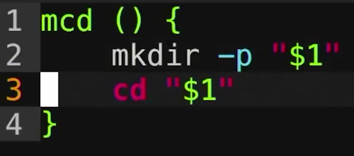

-p是什么意思


<hr style="border: 0; border-top: 5px solid #9333EA; margin: 48px 0 24px 0;">

## 🟣 🤖 AI 回答

在 `mkdir` 命令中，**`-p`** 代表 **`parents`**（父目录/多层路径）。

它主要有两个非常关键的作用：

### 1. 自动递归创建多级父目录

* **不加 `-p`**：如果你想创建多层文件夹（例如 `mkdir a/b/c`），但 `a` 和 `b` 尚不存在，系统会直接报错并拒绝创建：`No such file or directory`。
* **加了 `-p`**：系统会自动沿着路径把中间缺失的父文件夹（`a` 和 `b`）一路顺手建好，最后创建 `c`。

### 2. 文件夹已存在时不报错

* **不加 `-p`**：如果目标文件夹已经存在，执行 `mkdir` 会报错提示：`File exists`。
* **加了 `-p`**：如果文件夹已经存在，系统会直接静默忽略，**不会报错中断**。

### 💡 结合截图中的 `mcd` 函数来看

截图里的 `mcd` 函数是 **`mkdir` + `cd`** 的组合缩写，意思是“创建一个文件夹并立即进入”：

```Bash
mcd () {
    mkdir -p "$1"  # 1. 确保文件夹存在（无论是多级路径，还是已经建好的）
    cd "$1"        # 2. 切换进入该文件夹
}
```

正是因为加了 `-p`，这个函数变得非常方便：

* 你可以直接运行 `mcd project/src/utils`，它会帮你**一次性建好这一整串多级目录**并跳进去；
* 如果目录已经存在，它也不会报错，而是直接帮你 `cd` 进去。


<hr style="border: 0; border-top: 5px solid #2563EB; margin: 48px 0 24px 0;">

## 🔵 👤 用户提问

$?是上一个命令的报错信息吗


<hr style="border: 0; border-top: 5px solid #9333EA; margin: 48px 0 24px 0;">

## 🟣 🤖 AI 回答

**不是“报错信息”（文本），而是上一个命令的“退出状态码”（Exit Status Code）——也就是一个数字。**

它用来告诉系统或脚本：刚才那条命令到底有没有成功执行。

### 1. `$?` 的两种核心取值

* **`0`**：代表上一条命令**执行成功**，没有任何错误。
* **非 `0`（1 ~ 255）**：代表上一条命令**执行失败或报错**，不同的数字代表不同的错误类型。

### 2. 实际对比示例

#### 示例 1：命令成功运行

```Bash
ls ~
# （正常输出了你的家目录内容）

echo $?
# 输出：0 （代表成功）
```

#### 示例 2：命令报错

```Bash
cat non_existent.txt
# 终端打印报错文本：cat: non_existent.txt: No such file or directory

echo $?
# 输出：1 （代表出错了！注意：$? 拿到的只是数字 1，而不是上面的报错文字）
```

### 3. 常见的状态码含义

| 状态码 (`$?`) | 含义 | 常见场景 |
| --- | --- | --- |
| **`0`** | **成功** | 命令完全正常执行完毕 |
| **`1`** | **通用错误** | 权限不足、文件找不到等一般性错误 |
| **`2`** | **语法错误** | 命令参数写错或内置命令使用不当 |
| **`127`** | **命令未找到** | 输入了不存在的命令（如把 `ls` 错拼成 `sl`） |
| **`130`** | **人为中断** | 运行程序时按了 `Ctrl + C` 强制终止 |

### 💡 补充：如果想拿到真正的“报错文字”该怎么做？

在 Shell 中，错误文字是通过标准错误流（stderr / 2）输出的。如果你想在脚本里保存报错文字，需要重定向输出：

```Bash
# 将标准错误（2）重定向并捕获到变量中
error_msg=$(cat non_existent.txt 2>&1)

echo "捕获到的报错文字是: $error_msg"
```


<hr style="border: 0; border-top: 5px solid #2563EB; margin: 48px 0 24px 0;">

## 🔵 👤 用户提问

在多个指令之间放上分号是从左到右按顺序执行吗


<hr style="border: 0; border-top: 5px solid #9333EA; margin: 48px 0 24px 0;">

## 🟣 🤖 AI 回答

**是的，完全是从左到右按顺序依次执行。**

使用分号 `;` 分隔多条指令时，Shell 会遵循以下两个核心规则：

1. **严格按顺序（串行执行）**：系统会先运行第一条指令，等第一条指令完全运行结束（无论耗时多久），才会接着运行第二条，以此类推。
2. **无条件执行（不管报错）**：**即使前面的命令执行失败或报错，后面的命令也依然会照常执行。**

### 💡 简单示例

#### 示例 1：全部正常运行

```Bash
mkdir my_folder ; cd my_folder ; touch file.txt
```

* **过程**：先创建文件夹 $\rightarrow$ 成功后进入文件夹 $\rightarrow$ 再创建文件。

#### 示例 2：即使报错也会继续

```Bash
cat non_existent.txt ; echo "这行依然会打印！"
```

* **过程**：

  1. 执行 `cat non_existent.txt`，终端提示文件不存在（报错）。
  2. 尽管报错，Shell 仍会继续执行下一个命令，终端打印出 **`这行依然会打印！`**。

### 📊 拓展：符号对比速查

在 Linux 命令行中，除了分号 `;`，常用的多命令连接符还有以下几种：

| 符号 | 运行逻辑 | 适用场景 |
| --- | --- | --- |
| **`;`** | **无条件**依次执行 | 纯粹想把几条不相关的命令连起来一次性敲完 |
| **`&&`** | **只有前者成功（退出码 0）**，才执行下一个 | 安全链式操作（如：`编译 && 运行`） |
| **`||`** | **只有前者失败（报错）**，才执行下一个 | 容错/备用逻辑（如：`尝试下载 || 提示失败`） |
| **`&`** | **后台异步**执行（不等待前者完成） | 同时启动多个独立任务 |


<hr style="border: 0; border-top: 5px solid #2563EB; margin: 48px 0 24px 0;">

## 🔵 👤 用户提问

Linux 中有 dev/null 吗


<hr style="border: 0; border-top: 5px solid #9333EA; margin: 48px 0 24px 0;">

## 🟣 🤖 AI 回答

**有的，而且非常常用！** 它的正确完整路径是 **`/dev/null`**（注意开头有一个斜杠 `/`）。

在 Linux 中，`/dev/null` 被称为“黑洞”**、**“空设备”或“数据垃圾桶”。

### 它的两大核心特性

1. **写入它：数据彻底消失**

   任何重定向或发送到 `/dev/null` 的数据都会被系统直接丢弃，**完全不占用任何磁盘空间**。
2. **读取它：立刻返回为空**

   如果你尝试读取 `/dev/null`，它什么都不会输出，会直接返回文件结束符（EOF）。

### 💡 3 个最常见的实用场景

#### 1. 屏蔽输出（保持终端干净）

写脚本或运行命令时，如果你不想让大量的输出或报错信息刷屏，可以把它扔进黑洞：

* **屏蔽正常输出（stdout）**：

  ```Bash
  python3 script.py > /dev/null
  ```
* **屏蔽报错信息（stderr）**（在静默脚本中特别常用）：

  ```Bash
  rm non_existent_file 2> /dev/null
  ```
* **完全静默（普通输出和报错信息全部屏蔽）**：

  ```Bash
  command &> /dev/null
  ```

#### 2. 快速清空文件内容（而不删除文件本身）

如果你有一个几 GB 大的日志文件（如 `app.log`），想清除里面的内容但又不想删除文件，可以用 `/dev/null` 倒进去：

```Bash
cat /dev/null > app.log
```

*(这会瞬间把 `app.log` 清空为 0 字节)*

#### 3. 传入空输入

有些命令会卡在等待用户交互输入的状态，如果你给它重定向 `/dev/null`，它会读取到一个“空”并直接终止或跳过输入：

```Bash
interactive_tool < /dev/null
```


<hr style="border: 0; border-top: 5px solid #2563EB; margin: 48px 0 24px 0;">

## 🔵 👤 用户提问

convert 指令怎么用？


<hr style="border: 0; border-top: 5px solid #9333EA; margin: 48px 0 24px 0;">

## 🟣 🤖 AI 回答

在 Linux 中，**`convert`** 是开源图像处理工具包 **ImageMagick** 中最核心的命令行工具。它可以用于格式转换、调整大小、裁剪、压缩、旋转以及批量处理图片。

如果执行时提示 `command not found`，可以先通过以下命令安装：

```Bash
sudo apt update && sudo apt install imagemagick -y
```

### 基础语法结构

```Bash
convert [输入文件] [处理选项] [输出文件]
```

### 常用高频场景速查

#### 1. 格式转换（直接换后缀即可）

```Bash
# 将 PNG 转为 JPG
convert input.png output.jpg

# 将 WEBP 转为 PNG
convert image.webp image.png

# 将多张图片合并打包为单个 PDF
convert page1.jpg page2.jpg output.pdf
```

#### 2. 调整图片尺寸（`-resize`）

```Bash
# 按百分比等比例缩放（缩小到 50%）
convert input.jpg -resize 50% output.jpg

# 指定最大宽高（保持宽高比，限制在 800x600 范围内）
convert input.jpg -resize 800x600 output.jpg

# 强制指定宽高（忽略原图宽高比，加上叹号 !）
convert input.jpg -resize 800x600! output.jpg
```

#### 3. 压缩图片质量 / 减小体积（`-quality`）

```Bash
# 将 JPG 质量设置为 75%（数值介于 1-100，通常 75-85 能大幅减小体积且肉眼几乎无损）
convert input.jpg -quality 75 compressed.jpg
```

#### 4. 旋转与翻转（`-rotate` / `-flip`）

```Bash
# 顺时针旋转 90 度
convert input.jpg -rotate 90 output.jpg

# 上下翻转
convert input.jpg -flip output.jpg

# 左右镜像翻转
convert input.jpg -flop output.jpg
```

#### 5. 裁剪图片（`-crop`）

```Bash
# 语法：-crop [宽]x[高]+[X偏移量]+[Y偏移量]
# 从坐标 (50, 50) 开始，裁剪出一个 300x200 的区域
convert input.jpg -crop 300x200+50+50 output.jpg
```

#### 6. 合并图片为动态 GIF

```Bash
# 将当前目录下所有 png 图片合成 GIF（帧间隔 20ms，循环播放）
convert -delay 20 -loop 0 *.png animation.gif
```

### 💡 实用进阶技巧：批量处理

如果你想**同时处理整个文件夹里所有的图片**，结合 Bash Shell 脚本会非常方便：

```Bash
# 将当前目录下所有的 .png 批量转换为 .jpg
for img in *.png; do
    convert "$img" "${img%.png}.jpg"
done
```

> ⚠️ **温馨提示**：在较新的 ImageMagick v7 中，官方推荐将命令写作 `magick` 代替 `convert`（例如 `magick input.jpg output.png`），不过在 Ubuntu 系统中 `convert` 作为经典别名依然完全兼容。


<hr style="border: 0; border-top: 5px solid #2563EB; margin: 48px 0 24px 0;">

## 🔵 👤 用户提问

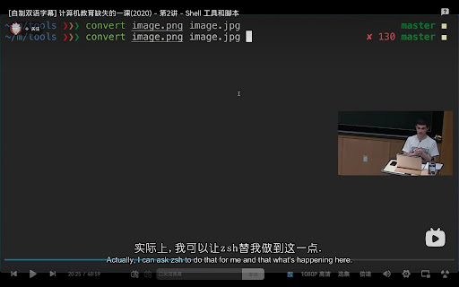

zsh是什么


<hr style="border: 0; border-top: 5px solid #9333EA; margin: 48px 0 24px 0;">

## 🟣 🤖 AI 回答

**Zsh（全称 Z Shell）** 是一种为交互使用和脚本编写设计的 Linux/Unix **Shell 解释器**。

你可以把它看作是你在 WSL 里默认使用的 **Bash 的“终极进阶加强版”**。

### 🔍 结合你这张截图来看 Zsh 的强大之处

这张截图来自著名的 MIT 课程 **《计算机教育缺失的一课》（The Missing Semester）**。讲师屏幕上用的正是 Zsh，注意看屏幕右侧和左侧的细节：

1. **实时显示 Git 状态（右侧的 `master`）**：
   当进入 Git 仓库文件夹时，Zsh 会在终端右侧自动显示当前所处的分支名称。
2. **直观显示上一条命令的状态码（右侧的 `x 130`）**：

   * 还记得我们刚才聊到的 **`$?`** 退出状态码吗？
   * 讲师按下了 `Ctrl + C` 强制终止了 `convert` 命令，Zsh 的主题直接在右侧打出了 **`130`**（代表被用户强制中断），省去了你手动去 `echo $?` 查看！
3. **路径自动缩写（左侧的 `~/m/tools`）**：
   它把原路径（可能是 `~/missing/tools`）自动压缩显示，让命令行界面保持干净整洁。

### 🚀 Zsh 相比默认 Bash 的 4 大核心优势

#### 1. 极其强大的 Tab 自动补全

* **补全提示**：按 Tab 键后不仅能补全文件名，还会弹出菜单让你用键盘**上下左右方向键**去挑选。
* **大小写不敏感**：敲 `cd desktop` 也能自动匹配并补全到 `Desktop` 文件夹。

#### 2. 路径快速简写

* 在 Bash 里进深层目录你需要敲：`cd /usr/local/bin`
* 在 Zsh 里你只需要敲：`cd /u/l/b` 然后按 Tab 键，它会自动帮你展开成 `/usr/local/bin`！

#### 3. 极丰富的插件生态（Oh My Zsh）

通过配合开箱即用的框架 **Oh My Zsh**，你可以安装各种神级插件：

* **`zsh-autosuggestions`（自动历史建议）**：根据你以前敲过的命令，在你输入时用暗灰色显示后续内容，按键盘 `右箭头 →` 直接补全整行。
* **`zsh-syntax-highlighting`（语法高亮）**：命令敲对了显示绿色，敲错了（如拼错命令）直接显示红色提醒。

#### 4. macOS 的默认 Shell

从 macOS Catalina 版本开始，Mac 的默认终端 Shell 就已经从 Bash 全面切换为了 Zsh。

### 💡 总结与兼容性

* **完全兼容 Bash**：你前面学的所有 Bash 命令、语法、变量（比如 `echo $?`、`declare`、`mkdir -p` 等）在 Zsh 里**全部正常通用**。
* **定位**：Bash 是稳重可靠的“标准干活工具”，而 Zsh 是加上了各种高亮、补全、皮肤的主力“效率神器”。


<hr style="border: 0; border-top: 5px solid #2563EB; margin: 48px 0 24px 0;">

## 🔵 👤 用户提问

touch 怎么用？


<hr style="border: 0; border-top: 5px solid #9333EA; margin: 48px 0 24px 0;">

## 🟣 🤖 AI 回答

在 Linux 中，**`touch`** 命令最核心的两个用途是：**“快速创建空文件”** 和 **“更新文件的时间戳”**。

### 常用场景速查

#### 1. 创建全新的空文件（最常用）

如果指定的文件不存在，`touch` 会直接创建一个 0 字节的空文件：

```Bash
touch testing.py
```

#### 2. 一次性创建多个文件

你可以同时传入多个文件名，甚至使用 Shell 括号展开语法批量创建：

```Bash
# 创建三个文件
touch file1.txt file2.txt file3.txt

# 批量创建 demo1.py 到 demo5.py
touch demo{1..5}.py
```

#### 3. 更新已有文件的时间戳

如果文件**已经存在**，再次运行 `touch` **不会覆盖或修改里面的文件内容**，而是会把该文件的“最后修改时间（mtime）”和“最后访问时间（atime）”更新为**当前的系统时间**：

```Bash
touch existing_file.txt
```

*(这在编写 Makefile、自动化构建脚本或触发某种依赖修改时间更新的监控机制时非常有用)*

### 💡 进阶常用选项

* **`-a`（仅更新访问时间 atime）**：

  ```Bash
  touch -a file.txt
  ```
* **`-m`（仅更新修改时间 mtime）**：

  ```Bash
  touch -m file.txt
  ```
* **`-c` / `--no-create`（防误建文件）**：
  只更新已有文件的时间戳；如果文件不存在，则**静默跳过**，不会创建新文件：

  ```Bash
  touch -c maybe_file.txt
  ```
* **`-t`（将时间戳指定为特定时间）**：
  格式为 `[[CC]YY]MMDDhhmm[.ss]`（例如：2026年8月9日 12:30）：

  ```Bash
  touch -t 202608091230 file.txt
  ```

### 📊 拓展小对比：`touch` vs `vim` 创建文件

| 创建方式 | 命令 | 适用场景 |
| --- | --- | --- |
| **`touch file.py`** | 仅创建空文件 | 快速占位、建空脚本、批量建文件（**不打开编辑器**） |
| **`vim file.py`** | 创建并打开文件 | 打算在创建后立刻编写代码内容 |


<hr style="border: 0; border-top: 5px solid #2563EB; margin: 48px 0 24px 0;">

## 🔵 👤 用户提问

正则表达式是什么意思


<hr style="border: 0; border-top: 5px solid #9333EA; margin: 48px 0 24px 0;">

## 🟣 🤖 AI 回答

**正则表达式**（Regular Expression，常缩写为 **Regex** 或 **RegEx**）简单来说，就是**一套用来匹配、查找、替换文本的“通配符模式”或“字符串搜索规则”**。

如果把普通的“查找（Ctrl + F）”比作**精准钓鱼**（搜什么就只能出来什么），那正则表达式就是**用网捕鱼**——你只需要描述“你想要的字符长什么样”，它就能把所有符合规则的文本全部找出来。

## 💡 现实中的类比

你在 Windows 里搜索文件时，可能用过星号 `*`，比如搜索 `*.txt` 代表“查找所有以 `.txt` 结尾的文件”。

正则表达式就是**功能强大 100 倍的 `*` 扩展版**，它不仅能根据后缀搜文件，还能在长篇文本里精准挖掘某种特征的内容。

## 🛠️ 它能解决什么问题？

日常开发和 Shell 脚本中，正则表达式主要用于以下 3 个场景：

1. **数据校验（最常见）**

   * 检查用户在网页上输入的手机号、电子邮箱、身份证号或 IP 地址格式是否合法。
2. **文本提取**

   * 从几万行的服务器日志里，把所有形如 `192.168.x.x` 的 IP 地址或者所有的报错 URL 集中抽出来。
3. **批量替换与清洗**

   * 将文章里所有的 HTML 标签（如 `<p>`、`</div>`）全部擦除，或者把文本里的 `2026-08-09` 批量格式化替换为 `2026/08/09`。

## 🔤 几个最核心的规则符号（极速入门）

正则表达式是由**普通字符**（如字母、数字）和**元字符**（代表特殊规则的控制符）组合而成的。

| 元字符 | 代表的含义 | 举个例子 | 能够匹配的内容 |
| --- | --- | --- | --- |
| **`\d`** | 匹配一个**数字**（0-9） | `\d\d\d` | 匹配像 `123`、`007` 这样的连续 3 个数字 |
| **`\w`** | 匹配字母、数字或下划线 | `\w+` | 匹配一个单词，如 `python` 或 `v2` |
| **`+`** | 匹配前面的规则 **1 次或多次** | `a+` | 匹配 `a`、`aa`、`aaa` 等 |
| **`*`** | 匹配前面的规则 **0 次或多次** | `go*d` | 匹配 `gd`、`god`、`good` |
| **`^`** | 匹配文本的**开头** | `^Hello` | 必须以 `Hello` 开头的行 |
| **`$`** | 匹配文本的**结尾** | `world$` | 必须以 `world` 结尾的行 |
| **`[ ]`** | 字符集合（匹配括号内的任意一个字符） | `[aeiou]` | 匹配任意一个元音字母 |

## 🌟 举两个常用的小例子

### 1. 匹配大陆手机号

规则：`^1[3-9]\d{9}$`

* `^1`：必须以数字 `1` 开头。
* `[3-9]`：第二位数字必须是 3 到 9 之间的任意一个。
* `\d{9}`：后面紧跟 9 个任意数字。
* `$`：到此结束，总共正好 11 位。

### 2. 在 Linux Shell 中用 `grep` 过滤报错

假设你想在日志中找到所有包含 `Error` 或 `ERR` 的行，你可以结合 Linux 命令使用正则：

```Bash
grep -E "E(rror|RR)" app.log
```

## 🐧 在 Linux 命令中的应用

在 Linux 终端里，很多经典命令就是依靠正则表达式发挥神威的：

* **`grep` / `ripgrep`**：文本搜索工具（如 `grep -E "正则"`）。
* **`sed`**：流编辑器，用于正则批量替换文本。
* **`awk`**：强大的文本分析处理工具。


<hr style="border: 0; border-top: 5px solid #2563EB; margin: 48px 0 24px 0;">

## 🔵 👤 用户提问

sudo apt install plocate执行这个命令会占用我很多空间吗


<hr style="border: 0; border-top: 5px solid #9333EA; margin: 48px 0 24px 0;">

## 🟣 🤖 AI 回答

**完全不会！它非常小巧，几乎不怎么占用空间。**

整体算下来，安装并建立索引后，总共占用的磁盘空间通常只有 **十几 MB 到几十 MB**（绝大多数情况下不超过 50 MB）。

### 空间占用详细拆解

`sudo apt install plocate` 的空间占用由两部分组成：

#### 1. 软件本身（安装包与程序）

* **体积**：**约 1 ~ 2 MB**
* 它的程序代码非常轻量，下载和解压几乎是一瞬间就完成。

#### 2. 文件索引数据库（`plocate.db`）

* **体积**：**约 10 MB ~ 50 MB**（取决于你系统里的文件数量）
* `plocate` 会在后台扫描你的所有文件名并生成一个索引数据库（存放在 `/var/lib/plocate/plocate.db`）。
* 因为它采用了现代的高效压缩算法（Zstd），即使你的系统里有几十万甚至上百万个文件，数据库的体积也极其压缩。

### 为什么推荐使用 `plocate`？

* **相比传统命令**：比传统的 `find` 搜索快 **几十倍**（因为它是直接查数据库，而不是去遍历硬盘）。
* **相比旧版 `mlocate`**：数据库体积更小，且搜索速度提高了 10 倍以上。

### 💡 实用小贴士

安装完成后，如果你想查看索引数据库到底占用了多少空间，可以在终端输入：

```Bash
ls -lh /var/lib/plocate/plocate.db
```

> ⚠️ **注意**：刚安装完时，可能需要等待系统自动运行一次 `updatedb`（或者手动敲 `sudo updatedb`）更新数据库后，才能用 `locate` 命令秒搜文件。


<hr style="border: 0; border-top: 5px solid #2563EB; margin: 48px 0 24px 0;">

## 🔵 👤 用户提问

shebang是啥


<hr style="border: 0; border-top: 5px solid #9333EA; margin: 48px 0 24px 0;">

## 🟣 🤖 AI 回答

**Shebang**（也叫 Hashbang）是指 Linux / Unix 脚本文件中**第一行的前两个字符 `#!`**。

简单来说，它的作用就是**告诉操作系统：“请用后面指定的解释器，来运行当前这个脚本文件。”**

### 💡 名称的由来

* **`#`** 在 UNIX 俚语中叫 **Hash**（或者 Sharp）
* **`!`** 在 UNIX 俚语中叫 **Bang**（感叹号）
* 两者合在一起 `#!` 就顺口拼成了 **Shebang**（或 Hashbang）。

### 🔍 常见的 Shebang 格式

在写不同语言的脚本时，第一行放置的 Shebang 会有所不同：

| 脚本类型 | 常见 Shebang 写法 | 含义 |
| --- | --- | --- |
| **Bash 脚本** | `#!/bin/bash` | 用系统的 Bash 解释器执行 |
| **Zsh 脚本** | `#!/bin/zsh` | 用系统的 Zsh 解释器执行 |
| **Python 脚本** | `#!/usr/bin/env python3` | **（推荐）** 自动在系统环境中寻找 Python 3 运行 |
| **Node.js 脚本** | `#!/usr/bin/env node` | 自动在系统环境中寻找 Node.js 运行 |

### 🛠️ 它能带来什么好处？

假设你写了一个 Python 脚本 `hello.py`：

```Python
#!/usr/bin/env python3
print("Hello, Linux!")
```

并将它赋予了可执行权限（`chmod +x hello.py`）：

* **没有 Shebang**：
  你必须在命令行里明确敲出解释器名称：

  ```Bash
  python3 hello.py
  ```

  如果你直接敲 `./hello.py`，操作系统会默认把它当作 Bash 脚本去逐行解析，结果必然报一堆语法错误。
* **加了 Shebang**：
  你可以把脚本**直接当成一个可执行程序**来双击或运行：

  ```Bash
  ./hello.py
  ```

  操作系统读取到第一行的 `#!/usr/bin/env python3` 后，就会悄悄自动调用 `python3 ./hello.py`。

### 💡 极具价值的最佳实践：为什么推荐用 `/usr/bin/env`？

你可能会看到两种 Python 的 Shebang 写法：

1. `#!/usr/bin/python3` （**绝对路径**）
2. `#!/usr/bin/env python3` （**环境查找，推荐**）

**强烈推荐第二种（`#!/usr/bin/env`）**！
因为不同 Linux 发行版（或 macOS、Conda 虚拟环境）中 Python 的安装路径可能千差万别（有的在 `/usr/bin/`，有的在 `/usr/local/bin/`，有的在 Miniconda 路径下）。通过 `env` 命令，系统会自动去当前的 `$PATH` 环境变量里搜寻对应的解释器，**跨平台和移植性最好**。

> ⚠️ **写 Shebang 的唯一铁律**：
> 它**必须是脚本文件的第一行**，且 `#!` 必须是文件的**最开头两个字节**，前面不能有任何空格、空行或缩进！


<hr style="border: 0; border-top: 5px solid #2563EB; margin: 48px 0 24px 0;">

## 🔵 👤 用户提问

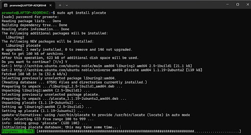

我卡在这里了怎么办


<hr style="border: 0; border-top: 5px solid #9333EA; margin: 48px 0 24px 0;">

## 🟣 🤖 AI 回答

别急，**系统其实并没有死机**，它只是在后台全盘扫描文件建立索引！

注意看屏幕上的提示：

> `Initializing plocate database; this may take some time...`

### 为什么会卡在 78%？

这是因为第一次安装 `plocate` 时，系统会自动运行一次 `updatedb` 来生成文件检索数据库。

在 **WSL（Windows 的 Linux 子系统）** 环境下，`plocate` 不仅会扫描 Linux 内部的文件，还可能会扫描你 Windows 的磁盘映射（比如 `/mnt/c`、`/mnt/d`）。Linux 跨界读取 Windows 几万甚至几十万个文件速度比较慢，所以进度条容易卡在某一个百分比很久。

### 建议的操作步骤

#### 1. 先耐心等待 1 ~ 3 分钟（推荐）

绝大多数情况下，等它扫完 Windows 或某些大文件夹之后，进度条就会突然跳到 **100%** 并完成安装。

#### 2. 如果等了 5 分钟以上依然卡住不懂

说明它可能被某个巨大的 Windows 文件夹卡住了，你可以强制中断它，不会损坏系统：

1. 按键盘 **`Ctrl + C`** 强制打断当前的安装进度。
2. 运行以下命令修复并完成未安装完的包：

   ```Bash
   sudo dpkg --configure -a
   ```
3. 实际上 `plocate` 软件此时已经安装成功了，你可以直接使用 `locate` 命令。

> 💡 **小贴士**：后续使用中，如果想更新搜索数据库，只需在终端敲 `sudo updatedb` 即可。


<hr style="border: 0; border-top: 5px solid #2563EB; margin: 48px 0 24px 0;">

## 🔵 👤 用户提问

我按 Ctrl+C 也结束不了怎么办


<hr style="border: 0; border-top: 5px solid #9333EA; margin: 48px 0 24px 0;">

## 🟣 🤖 AI 回答

`Ctrl + C` 发送的是 `SIGINT` 中断信号。当程序卡在磁盘 I/O（比如正大力扫描 Windows 的 `/mnt/c` 盘）或者被脚本捕获了信号时，`Ctrl + C` 可能会被暂时忽略。

别慌，按照以下步骤可以强制结束它：

### 方法 1：新建一个终端标签页强制杀进程（最有效）

1. 在当前 Windows Terminal 顶部点击 **`+`** 号，或者按快捷键 **`Ctrl + Shift + T`**，打开一个新的 WSL 终端标签页。
2. 在**新打开**的终端里运行以下命令，强制杀死后台的搜索和安装进程：

   ```Bash
   sudo killall -9 updatedb updatedb.plocate apt apt-get
   ```
3. 此时切回原来的终端页面，你会发现原命令已经彻底中断退出了。

### 方法 2：在当前窗口尝试 `Ctrl + Z`（挂起后再杀）

如果不想开新窗口，可以尝试：

1. 按键盘 **`Ctrl + Z`**（这会强制将当前的进程挂起并推到后台）。
2. 如果成功退出了界面，接着输入以下命令把挂起的任务杀掉：

   ```Bash
   sudo killall -9 apt updatedb
   ```

### 方法 3：终极招式（重启 WSL）

如果整个终端窗口都卡住没有任何反应，说明 WSL 的网络或文件系统卡死了，直接在 Windows 侧重启 WSL：

1. 在 Windows 桌面按下 **`Win + R`**，输入 **`powershell`** 并回车。
2. 在 PowerShell 里运行：

   ```PowerShell
   wsl --shutdown
   ```
3. 重新打开 Ubuntu 即可。

### ⚠️ 注意：结束之后一定要做这一步修复！

强制杀死 `apt` 或 `updatedb` 后，系统的软件包管理器会留下一条“未完成”的锁。**请务必在终端里运行这一行命令来自动修复锁**：

```Bash
sudo dpkg --configure -a
```

修复完成后，`plocate` 软件本身其实已经装好了，你可以直接运行 `locate 文件名` 试试！


<hr style="border: 0; border-top: 5px solid #2563EB; margin: 48px 0 24px 0;">

## 🔵 👤 用户提问

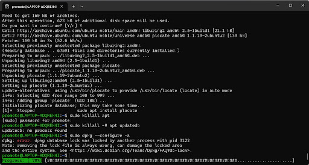


<hr style="border: 0; border-top: 5px solid #9333EA; margin: 48px 0 24px 0;">

## 🟣 🤖 AI 回答

这是因为你刚才按的 `Ctrl + Z` **只是把任务“暂停（挂起）”了，并没有真正杀死它**。

从报错信息可以看到：`pid 3122` 这个进程（就是那个被暂停的 `apt` / `dpkg` 任务）依然活在后台，并且一直死死占着系统安装锁，所以 `dpkg` 提示锁被占用。

### 简单 3 步彻底解决

请直接在当前终端依次复制运行以下几行命令：

#### 1. 强制杀死占用锁的 PID 3122 进程

```Bash
sudo kill -9 3122
```

#### 2. 清理可能残余的相关后台进程

```Bash
sudo killall -9 dpkg apt updatedb.plocate 2>/dev/null
```

#### 3. 重新修复并解锁系统

```Bash
sudo dpkg --configure -a
```

### 💡 运行完这 3 步会发生什么？

在运行第 3 步 `sudo dpkg --configure -a` 时，系统会自动接管未完成的配置，并顺利退出。

完成之后，`plocate` 实际上已经安装成功了！你可以直接运行下面这行命令测试一下：

```Bash
locate --version
```

如果能正常显示版本号，就说明一切恢复正常，可以愉快的秒搜文件了！


<hr style="border: 0; border-top: 5px solid #2563EB; margin: 48px 0 24px 0;">

## 🔵 👤 用户提问

我能不能直接关闭该终端然后再开一个Ubuntu修复？


<hr style="border: 0; border-top: 5px solid #9333EA; margin: 48px 0 24px 0;">

## 🟣 🤖 AI 回答

**可以，完全没问题！** 直接把当前这个终端窗口关掉没有任何风险。

当你关闭终端窗口时，Linux 会自动清理并强行终止在该窗口下挂起的所有任务（包括刚才卡住的 PID 3122 进程）。

### 重新打开 Ubuntu 后的修复步骤

1. **直接关闭当前终端窗口**，然后重新打开一个新的 Ubuntu 终端。
2. 在新终端中直接运行以下修复命令：

   ```Bash
   sudo dpkg --configure -a
   ```
3. 验证是否修复成功：

   ```Bash
   locate --version
   ```

   看到输出了版本号，就说明 `plocate` 已经完全安装并配置好了！

> 💡 **极小概率的补充**：如果重开新终端后运行 `sudo dpkg --configure -a` 依然提示锁被占用，说明后台有残余进程，只需先运行一次 `sudo killall -9 apt dpkg`，然后再重新执行 `sudo dpkg --configure -a` 即可。


<hr style="border: 0; border-top: 5px solid #2563EB; margin: 48px 0 24px 0;">

## 🔵 👤 用户提问

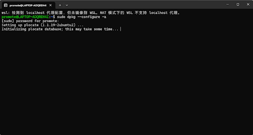

这次直接卡在这里了


<hr style="border: 0; border-top: 5px solid #9333EA; margin: 48px 0 24px 0;">

## 🟣 🤖 AI 回答

这还是因为 `plocate` 在完成最后一步时，自动触发了后台索引扫描（`updatedb`），而它正试图扫描你 Windows 的 C 盘和 D 盘（路径在 `/mnt/c`、`/mnt/d`）。WSL 跨界扫描几万个 Windows 文件极其缓慢，所以看起来就像卡死了一样。

只要**禁止它扫描 Windows 的 `/mnt` 目录**，问题就能根本解决。按以下 3 步操作即可：

### 🛠️ 彻底解决步骤

#### 1. 杀掉卡住的扫描进程

1. 按键盘 **`Ctrl + Shift + T`** 打开一个新的终端标签页。
2. 在新标签页里运行以下命令，强制杀掉正在扫盘的进程：

   ```Bash
   sudo killall -9 updatedb updatedb.plocate
   ```
3. 切回原来卡住的那个标签页，你会发现它已经中断并退回到了提示符。

#### 2. 修改配置：禁止扫描 Windows 磁盘（核心）

在终端中执行下面这行命令，将 `/mnt`（Windows 磁盘挂载目录）直接加入 `plocate` 的忽略名单：

```Bash
sudo sed -i 's|PRUNEPATHS="|PRUNEPATHS="/mnt |' /etc/updatedb.conf
```

> 💡 **原理**：修改 `/etc/updatedb.conf` 里的 `PRUNEPATHS` 参数，让系统生成索引时跳过 `/mnt`，只建立 Linux 内部文件的索引。

#### 3. 重新运行修复命令

再次执行修复，这次因为不用扫描 Windows 盘，**几秒钟就能瞬间完成**：

```Bash
sudo dpkg --configure -a
```

完成之后，输入 `locate --version`，如果正常输出了版本号，说明 `plocate` 已经完美配置完毕，以后再也不会卡住了！


<hr style="border: 0; border-top: 5px solid #2563EB; margin: 48px 0 24px 0;">

## 🔵 👤 用户提问

我直接 Ctrl+C 结束了，现在该做什么？


<hr style="border: 0; border-top: 5px solid #9333EA; margin: 48px 0 24px 0;">

## 🟣 🤖 AI 回答

直接按 `Ctrl+C` 打断是完全没问题的！既然已经退出了卡住的状态，现在按顺序输入下面 3 行命令，就能彻底配置好：

运行下面这行命令，把 `/mnt`（Windows 磁盘挂载路径）加入 `plocate` 的忽略名单：

```Bash
sudo sed -i 's|PRUNEPATHS="|PRUNEPATHS="/mnt |' /etc/updatedb.conf
```

避开 Windows 盘之后，再次运行修复命令，几秒钟就能瞬间完成：

```Bash
sudo dpkg --configure -a
```

检查 `locate` 命令是否可以正常工作：

```Bash
locate --version
```

> 💡 **小贴士**：修改配置后，`locate` 会专注于检索你 Ubuntu 内部的文件，以后无论是在后台更新数据库还是用它搜文件，速度都非常快！

