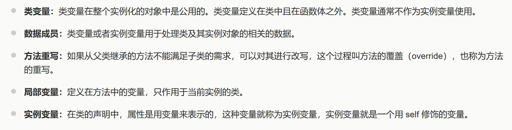
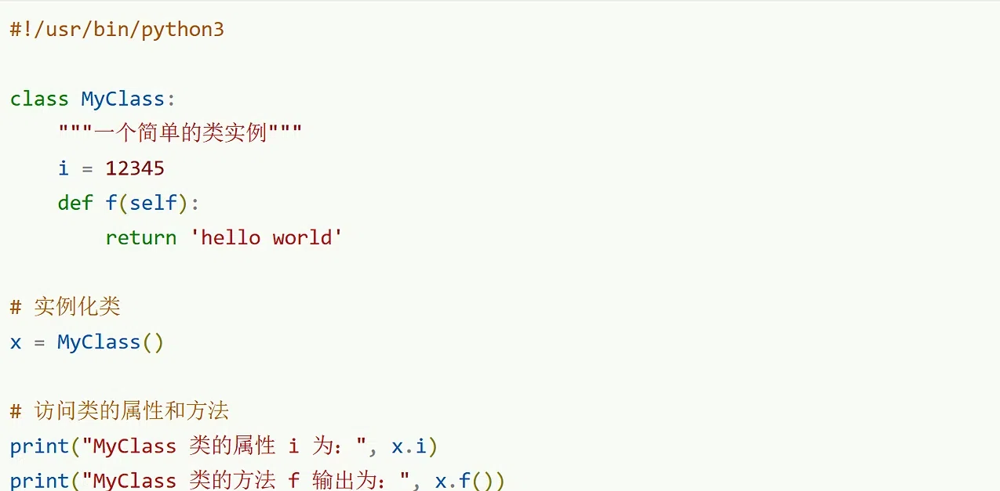

# AI 对话可续接记忆

- 后端：siliconflow
- 模型：Qwen/Qwen3-8B
- 来源：export.md
- 消息数：10
- 分块数：1
- 对话类型：编程学习、媒体分析

## 总览

用户正在学习面向对象编程中的类变量、实例变量和局部变量的区别，并了解了 Python 之禅的哲学思想及其在编程中的体现。AI 已经详细解释了这些概念的定义、作用域、生命周期和访问方式，并通过代码示例帮助用户理解。用户确认了 i 是类变量，AI 也解释了类变量与实例变量的修改方式。此外，AI 介绍了 Python 之禅的完整内容和核心思想，强调了代码的可读性、简洁性和实用性。

## 当前对话断点与工作状态

- 当前活动：用户最近提出：介绍一下Python 之禅（import this） `[来源：用户明确提供｜状态：已确认｜消息：9]`
- 已到阶段：上一 AI 已回答最近一轮用户问题 `[来源：上一 AI 陈述｜状态：上一 AI 已回答｜消息：10]`
- 下一步：用户可能需要进一步理解 Python 之禅的具体内容或其在实际编程中的应用 `[来源：用户明确提供｜状态：上一 AI 已回答｜消息：9]`
- 最后一条用户消息：消息 9；介绍一下Python 之禅（import this）
- 最新消息：消息 10；角色 AI；最后用户轮已获回答：是
- 断点状态：complete

### 已完成/已执行

- 用户学习了类变量、实例变量和局部变量的定义与区别 `[来源：上一 AI 陈述｜状态：上一 AI 已回答｜消息：6]`
- 用户确认了 i 是类变量 `[来源：用户明确提供｜状态：已确认｜消息：7]`
- AI 解释了类变量 i 的定义与访问方式 `[来源：上一 AI 陈述｜状态：上一 AI 已回答｜消息：8]`
- AI 介绍了 Python 之禅的哲学思想及其在编程中的体现 `[来源：上一 AI 陈述｜状态：上一 AI 已回答｜消息：10]`

## 分主题摘要

### 面向对象编程与 Python 之禅学习记忆整理

用户学习了面向对象编程中的数据成员、类变量、实例变量和局部变量的区别，并了解了 Python 之禅的哲学思想及其在编程中的体现。

- 来源消息：1~10

### 用户询问类变量、实例变量和局部变量的区别

用户询问了类变量、实例变量和局部变量的区别，AI 给出了详细的对比表格和代码示例。

- 来源消息：5, 6

### 用户确认 i 是类变量

用户确认了 i 是类变量，AI 给出了详细解释。

- 来源消息：7, 8

### Python 之禅的完整内容

AI 提供了 Python 之禅的完整内容和翻译，帮助用户理解其哲学思想。

- 来源消息：9, 10

### Python 之禅与面向对象编程的关系

AI 提供了 Python 之禅在面向对象编程中的体现，如命名空间、代码可读性等。

- 来源消息：9, 10

## 媒体与附件说明（开发检查）

### M001｜消息 1｜image

- 来源：用户消息
- 标签：image.png
- 图片：
- 状态：described；本地可访问，可重新验证
- 内容说明：用户上传了一张图片“image.png”；以下为模型视觉识别结果，其中 OCR 字符可能存在误差：标题为“面向对象技术简介”，内容包含五个要点：类（Class）的定义、方法的定义、类变量的说明、数据成员的用途、方法重写的概念。
- 上一 AI 结论（消息 2）（uncertain）：数据成员就是类里面用来存放数据的变量

### M002｜消息 5｜image

- 来源：用户消息
- 标签：image.png
- 图片：
- 状态：described；本地可访问，可重新验证
- 内容说明：用户上传了一张图片“image.png”；以下为模型视觉识别结果，其中 OCR 字符可能存在误差：内容与 M001 部分重复，新增了“局部变量”和“实例变量”两个要点。局部变量定义在方法中，作用于当前实例的类；实例变量在类声明中用 self 修饰。
- 上一 AI 结论（消息 6）（uncertain）：类变量定义在类中，函数体外；实例变量用 self 修饰；局部变量定义在方法中

### M003｜消息 7｜image

- 来源：用户消息
- 标签：image.png
- 图片：
- 状态：described；本地可访问，可重新验证
- 内容说明：用户上传了一张图片“image.png”；以下为模型视觉识别结果，其中 OCR 字符可能存在误差：显示一段 Python 代码，定义了一个名为 MyClass 的类，包含一个类变量 i 和一个方法 f。代码随后实例化该类，并打印了类的属性 i 和方法 f 的输出结果。
- 上一 AI 结论（消息 8）（uncertain）：i 是类变量

## 细节记忆（可选）

以下仅保留有助于继续任务的关键细节，已合并重复内容：

- **用户信息｜用户确认 i 是类变量**：用户确认了 i 是类变量，AI 给出了详细解释。
- **历史问答｜用户询问类变量、实例变量和局部变量的区别**：用户询问了类变量、实例变量和局部变量的区别，AI 给出了详细的对比表格和代码示例。
- **上一 AI 回答｜用户上传的图片内容**：用户上传了三张图片，分别涉及面向对象技术简介、类变量与实例变量的区分、以及类变量 i 的判断。
- **上一 AI 回答｜Python 之禅的定义与内容**：Python 之禅是一首由19条格言组成的短诗，体现了Python的编程哲学。
- **上一 AI 回答｜Python 之禅的核心思想**：Python 之禅的核心思想包括：可读性至上、明确优于隐晦、克制与实用并存。
- **上一 AI 回答｜Python 之禅的编程哲学**：Python 之禅强调代码的可读性和简洁性，主张“优美胜于丑陋”、“明了胜于晦涩”。
- **上一 AI 回答｜Python 之禅与命名空间的关系**：Python 之禅的最后一条强调命名空间的重要性，类和实例本质上是命名空间。
- **上一 AI 回答｜Python 之禅的完整内容**：AI 提供了 Python 之禅的完整内容和翻译，帮助用户理解其哲学思想。
