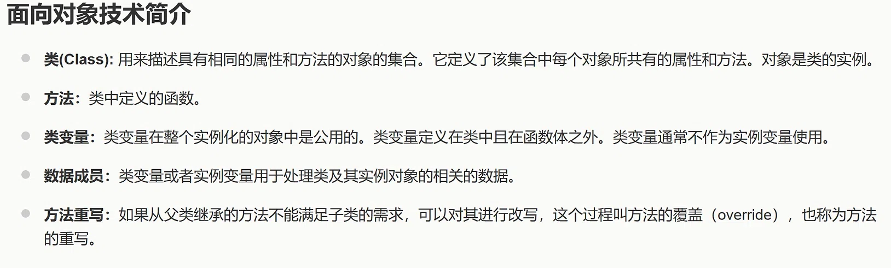

# AI 对话记忆导出


<hr style="border: 0; border-top: 5px solid #2563EB; margin: 48px 0 24px 0;">

## 🔵 👤 用户提问



解释一下数据成员


<hr style="border: 0; border-top: 5px solid #9333EA; margin: 48px 0 24px 0;">

## 🟣 🤖 AI 回答

结合图片中的定义以及面向对象编程（OOP）的通用概念，为您详细解释一下**数据成员（Data Member）**。

### 1. 图片中的定义

图片中写道：**“类变量或者实例变量用于处理类及其实例对象的相关数据。”**

这句话的核心意思是：**数据成员就是类里面用来存放数据的变量**。如果把类比作一个“设计方案”，那么数据成员就是这个方案中规定的“属性”或“状态”。

### 2. 数据成员的分类

根据图片内容，数据成员可以分为两类：

* **类变量（Class Variable）**：

  + **定义**：定义在类中，但在所有函数体（方法）之外。
  + **特点**：在整个类的所有实例化对象中是**公用**的（只有一份）。修改它，所有该类的对象都会受到影响。
  + **图片补充**：图片特别提到“类变量通常不作为实例变量使用”，这意味着在规范编程中，应该明确区分哪些数据是所有对象共享的，哪些是每个对象独有的。
* **实例变量（Instance Variable）**：

  + **定义**：通常定义在类的构造函数或方法内部（以 `self` 或 `this` 修饰）。
  + **特点**：每个实例对象（实例）都有自己**独立的一份**。修改对象A的实例变量，不会影响对象B。

### 3. 与“方法”的对比

图片中同时定义了**方法**（类中定义的函数）。

* **数据成员（变量）** 负责描述“**是什么（状态/属性）**”。例如：一个“学生”有姓名、年龄、学号。
* **方法（函数）** 负责描述“**能做什么（行为）**”。例如：一个“学生”可以“上课”、“考试”。

### 4. 举例说明（通俗理解）

假设我们有一个类叫 `Student`（学生）：

```
class Student:
    # 1. 类变量（数据成员的一种）
    school_name = "清华大学"  # 所有学生共享的学校名称

    def __init__(self, name, age):
        # 2. 实例变量（数据成员的一种）
        self.name = name  # 每个学生独有的名字
        self.age = age    # 每个学生独有的年龄
```

在上面的代码中，`school_name`、`name` 和 `age` **统称为这个类的数据成员**。

* `school_name` 是类变量，张三和李四的 `school_name` 都是"清华大学"。
* `name` 和 `age` 是实例变量，张三的 `name` 是"张三"，李四的 `name` 是"李四"，它们互不干扰。

### 5. 总结其存在的意义

数据成员的作用就是**封装数据**。通过将数据（数据成员）和处理这些数据的逻辑（方法）绑定在同一个类中，保证了数据的安全性和代码的模块化，这也是面向对象技术（OOP）的核心思想之一。


<hr style="border: 0; border-top: 5px solid #2563EB; margin: 48px 0 24px 0;">

## 🔵 👤 用户提问

类的实例是对象吗


<hr style="border: 0; border-top: 5px solid #9333EA; margin: 48px 0 24px 0;">

## 🟣 🤖 AI 回答

**是的，类的实例就是对象。**

这在您刚刚提供的图片第一点中其实已经给出了明确的答案：**“对象是类的实例。”**

为了帮您更透彻地理解，我们可以从以下几个角度来梳理：

### 1. 概念上的关系

* **类（Class）是模板/图纸**：它只是一个抽象的概念，定义了这类事物应该具备哪些属性（数据成员）和哪些行为（方法）。它本身不占用具体的内存空间来存放实际数据。
* **对象（Object）是实体/产品**：它是根据这张“图纸”实际制造出来的具体事物。在面向对象编程中，**通过类创建对象的过程叫做“实例化”，而创建出来的结果就叫“实例”（Instance）**。因此，“对象”和“类的实例”在日常交流中通常可以画等号。

### 2. 通俗的比喻

* 如果把**“汽车图纸”**看作**类（Class）**。
* 那么根据这张图纸生产出来的**“一辆具体的、红色的、车牌号是沪A12345的汽车”**就是**对象（Object）**，也就是**类的实例（Instance）**。
* 你可以根据同一张图纸（类）生产出无数辆汽车（对象/实例），它们结构相同，但具体的颜色、车牌、行驶里程（实例变量）可能各不相同。

### 3. 代码体现

结合刚才我们聊到的数据成员的例子：

```
class Student:  # 定义了一个类（图纸）
    def __init__(self, name):
        self.name = name

# 下面开始实例化：
student1 = Student("张三")  # student1 就是一个对象，也是 Student 类的一个实例
student2 = Student("李四")  # student2 是另一个对象，也是 Student 类的另一个实例
```

* `Student` 是类。
* `student1` 和 `student2` 是具体的对象。
* 它们都是 `Student` 类的实例。

**总结：**  
当我们在代码中写 `对象 = 类名()` 时，我们就完成了一次“实例化”，内存中分配了实际空间，这个 `对象` 就是一个实实在在的 `实例`。所以在面向对象编程中，**类的实例 == 对象**。


<hr style="border: 0; border-top: 5px solid #2563EB; margin: 48px 0 24px 0;">

## 🔵 👤 用户提问


区分一下类变量、局部变量、实例变量


<hr style="border: 0; border-top: 5px solid #9333EA; margin: 48px 0 24px 0;">

## 🟣 🤖 AI 回答

结合您提供的图片以及面向对象编程（OOP）的通用知识，我们通过**定义位置**、**作用域/生命周期**以及**共享方式**来区分这三个概念。

首先需要指出，图片中关于“局部变量：只作用于当前实例的类”的表述**不太严谨**（局部变量通常只作用于它所在的那个方法内部），我们在下面的详细对比中会予以纠正。

### 一、 核心对比表格

| 维度 | 类变量 (Class Variable) | 实例变量 (Instance Variable) | 局部变量 (Local Variable) |
| --- | --- | --- | --- |
| **定义位置** | 类中，但在所有函数体（方法）**之外** | 类的方法内部（通常用 `self` 修饰） | 方法（函数）内部，或者代码块中 |
| **作用范围** | 整个类及所有实例对象 | 特定的实例对象（每个对象独立一份） | 仅限于定义它的那个方法内部 |
| **生命周期** | 随类的加载而创建，随程序结束销毁 | 随对象的创建而创建，随对象被垃圾回收而销毁 | 随方法的调用而创建，方法执行完毕立即销毁 |
| **共享方式** | 所有该类的实例**共享**同一份数据 | 每个实例**独享**自己的一份数据 | 不共享，方法内的私有数据 |
| **修饰方式** | 无特殊修饰（在Python中直接写） | 通常用 `self.变量名`（Python）或 `this.变量名`（Java） | 直接写变量名，无修饰 |

---

### 二、 结合图片定义的详细解析

#### 1. 类变量（图片定义：类中且在函数体之外，实例化对象中公用）

* **特点**：它是属于**类（图纸）**的，而不是属于某个具体的**对象（产品）**。
* **使用场景**：通常用于存储所有对象都需要共享的数据。例如，`Student`（学生）类中，`school_name = "清华大学"` 就是一个类变量，张三、李四两个学生对象都共享这个学校名称。
* **注意**：图片中提醒“类变量通常不作为实例变量使用”，意思是不要在实例方法里随意修改类变量，否则容易引起全局数据混乱。

#### 2. 实例变量（图片定义：用 self 修饰的变量）

* **特点**：它是属于**特定对象**的。每个对象都有自己独立的一份实例变量，互不干扰。
* **使用场景**：用于描述对象独有的属性。例如，`Student` 类中的 `self.name`（姓名）、`self.age`（年龄），张三的名字叫“张三”，李四叫“李四”，不能混用。
* **注意**：图片中提到“在类的声明中，属性是用变量来表示的，这种变量就称为实例变量”，这揭示了实例变量的本质：它就是对象的“属性”。

#### 3. 局部变量（图片定义：定义在方法中，只作用于当前实例的类 —— 需纠偏）

* **特点**：它是在方法（函数）内部临时创建的变量。
* **使用场景**：用于方法执行过程中的临时计算或数据存储。
* **图片纠偏**：图片说它“只作用于当前实例的类”是不准确的。**局部变量的作用域仅仅局限于定义它的那个方法内部**。离开了这个方法，局部变量就会被销毁，连同一个类的其他方法都访问不到它。

---

### 三、 代码示例对比（以Python为例）

```
class Student:
    # 1. 类变量：定义在类中，函数体外
    school_name = "清华大学"  

    def __init__(self, name, age):
        # 2. 实例变量：用 self 修饰，每个对象独享
        self.name = name  
        self.age = age    

    def study(self):
        # 3. 局部变量：定义在方法内部
        subject = "数学"  # 局部变量
        print(f"{self.name} 正在学习 {subject} 在 {self.school_name}")

# 实例化对象
stu1 = Student("张三", 18)
stu2 = Student("李四", 19)

# 访问类变量
print(Student.school_name)  # 输出：清华大学

# 访问实例变量
print(stu1.name)  # 输出：张三
print(stu2.name)  # 输出：李四

# 局部变量无法在外部访问
# print(subject)  # 报错：NameError: name 'subject' is not defined
```

### 四、 一句话通俗总结

* **类变量**：大家共用的（比如学校名称）。
* **实例变量**：自己独有的（比如自己的名字）。
* **局部变量**：临时借用的（比如算题时在草稿纸上写下的中间结果，算完就扔了）。


<hr style="border: 0; border-top: 5px solid #2563EB; margin: 48px 0 24px 0;">

## 🔵 👤 用户提问


i 是类变量，对吗？


<hr style="border: 0; border-top: 5px solid #9333EA; margin: 48px 0 24px 0;">

## 🟣 🤖 AI 回答

**是的，非常正确！** `i` 就是一个**类变量**。

结合您提供的代码和之前讨论的定义，我们可以这样分析：

### 1. 为什么它是类变量？

* **定义位置**：在代码中，`i = 12345` 直接写在 `class MyClass:` 的下面，并且在所有方法（也就是 `def f(self):`）的**外部**。这完全符合类变量的定义（“类变量定义在类中且在函数体之外”）。
* **归属**：它属于 `MyClass` 这个类本身，而不是属于某个特定的对象。

### 2. 在代码中的表现

```
class MyClass:
    i = 12345  # 类变量，所有实例共享这一份数据
    def f(self):
        ...
```

当您实例化 `x = MyClass()` 并通过 `x.i` 访问时，Python 的查找机制是这样的：

* 它首先看实例 `x` 自己有没有 `i`（没有）。
* 然后去 `x` 所属的类 `MyClass` 中找，找到了 `i = 12345`，所以输出 12345。
* 这就解释了为什么图片里说“类变量在整个实例化的对象中是公用的”。

### 3. 类变量 vs 实例变量（结合这段代码的延伸）

为了加深理解，假设我们在类外部做如下修改：

```
x = MyClass()
y = MyClass()

print(x.i)  # 输出 12345
print(y.i)  # 输出 12345

# 情况一：通过类名修改类变量
MyClass.i = 999
print(x.i)  # 输出 999 (因为i是类变量，被改变了，所有实例访问到的都变了)

# 情况二：通过实例名“修改”i（这是一个坑！）
x.i = 888   # 这不会改变类变量 MyClass.i，而是在实例 x 中新建了一个“实例变量” i
print(x.i)  # 输出 888 （x 现在优先使用自己的实例变量 i）
print(y.i)  # 输出 999 （y 依然使用类变量 i）
print(MyClass.i) # 输出 999 （类变量 i 仍然是 999）
```

### 4. 结合图片中的提示

图片里有一句话：“**类变量通常不作为实例变量使用**”。  
意思就是，像 `i = 12345` 这样定义好后，最好当做一个全局的常量或者共享状态来读取（比如通过 `MyClass.i` 去读）。**尽量避免像上面“情况二”那样，通过 `x.i = 888` 去赋值修改**，因为那样会在实例中偷偷创建一个同名的实例变量，把类变量“遮蔽（Shadow）”起来，容易引起代码混乱，这也正是您在图片里之前看到那句警告的原因。

**总结**：在这个简单的代码例子中，`i` 是典型的类变量，`f` 是方法（函数），`x` 是实例对象。


<hr style="border: 0; border-top: 5px solid #2563EB; margin: 48px 0 24px 0;">

## 🔵 👤 用户提问

介绍一下Python 之禅（import this）


<hr style="border: 0; border-top: 5px solid #9333EA; margin: 48px 0 24px 0;">

## 🟣 🤖 AI 回答

在Python的世界里，**Python之禅（The Zen of Python）** 是一份极其著名的“编程哲学指南”。它由Python核心开发者 Tim Peters 在1999年编写，是一首由19条格言组成的短诗。

你只需在Python的交互式命令行（或终端）中输入 `import this`，就可以召唤出这段隐藏的“心法”。

### 一、 完整内容与翻译

输入 `import this` 后，你会看到以下内容（附带中文意译）：

> **The Zen of Python, by Tim Peters**
>
> Beautiful is better than ugly.  
> **优美胜于丑陋**（代码要优雅，不要写得像一坨乱码）
>
> Explicit is better than implicit.  
> **明了胜于晦涩**（代码意图要清晰，不要藏着掖着）
>
> Simple is better than complex.  
> **简单胜于复杂**（能简单解决就不要搞复杂）
>
> Complex is better than complicated.  
> **复杂胜于凌乱**（如果问题本身就复杂，那就接受它的复杂，但不要写得一团糟）
>
> Flat is better than nested.  
> **扁平胜于嵌套**（尽量少用多层嵌套的if/for，代码层级越平越好）
>
> Sparse is better than dense.  
> **间隔胜于紧凑**（适当留白，不要把一百行逻辑塞进一行里）
>
> Readability counts.  
> **可读性很重要**（代码是给人看的，顺便能在机器上运行）
>
> Special cases aren't special enough to break the rules.  
> **特例并不足以打破规则**（不要为了个别情况随意破坏整体设计）
>
> Although practicality beats purity.  
> **虽然实用胜过纯粹**（但也不能死守规则，实际需要时该变通就变通）
>
> Errors should never pass silently.  
> **错误不应该被静默地忽略**（遇到异常要抛出，不要装作没看见）
>
> Unless explicitly silenced.  
> **除非明确地忽略**（除非你真的故意想忽略它，并明确写了处理逻辑）
>
> In the face of ambiguity, refuse the temptation to guess.  
> **面对模棱两可，拒绝猜测的诱惑**（不要猜代码会怎么跑，要把逻辑写死、写明确）
>
> There should be one-- and preferably only one --obvious way to do it.  
> **应当有且仅有一种——最好只有一种——显而易见的做法**（这也是Python的设计核心）
>
> Although that way may not be obvious at first unless you're Dutch.  
> **尽管这种方式一开始可能并不明显，除非你是荷兰人**（幽默梗：Python之父Guido van Rossum是荷兰人）
>
> Now is better than never.  
> **现在做总比不做好**（不要拖延，先让代码跑起来）
>
> Although never is often better than *right* now.  
> **尽管“从不”往往比“立刻”更好**（警告：不要在没想清楚前草率动手，过早优化是万恶之源）
>
> If the implementation is hard to explain, it's a bad idea.  
> **如果实现很难解释，那它就是个坏主意**（解释不清说明设计有问题）
>
> If the implementation is easy to explain, it may be a good idea.  
> **如果实现容易解释，那它可能是个好主意**
>
> Namespaces are one honking great idea -- let's do more of those!  
> **命名空间是一个绝妙的主意——让我们多做一些吧！**

---

### 二、 核心思想提炼

这19条并非死板的数学定律，而是Python社区的**文化共识**。总结起来主要是三点：

1. **可读性至上 (Readability counts)**：Python的设计哲学认为，代码被阅读的次数远远多于被编写的次数。所以，放弃炫技，追求直观、优雅。
2. **明确优于隐晦 (Explicit is better than implicit)**：这解释了为什么Python要求方法必须显式地用 `self` 传参（而不像Java或C++隐式隐藏 `this`），为什么Python没有隐式的类型转换。
3. **克制与实用并存**：既追求简单纯粹，又承认现实工程的复杂性（“虽然实用胜过纯粹”）。

---

### 三、 结合你之前学习的OOP概念

结合你正在学的类、实例、变量，Python之禅在面向对象编程中有着直接的体现：

* **命名空间（最后一条）**：你之前学的**类（Class）**和**实例（Instance）**，本质上就是在创建“命名空间”。类提供了一个独立的命名空间存放类变量和实例变量，解决了变量名冲突的问题。
* **明了胜于晦涩**：这就是为什么在写类的时候，我们强烈建议区分**类变量**和**实例变量**（加 `self.`），而不是让它们混在一起让人猜。
* **如果实现很难解释，那它就是个坏主意**：如果你写的一个类继承关系极度复杂（多重继承、深层次嵌套），导致别人根本看不懂它的数据成员和方法是怎么流转的，那就说明类的设计违背了Python之禅，需要重构（Refactor）。

下次写代码时，如果不知道怎么写更“Pythonic”（地道），不妨在脑海中回忆一下这首诗。输入 `import this` 随时复习！

