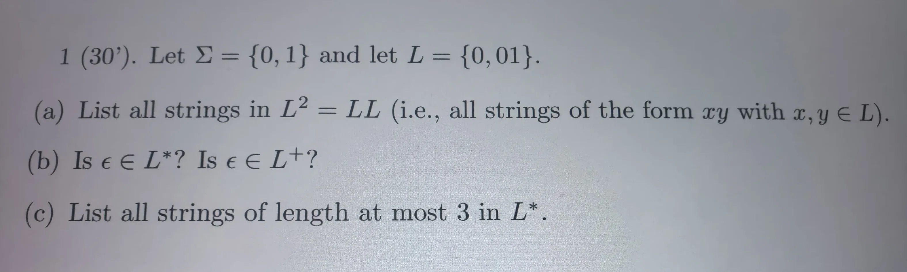

# AI 对话记忆导出

## 🔵 👤 用户提问

翻译并完成

## 🟣 🤖 AI 回答

以下是题目的翻译以及详细解答：

### 翻译

1 (30分). 设 $\Sigma = \{0, 1\}$，令 $L = \{0, 01\}$。

(a) 列出 $L^2 = LL$ 中的所有字符串（即所有形式为 $xy$ 的字符串，其中 $x, y \in L$）。  
(b) $\epsilon \in L^*$ 吗？$\epsilon \in L^+$ 吗？  
(c) 列出 $L^*$ 中所有长度至多为 3 的字符串。

---

### 解答

#### (a) 列出 $L^2 = LL$ 中的所有字符串

$L^2$ 表示从 $L$ 中取两个字符串进行拼接（$x$ 和 $y$ 均取自 $L$）。  
已知 $L = \{0, 01\}$，那么：

* 当 $x = 0, y = 0$ 时，$xy = 00$
* 当 $x = 0, y = 01$ 时，$xy = 001$
* 当 $x = 01, y = 0$ 时，$xy = 010$
* 当 $x = 01, y = 01$ 时，$xy = 0101$

**答案：** $L^2 = \{00, 001, 010, 0101\}$

#### (b) $\epsilon \in L^*$ 吗？$\epsilon \in L^+$ 吗？

* **$L^*$ (Kleene星号)**：表示由 $L$ 中的字符串拼接零次或多次得到的所有字符串的集合。根据定义，拼接零次即为空字符串 $\epsilon$。因此，**$\epsilon \in L^*$ 是成立的**（无论 $L$ 是什么，空串总是属于 $L^*$）。
* **$L^+$ (Kleene加号)**：表示由 $L$ 中的字符串拼接一次或多次得到的所有字符串的集合。即 $L^+ = L^* \setminus \{\epsilon\}$。因为 $L = \{0, 01\}$ 中不包含空串 $\epsilon$，拼接一次或多次不可能产生空串。因此，**$\epsilon \notin L^+$**。

**答案：** $\epsilon \in L^*$ 是；$\epsilon \in L^+$ 否。

#### (c) 列出 $L^*$ 中所有长度至多为 3 的字符串

$L^*$ 中的字符串是由 $L$ 中的元素（$0$ 或 $01$）拼接任意次（包括0次）组成的。我们需要找出长度 $\le 3$ 的所有字符串。

按长度分类进行枚举：

* **长度为 0**：$\epsilon$ （拼接0次）
* **长度为 1**：$0$ （取自 $L$ 本身）
* **长度为 2**：$00$（$0+0$），$01$（取自 $L$ 本身）
* **长度为 3**：

  + 由三个长度为1的字符串拼接：$0+0+0 = 000$
  + 由一个长度为1和一个长度为2的字符串拼接：$0+01 = 001$；$01+0 = 010$
  + （注：$01+01 = 0101$ 长度为4，不符合要求）

**答案：** 长度至多为 3 的字符串集合为 $\{\epsilon, 0, 00, 01, 000, 001, 010\}$

## 🔵 👤 用户提问

翻译并完成

## 🟣 🤖 AI 回答

以下是题目的翻译以及详细解答：

### 翻译

2 (30分). 考虑以下问题：给定一个用二进制表示的正整数 $n$（最高有效位在前），判断 $n$ 是否能被 3 整除。

(a) 将其形式化为一个语言 $L \subseteq \{0,1\}^*$。即，精确描述字符串集合 $L$。  
(b) 假设 $n$ 改用一元表示（即，由 $n$ 个 1 组成的字符串）。简要解释为什么这个问题仍然可以表示为一个语言 $L' \subseteq \{1\}^*$。

---

### 解答

#### (a) 形式化语言 $L$

我们需要描述所有二进制表示的、能被 3 整除的正整数所构成的字符串集合。

* **条件1**：因为是正整数，且是标准二进制表示，所以字符串不能为空，且必须以 '1' 开头（不能有前导零，且不包含数值为 0 的情况）。
* **条件2**：该二进制字符串所代表的数值对 3 取模等于 0。

**答案：**  
语言 $L$ 可以精确描述为：  
$L = \{ w \in \{0,1\}^* \mid w \text{ 以 '1' 开头，且 } \text{val}(w) \equiv 0 \pmod 3 \}$  
其中 $\text{val}(w)$ 是将字符串 $w$ 解释为二进制数时的数值。  
（或者写成：$L = \{ w \in \{0,1\}^+ \mid \sum_{i=0}^{|w|-1} w_i \cdot 2^{|w|-1-i} \equiv 0 \pmod 3 \}$ 且 $w$ 不以 '0' 开头。）

#### (b) 解释一元表示下的语言 $L'$

在一元表示（Unary）中，正整数 $n$ 被唯一地表示为一个由 $n$ 个 '1' 组成的字符串，记作 $1^n$。字符串的长度直接对应于数值的大小。

因此，判断“正整数 $n$ 是否能被 3 整除”这一数值问题，在一元表示下自然转化为字符串问题：“字符串 $1^n$ 的长度是否能被 3 整除”。

由于一元表示的字母表只有 $\{1\}$，所有合法的输入字符串都属于 $\{1\}^*$。

**答案：**  
因为在一元表示中，数值 $n$ 直接映射为字符串 $1^n$ 的长度，所以原问题等价于判断字符串的长度是否为 3 的倍数。该语言可以表示为：  
$L' = \{ 1^n \mid n \text{ 是正整数且 } n \equiv 0 \pmod 3 \}$  
即 $L' = \{1, 111, 111111, \dots\}$。由于这些字符串仅由 '1' 组成，因此显然有 $L' \subseteq \{1\}^*$。

## 🔵 👤 用户提问

翻译并完成

## 🟣 🤖 AI 回答

### 翻译

3 (40分). 设计一个识别以下语言的有限自动机（Finite Automaton）  
$L = \{w \in \{0,1\}^* : w \text{ starts with } 0 \text{ and ends with } 1\}$。  
（即：$w$ 以 0 开头并以 1 结尾）。  
画出状态图（state diagram），或者提交可以在 <https://web.cs.ucdavis.edu/~doty/automata/> 运行的代码。

---

### 解答

**一、 题目分析**  
语言 $L$ 要求字符串满足两个条件：

1. 必须以 `0` 开头。
2. 必须以 `1` 结尾。  
   字母表为 $\Sigma = \{0, 1\}$。

**二、 状态设计**  
我们可以设计 4 个状态（包含一个死状态）：

* **$q_0$ (起始状态)**：尚未读取任何字符。
* **$q_1$**：已读取第一个字符 `0`，当前字符串合法（以0开头），但还未以 `1` 结尾。
* **$q_2$ (接受状态)**：字符串以 `0` 开头，且当前读取的最后一个字符是 `1`（即满足以1结尾）。
* **$q_{dead}$ (死状态/陷阱状态)**：第一个字符是 `1`，永远无法满足“以0开头”的条件。

**三、 状态转移逻辑**

* **从 $q_0$**：

  + 输入 `0`，转到 $q_1$（成功以0开头）。
  + 输入 `1`，转到 $q_{dead}$（非法开头）。
* **从 $q_1$**：

  + 输入 `0`，保持在 $q_1$（依然以0开头，但还没遇到结尾的1）。
  + 输入 `1`，转到 $q_2$（遇到了结尾的1）。
* **从 $q_2$ (接受状态)**：

  + 输入 `1`，保持在 $q_2$（最后读的还是1，依然合法）。
  + 输入 `0`，转到 $q_1$（最后读的是0了，需要重新等待后面的1作为结尾）。
* **从 $q_{dead}$**：

  + 输入 `0` 或 `1`，都保持在 $q_{dead}$。

**四、 状态图表示 (Mermaid 格式)**  
你可以参考以下结构在作业系统中画图：

0

1

0

1

0

1

0, 1

q0

q1

q\_dead

q2

**五、 形式化描述 (五元组)**  
如果你需要以文字形式提交，可以这样写：

* **状态集 $Q$** = $\{q_0, q_1, q_2, q_{dead}\}$
* **字母表 $\Sigma$** = $\{0, 1\}$
* **起始状态** = $q_0$
* **接受状态集 $F$** = $\{q_2\}$
* **转移函数 $\delta$**:

  + $\delta(q_0, 0) = q_1$
  + $\delta(q_0, 1) = q_{dead}$
  + $\delta(q_1, 0) = q_1$
  + $\delta(q_1, 1) = q_2$
  + $\delta(q_2, 0) = q_1$
  + $\delta(q_2, 1) = q_2$
  + $\delta(q_{dead}, 0) = q_{dead}$
  + $\delta(q_{dead}, 1) = q_{dead}$

*(提示：该课程的作业系统通常接受 JFLAP 格式的自动机文件，如果你在网站上操作，可以直接按照上述逻辑拖拽状态和连线)*

