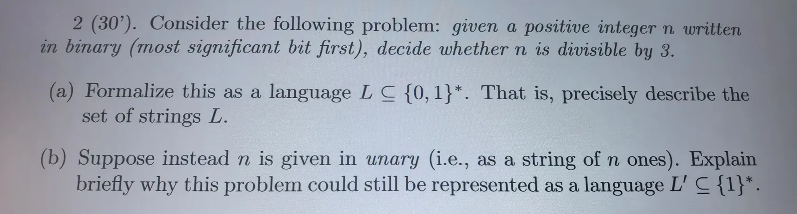
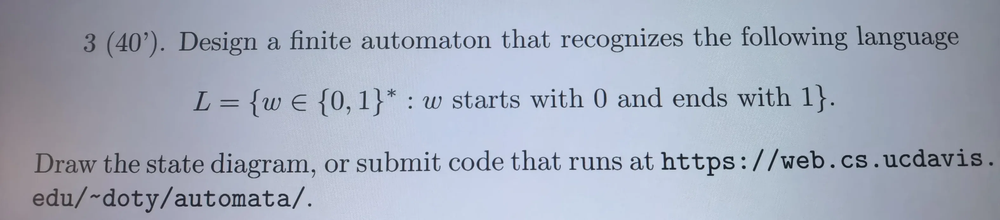

# AI 对话可续接记忆

- 后端：siliconflow
- 模型：Qwen/Qwen3-8B
- 来源：export.md
- 消息数：6
- 分块数：1
- 对话类型：计算推算、文档分析、媒体分析

## 总览

用户上传了三道形式语言与自动机相关的题目，AI 已完成所有题目的翻译和解答。题目1要求计算 L²、判断 ε 是否属于 L* 和 L+，并列出 L* 中长度不超过3的字符串；题目2要求形式化二进制正整数能被3整除的问题，并解释为何该问题仍可表示为一元表示法下的语言；题目3要求设计一个自动机识别以0开头且以1结尾的字符串。AI 已给出所有题目的解答，但用户未明确确认是否采纳或执行。

## 当前对话断点与工作状态

- 当前活动：用户最近提出：翻译并完成 `[来源：用户明确提供｜状态：已确认｜消息：5]`
- 已到阶段：上一 AI 已回答最近一轮用户问题 `[来源：上一 AI 陈述｜状态：上一 AI 已回答｜消息：6]`
- 下一步：未明确下一步动作 `[来源：总结器推断｜状态：不确定｜消息：无]`
- 最后一条用户消息：消息 5；翻译并完成
- 最新消息：消息 6；角色 AI；最后用户轮已获回答：是
- 断点状态：complete

### 已完成/已执行

- AI 已给出题目1(a)、1(b)、1(c)的解答 `[来源：上一 AI 陈述｜状态：上一 AI 已回答｜消息：2]`
- AI 已给出题目2(a)、2(b)的解答 `[来源：上一 AI 陈述｜状态：上一 AI 已回答｜消息：2]`
- AI 已给出题目3的解答 `[来源：用户明确提供｜状态：上一 AI 已回答｜消息：3]`

## 分主题摘要

### 形式语言与自动机题目解答记忆整理

用户上传了三道形式语言与自动机相关的题目，AI 分别给出了每道题的翻译和解答。题目1要求计算 L²、判断 ε 是否属于 L* 和 L+，并列出 L* 中长度不超过3的字符串；题目2要求形式化二进制正整数能被3整除的问题，并解释为何该问题仍可表示为一元表示法下的语言；题目3要求设计一个自动机识别以0开头且以1结尾的字符串。

- 来源消息：1~6

## 媒体与附件说明（开发检查）

### M001｜消息 1｜image

- 来源：用户消息
- 标签：deepseek-1789537535418_170679968650529165.webp
- 图片：
- 状态：described；本地可访问，可重新验证
- 内容说明：用户上传了一张图片“deepseek-1789537535418_170679968650529165.webp”；以下为模型视觉识别结果，其中 OCR 字符可能存在误差：媒体 M001：包含一道形式语言与自动机的题目，题号为1，分值30分。题目定义字母表 Σ = {0,1} 和语言 L = {0, 01}，并要求：(a) 列出 L² = LL 中的所有字符串；(b) 判断空字符串 ε 是否属于 L* 和 L+；(c) 列出 L* 中长度不超过3的所有字符串。
- 当前附件处理结论（suggested）：题目1(a)的答案为 L² = {00, 001, 010, 0101}，题目1(b)的答案为 ε ∈ L* 是；ε ∈ L+ 否，题目1(c)的答案为长度至多为 3 的字符串集合为 {ε, 0, 00, 01, 000, 001, 010}

### M002｜消息 3｜image

- 来源：用户消息
- 标签：deepseek-1789537721360_1310193992048385931.webp
- 图片：
- 状态：described；本地可访问，可重新验证
- 内容说明：用户上传了一张图片“deepseek-1789537721360_1310193992048385931.webp”；以下为模型视觉识别结果，其中 OCR 字符可能存在误差：媒体 M002：包含一道形式语言与自动机的题目，题号为2，分值30分。题目要求：(a) 将“给定一个以最高有效位在前的二进制正整数 n，判断 n 是否能被3整除”这一问题形式化为一个语言 L ⊆ {0,1}*；(b) 假设 n 以一元表示法（即 n 个1组成的字符串）给出，解释为何该问题仍可表示为一个语言 L' ⊆ {1}*。
- 当前附件处理结论（suggested）：题目2(a)的答案为 L = {w ∈ {0,1}* | w 以 '1' 开头，且 val(w) ≡ 0 (mod 3)}，题目2(b)的答案为 L' = {1^n | n 是正整数且 n ≡ 0 (mod 3)}

### M003｜消息 5｜image

- 来源：用户消息
- 标签：deepseek-1789538251971_4455934156660957242.webp
- 图片：
- 状态：described；本地可访问，可重新验证
- 内容说明：用户上传了一张图片“deepseek-1789538251971_4455934156660957242.webp”；以下为模型视觉识别结果，其中 OCR 字符可能存在误差：媒体 M003：包含一道形式语言与自动机的题目，题号为3，分值40分。题目要求设计一个有限自动机，用于识别语言 L = {w ∈ {0,1}* : w 以0开头且以1结尾}，并要求绘制状态图或提交可在 https://web.cs.ucdavis.edu/~doty/automata/ 运行的代码。
- 当前附件处理结论（suggested）：题目3的答案为设计一个包含4个状态的自动机，其中 q0 是起始状态，q2 是接受状态，转移函数如上所述
