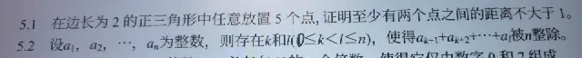
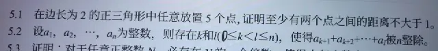
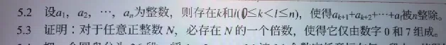
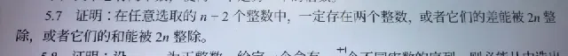

# AI 对话记忆导出

## 🔵 👤 用户提问

完成5.1

## 🟣 🤖 AI 回答

这是题目 **5.1** 的详细证明过程：

**题目：** 在边长为2的正三角形中任意放置5个点，证明至少有两个点之间的距离不大于1。

**证明：**

1. **分割图形（构造抽屉）**：  
   取边长为2的正三角形各边的中点，并将这三个中点两两相连。  
   这样，原来的大正三角形就被分割成了 **4个全等的小正三角形**。
2. **分析小三角形的性质**：  
   因为大正三角形的边长为2，所以分割出的每个小正三角形的边长均为1。  
   在边长为1的小正三角形中，任意两点之间的最大距离就是其边长（即1）。也就是说，**只要两个点落在同一个小正三角形内（包括边界），它们之间的距离就不大于1**。
3. **应用抽屉原理（鸽巢原理）**：  
   题目中要在正三角形内放置5个点。我们可以把这5个点看作“鸽子”，把4个小正三角形看作“抽屉”。  
   根据抽屉原理，将5个点放入4个小正三角形中，**必然至少有一个小正三角形内包含至少2个点**。
4. **得出结论**：  
   设落在同一个小正三角形内的这两个点为A和B。  
   由于这个小正三角形的边长为1，且包含边界，所以点A和点B之间的距离 $|AB| \le 1$。

因此，原命题得证：**在边长为2的正三角形中任意放置5个点，至少有两个点之间的距离不大于1。**

## 🔵 👤 用户提问

完成5.2

## 🟣 🤖 AI 回答

以下是题目 **5.2** 的详细证明过程：

**题目：** 设 $a_1, a_2, \dots, a_n$ 为整数，则存在 $k$ 和 $l$ ($0 \le k < l \le n$)，使得 $a_{k+1} + a_{k+2} + \dots + a_l$ 被 $n$ 整除。

**证明：**

1. **构造前缀和（累积和）**：  
   设 $S_0 = 0$，并定义 $S_m = a_1 + a_2 + \dots + a_m$，其中 $m = 1, 2, \dots, n$。  
   这样我们一共得到了 $n+1$ 个整数：$S_0, S_1, S_2, \dots, S_n$。
2. **分析模 $n$ 的余数**：  
   考虑这 $n+1$ 个和式 $S_0, S_1, \dots, S_n$ 除以 $n$ 所得的余数。  
   一个整数除以 $n$，余数只可能是 $0, 1, 2, \dots, n-1$ 这 $n$ 种情况。
3. **应用抽屉原理（鸽巢原理）**：  
   我们现在有 $n+1$ 个和式（看作“鸽子”），而余数只有 $n$ 种可能（看作“抽屉”）。  
   根据抽屉原理，将 $n+1$ 个物体放入 $n$ 个抽屉中，**必有两个和式除以 $n$ 的余数相同**。  
   也就是说，存在 $k$ 和 $l$，满足 $0 \le k < l \le n$，使得：  
   $S_l \equiv S_k \pmod n$
4. **得出结论**：  
   将上述同余式相减，得到：  
   $S_l - S_k \equiv 0 \pmod n$  
   根据前缀和的定义，$S_l - S_k = (a_1 + \dots + a_k + a_{k+1} + \dots + a_l) - (a_1 + \dots + a_k) = a_{k+1} + a_{k+2} + \dots + a_l$。  
   因此，$a_{k+1} + a_{k+2} + \dots + a_l$ 能被 $n$ 整除。  
   并且由于 $k$ 和 $l$ 是这 $n+1$ 个和式的下标，其范围必然满足 $0 \le k < l \le n$。

**结论：**  
原命题得证。存在这样的 $k$ 和 $l$，使得连续的一段整数序列之和能被 $n$ 整除。

## 🔵 👤 用户提问

完成5.3

## 🟣 🤖 AI 回答

以下是题目 **5.3** 的详细证明过程：

**题目：** 证明：对于任意正整数 $N$，必存在 $N$ 的一个倍数，使得它仅由数字 $0$ 和 $7$ 组成。

**证明：**

这道题与 5.2 思路极其相似，核心依然是利用**抽屉原理（鸽巢原理）**。我们只需要构造一串由数字 7 组成的数列，然后考察它们除以 $N$ 的余数。

1. **构造由 7 组成的数列**：  
   我们构造如下 $N+1$ 个整数：  
   $a_1 = 7$  
   $a_2 = 77$  
   $a_3 = 777$  
   $\dots$  
   $a_{N+1} = \underbrace{77\dots7}_{N+1 \text{个} 7}$

   这一共有 $N+1$ 个数。
2. **分析模 $N$ 的余数**：  
   将这 $N+1$ 个数分别除以 $N$，考察它们的余数。  
   一个整数除以 $N$，余数只可能是 $0, 1, 2, \dots, N-1$ 这 $N$ 种情况。
3. **应用抽屉原理**：  
   我们现在有 $N+1$ 个数字（看作“鸽子”），而余数只有 $N$ 种可能（看作“抽屉”）。  
   根据抽屉原理，将 $N+1$ 个数放入 $N$ 个余数集合中，**必然至少有两个数除以 $N$ 的余数相同**。

   设这两个数为 $a_i$ 和 $a_j$（其中 $1 \le i < j \le N+1$），即：  
   $a_j \equiv a_i \pmod N$
4. **构造倍数**：  
   将上述同余式相减，得到：  
   $a_j - a_i \equiv 0 \pmod N$  
   这就意味着 $a_j - a_i$ 一定能被 $N$ 整除，即 $a_j - a_i$ 是 $N$ 的倍数。

   我们来看 $a_j - a_i$ 具体是什么形式。由于 $a_j$ 和 $a_i$ 都是由数字 7 组成的数，且 $j > i$：  
   $a_j - a_i = \underbrace{77\dots7}_{j \text{个} 7} - \underbrace{77\dots7}_{i \text{个} 7}$  
   做减法运算时，由于位数对齐（个位对齐个位），后 $i$ 位全是 7 减 7，结果为 0。前面剩下 $j-i$ 位，每一位都是 7 减 0（因为被减数在该位置没有数字），结果依然是 7。  
   因此，差的形式为：  
   $\underbrace{77\dots7}_{(j-i) \text{个} 7}\underbrace{00\dots0}_{i \text{个} 0}$

   这个数字完全由数字 $7$ 和数字 $0$ 组成。

**结论：**  
存在 $N$ 的一个倍数（即 $a_j - a_i$），使得它仅由数字 $0$ 和 $7$ 组成。原命题得证。

## 🔵 👤 用户提问

## 🟣 🤖 AI 回答

以下是题目 **5.5** 的详细证明过程：

**题目：** 证明下述程序能在 $2n$ 个不同的数中选取最大的 $n$ 个数。  
(1) 将 $2n$ 个数中的 $n$ 个数排成递增次序，设它们为 $a_1, a_2, \dots, a_n$。  
(2) 将剩下的 $n$ 个数排成递减次序，设它们为 $b_1, b_2, \dots, b_n$。  
(3) 对一切 $i = 1, 2, \dots, n$，比较 $a_i$ 和 $b_i$，并且选取它们中较大的一个。

**证明：**

我们采用**反证法**来证明。

1. **定义与假设**：  
   设这 $2n$ 个不同的数组成集合 $S$。  
   其中，$A = \{a_1, a_2, \dots, a_n\}$，且满足 $a_1 < a_2 < \dots < a_n$。  
   $B = \{b_1, b_2, \dots, b_n\}$，且满足 $b_1 > b_2 > \dots > b_n$。  
   算法选出的 $n$ 个数构成集合 $C = \{c_1, c_2, \dots, c_n\}$，其中 $c_i = \max(a_i, b_i)$。  
   假设该程序**不能**选出 $S$ 中最大的 $n$ 个数。  
   这意味着：存在一个数 $x \in S$，它属于 $S$ 中最大的 $n$ 个数，但却没有被程序选中（即 $x \notin C$）。  
   由于 $x \in S$，它要么属于集合 $A$，要么属于集合 $B$。我们分两种情况讨论。
2. **情况一：$x \in A$**  
   设 $x = a_k$（$1 \le k \le n$）。  
   因为 $x$ 没有被选中（即 $a_k \notin C$），所以 $c_k = \max(a_k, b_k) \neq a_k$，这意味着 $b_k > a_k$。  
   现在，我们来统计集合 $S$ 中严格大于 $a_k$ 的数的个数：

   * 在集合 $A$ 中，由于是递增序列，大于 $a_k$ 的数有 $a_{k+1}, a_{k+2}, \dots, a_n$，共 $n - k$ 个。
   * 在集合 $B$ 中，由于 $b_k > a_k$，且 $b$ 是递减序列（$b_1 > b_2 > \dots > b_k$），所以大于 $a_k$ 的数至少有 $b_1, b_2, \dots, b_k$，共 $k$ 个。  
     因此，集合 $S$ 中严格大于 $a_k$ 的数至少有 $(n - k) + k = n$ 个。  
     这意味着 $a_k$ 在 $S$ 的所有数中，最多只能排在第 $n+1$ 位。这与“$a_k$ 属于最大的 $n$ 个数”的假设**矛盾**。
3. **情况二：$x \in B$**  
   设 $x = b_k$（$1 \le k \le n$）。  
   因为 $x$ 没有被选中（即 $b_k \notin C$），所以 $c_k = \max(a_k, b_k) \neq b_k$，这意味着 $a_k > b_k$。  
   同样，我们来统计集合 $S$ 中严格大于 $b_k$ 的数的个数：

   * 在集合 $B$ 中，由于是递减序列，大于 $b_k$ 的数有 $b_1, b_2, \dots, b_{k-1}$，共 $k - 1$ 个。
   * 在集合 $A$ 中，由于 $a_k > b_k$，且 $a$ 是递增序列（$a_k < a_{k+1} < \dots < a_n$），所以大于 $b_k$ 的数至少有 $a_k, a_{k+1}, \dots, a_n$，共 $n - k + 1$ 个。  
     因此，集合 $S$ 中严格大于 $b_k$ 的数至少有 $(k - 1) + (n - k + 1) = n$ 个。  
     这意味着 $b_k$ 在 $S$ 的所有数中，最多只能排在第 $n+1$ 位。这与“$b_k$ 属于最大的 $n$ 个数”的假设**矛盾**。
4. **结论**：  
   无论 $x$ 属于 $A$ 还是 $B$，假设都会导致矛盾。因此，假设不成立，程序选出的 $n$ 个数中不可能漏掉任何一个属于最大的 $n$ 个数的元素。  
   由于程序恰好选出了 $n$ 个数，且包含了所有最大的 $n$ 个数，因此**该程序能在 $2n$ 个不同的数中准确选取最大的 $n$ 个数**。证毕。

## 🔵 👤 用户提问

## 🟣 🤖 AI 回答

以下是题目 **5.7** 的详细证明过程：

**题目：** 证明：在任意选取的 $n+2$ 个整数中，一定存在两个整数，或者它们的差能被 $2n$ 整除，或者它们的和能被 $2n$ 整除。

**证明：**

这道题的核心依然是**抽屉原理（鸽巢原理）**。我们需要根据整数除以 $2n$ 的余数来构造抽屉。

1. **分析余数并构造“抽屉”**：  
   任意一个整数除以 $2n$，其余数只可能是 $0, 1, 2, \dots, 2n-1$ 这 $2n$ 种情况。  
   我们可以将这 $2n$ 个余数划分为以下 $n$ 个集合（即 $n$ 个“抽屉”）：

   * 抽屉 1：$\{0\}$
   * 抽屉 2：$\{n\}$
   * 抽屉 3：$\{1, 2n-1\}$
   * 抽屉 4：$\{2, 2n-2\}$
   * $\dots$
   * 抽屉 $n$：$\{n-1, n+1\}$

   注意观察，除了第一个和第二个抽屉是单元素集合外，其余每个抽屉里的两个数之和都等于 $2n$。一共刚好有 $n$ 个抽屉。
2. **应用抽屉原理**：  
   题目中选取了 $n+2$ 个整数，我们将这 $n+2$ 个数看作“鸽子”。  
   现在我们要把这 $n+2$ 个数放入上述 $n$ 个抽屉中（根据它们除以 $2n$ 的余数决定放入哪个抽屉）。  
   因为 $n+2 > n$，根据抽屉原理，**至少有一个抽屉中包含了至少两个整数**。
3. **得出结论**：  
   设落在同一个抽屉里的两个整数为 $a$ 和 $b$。我们分情况讨论：

   * **情况一：它们落在抽屉 1 或抽屉 2 中**。  
     此时它们除以 $2n$ 的余数相同（都是 $0$ 或都是 $n$）。因此 $a \equiv b \pmod{2n}$，即 $a - b$ 能被 $2n$ 整除。满足条件。
   * **情况二：它们落在抽屉 $\{k, 2n-k\}$ 中（其中 $1 \le k \le n-1$）**。  
     此时有两种可能：

     + 如果这两个数除以 $2n$ 的余数相同，那么它们的差 $a - b$ 能被 $2n$ 整除。
     + 如果这两个数除以 $2n$ 的余数不同，其中一个余数为 $k$，另一个余数为 $2n-k$。那么它们的和 $a + b$ 除以 $2n$ 的余数就是 $k + (2n-k) = 2n \equiv 0 \pmod{2n}$，即 $a + b$ 能被 $2n$ 整除。

**结论：**  
无论哪种情况，在选取的 $n+2$ 个整数中，必然存在两个整数，它们的差或和能被 $2n$ 整除。原命题得证。

