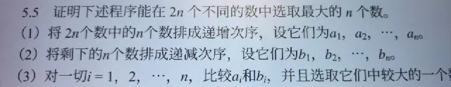

# AI 对话可续接记忆

- 后端：siliconflow
- 模型：Qwen/Qwen3-8B
- 来源：export.md
- 消息数：10
- 分块数：1
- 对话类型：计算推算

## 总览

AI 已完成对多个数学题的证明过程，包括5.1、5.2、5.3、5.5和5.7。用户上传了对应题号的图片并表示完成，但未提出新的问题或请求。所有证明过程均基于抽屉原理或反证法，AI 已完整给出解答，但用户未明确确认或执行。

## 当前对话断点与工作状态

- 当前活动：用户最近提出：用户上传图片并表示完成题号，但未提出新问题 `[来源：用户明确提供｜状态：已确认｜消息：9]`
- 已到阶段：AI 已提供所有题目的证明过程 `[来源：上一 AI 陈述｜状态：上一 AI 已回答｜消息：10]`
- 下一步：无明确下一步操作 `[来源：用户明确提供｜状态：不确定｜消息：9]`
- 最后一条用户消息：消息 9；用户上传图片并表示完成题号，但未提出新问题
- 最新消息：消息 10；角色 AI；最后用户轮已获回答：是
- 断点状态：complete

### 已完成/已执行

- AI 已给出5.1的证明过程 `[来源：上一 AI 陈述｜状态：上一 AI 已回答｜消息：2]`
- AI 已给出5.2的证明过程 `[来源：上一 AI 陈述｜状态：上一 AI 已回答｜消息：4]`
- AI 已给出5.3的证明过程 `[来源：上一 AI 陈述｜状态：上一 AI 已回答｜消息：6]`
- AI 已给出5.5的证明过程 `[来源：上一 AI 陈述｜状态：上一 AI 已回答｜消息：8]`
- AI 已给出5.7的证明过程 `[来源：上一 AI 陈述｜状态：上一 AI 已回答｜消息：10]`

## 分主题摘要

### 5.1 正三角形中点距离问题

用户上传了图片并表示完成5.1，AI 提供了正三角形中点距离问题的证明过程，包括分割图形、分析小三角形性质、应用抽屉原理并得出结论。

- 来源消息：1, 2

### 5.2 整数序列和被n整除问题

用户上传了图片并表示完成5.2，AI 提供了整数序列和被n整除问题的证明过程，包括构造前缀和、分析模n余数、应用抽屉原理并得出结论。

- 来源消息：3, 4

### 5.3 仅由0和7组成的N的倍数问题

用户上传了图片并表示完成5.3，AI 提供了仅由0和7组成的N的倍数问题的证明过程，包括构造由7组成的数列、分析模N余数、应用抽屉原理并得出结论。

- 来源消息：3, 4

### 5.5 选取最大的n个数问题

用户上传了图片并表示完成5.5，AI 提供了选取最大的n个数问题的证明过程，包括构造递增和递减序列、应用反证法并得出结论。

- 来源消息：7, 8

### 5.7 两个整数的差或和能被2n整除问题

用户上传了图片并表示完成5.7，AI 提供了两个整数的差或和能被2n整除问题的证明过程，包括构造余数集合、应用抽屉原理并得出结论。

- 来源消息：9, 10

### 5.3 仅由0和7组成的N的倍数问题

将 $2n$ 个数分为两组，一组递增，一组递减，比较每组对应元素；通过反证法证明该程序能选出最大的 $n$ 个数；构造 $n+1$ 个由7组成的数，分析其模 $N$ 的余数

- 来源消息：5, 6

## 媒体与附件说明（开发检查）

### M001｜消息 1｜image

- 来源：用户消息
- 标签：deepseek-1791112562701_5827279679918705560.webp
- 图片：
- 状态：described；本地可访问，可重新验证
- 内容说明：用户上传了一张图片“deepseek-1791112562701_5827279679918705560.webp”；以下为模型视觉识别结果，其中 OCR 字符可能存在误差：图片显示了数学题5.1，内容为：在边长为2的正三角形中任意放置5个点，证明至少有两个点之间的距离不大于1。
- 上一 AI 结论（消息 2）（suggested）：AI 已给出5.1的证明过程

### M002｜消息 3｜image

- 来源：用户消息
- 标签：deepseek-1791112872405_6077685847281221516.webp
- 图片：
- 状态：described；本地可访问，可重新验证
- 内容说明：用户上传了一张图片“deepseek-1791112872405_6077685847281221516.webp”；以下为模型视觉识别结果，其中 OCR 字符可能存在误差：图片显示了数学题5.1和5.2，其中5.1内容为：在边长为2的正三角形中任意放置5个点，证明至少有两个点之间的距离不大于1。5.2内容为：设a₁, a₂, …, aₙ为整数，则存在k和l（0≤k<l≤n），使得aₖ₊₁+aₖ₊₂+…+aₗ被n整除。
- 上一 AI 结论（消息 4）（suggested）：AI 已给出5.2的证明过程

### M003｜消息 5｜image

- 来源：用户消息
- 标签：deepseek-1791113351598_5000039465003862133.webp
- 图片：
- 状态：described；本地可访问，可重新验证
- 内容说明：用户上传了一张图片“deepseek-1791113351598_5000039465003862133.webp”；以下为模型视觉识别结果，其中 OCR 字符可能存在误差：图片显示了数学题5.2和5.3，其中5.2内容为：设a₁, a₂, …, aₙ为整数，则存在k和l（0≤k<l≤n），使得aₖ₊₁+aₖ₊₂+…+aₗ被n整除。5.3内容为：证明：对于任意正整数N，必存在N的一个倍数，使得它仅由数字0和7组成。
- 上一 AI 结论（消息 6）（suggested）：AI 已给出5.3的证明过程

### M004｜消息 7｜image

- 来源：用户消息
- 标签：deepseek-1791114428531_5916558733993845393.webp
- 图片：
- 状态：described；本地可访问，可重新验证
- 内容说明：用户上传了一张图片“deepseek-1791114428531_5916558733993845393.webp”；以下为模型视觉识别结果，其中 OCR 字符可能存在误差：图片显示了数学题5.5，内容为：证明下述程序能在2n个不同的数中选取最大的n个数。（1）将2n个数中的n个数排成递增次序，设它们为a₁, a₂, …, aₙ。（2）将剩下的n个数排成递减次序，设它们为b₁, b₂, …, bₙ。（3）对一切i=1, 2, …, n，比较aᵢ和bᵢ，并且选取它们中较大的一个。
- 上一 AI 结论（消息 8）（suggested）：AI 已给出5.5的证明过程

### M005｜消息 9｜image

- 来源：用户消息
- 标签：deepseek-1791114894924_2982910591686237741.webp
- 图片：
- 状态：described；本地可访问，可重新验证
- 内容说明：用户上传了一张图片“deepseek-1791114894924_2982910591686237741.webp”；以下为模型视觉识别结果，其中 OCR 字符可能存在误差：图片显示了数学题5.7，内容为：证明：在任意选取的n-2个整数中，一定存在两个整数，或者它们的差能被2n整除，或者它们的和能被2n整除。
- 上一 AI 结论（消息 10）（suggested）：AI 已给出5.7的证明过程

## 细节记忆（可选）

以下仅保留有助于继续任务的关键细节，已合并重复内容：

- **上一 AI 回答｜5.7 两个整数的差或和能被2n整除问题**：构造 $n+2$ 个整数并分析其模 $2n$ 的余数，将余数划分为 $n$ 个集合；应用抽屉原理，证明在 $n+2$ 个整数中，至少有两个数的差或和能被 $2n$ 整除
- **上一 AI 回答｜5.5 选取最大的n个数问题**：将 $2n$ 个数分为两组，一组递增，一组递减，比较每组对应元素；通过反证法证明该程序能选出最大的 $n$ 个数
- **上一 AI 回答｜5.3 仅由0和7组成的N的倍数问题**：构造由7组成的数列 $a_1, a_2, imes, a_{N+1}$，并分析其模 $N$ 的余数；通过构造 $N+1$ 个数并分析其模 $N$ 的余数，证明存在一个差值为 $N$ 的倍数且仅由0和7组成的数
- **上一 AI 回答｜5.2 整数序列和被n整除问题**：构造前缀和 $S_0, S_1, imes, S_n$，并分析其模 $n$ 的余数；应用抽屉原理，将 $n+1$ 个前缀和放入 $n$ 个余数集合中，至少有两个余数相同
- **上一 AI 回答｜5.1 正三角形中点距离问题**：将边长为2的正三角形分割为4个全等的小正三角形，每个边长为1；在边长为1的小正三角形中，任意两点之间的最大距离为1
