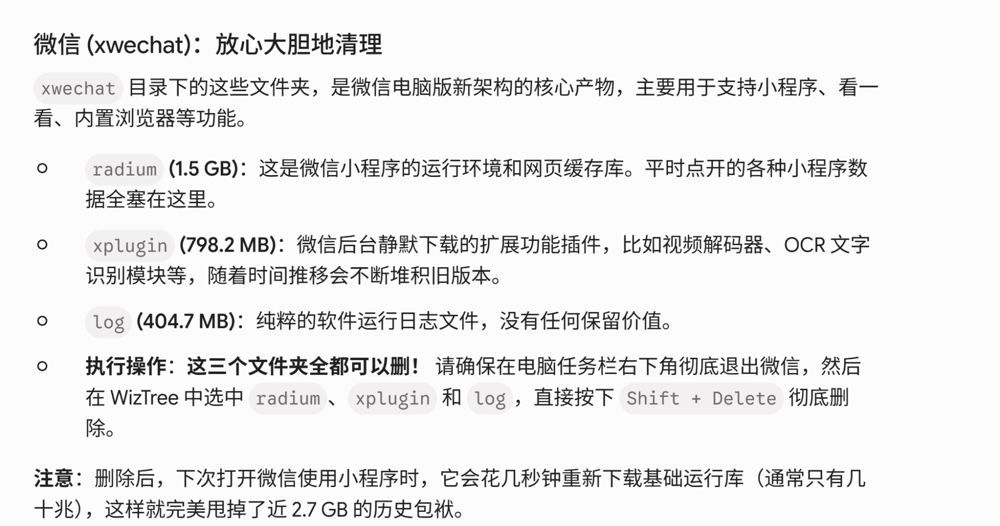

# AI 对话可续接记忆

- 后端：deepseek
- 模型：deepseek-v4-pro
- 来源：export.md
- 消息数：4
- 分块数：1
- 对话类型：媒体分析、普通对话

## 总览

用户连续上传两张关于微信磁盘清理的图片，分别询问“他说得对吗”。AI 已分别评估两张图中的清理说法，指出大体正确但部分表述过于绝对，并给出安全清理建议。用户未提供更多目录信息，也未确认是否执行清理；当前问答任务已完整回答。

## 当前对话断点与工作状态

- 当前活动：用户最近提出：image(1).png 图像 他说得对吗 `[来源：用户明确提供｜状态：已确认｜消息：3]`
- 已到阶段：AI 已分别评估两张图片，指出其中说法的正确与不严谨之处，并给出安全清理建议。 `[来源：上一 AI 陈述｜状态：上一 AI 已提供｜消息：4]`
- 下一步：无明确下一步；除非用户主动提供更多目录截图或继续询问，否则无需进一步操作。 `[来源：总结器推断｜状态：AI 假设｜消息：无]`
- 最后一条用户消息：消息 3；image(1).png 图像 他说得对吗
- 最新消息：消息 4；角色 AI；最后用户轮已获回答：是
- 断点状态：complete

### 已完成/已执行

- AI 评估了第一张图中关于 radium、xplugin、log 目录清理和释放 2.7GB 的说法。 `[来源：上一 AI 陈述｜状态：上一 AI 已提供｜消息：2]`
- AI 评估了第二张图中关于 XPlugin 清理和节省 900MB 的说法。 `[来源：上一 AI 陈述｜状态：上一 AI 已提供｜消息：4]`
- AI 给出了安全清理的具体建议，包括优先清理 log、谨慎处理 xplugin、不要删除聊天记录目录等。 `[来源：上一 AI 陈述｜状态：上一 AI 已提供｜消息：2, 4]`

## 分主题摘要

### 微信磁盘清理图片说法评估（仅历史 AI 判断，原文档不可重新验证）

该媒体当前不可重新验证；以下具体内容仅来自历史 AI 的判断：用户上传两张微信 xwechat 目录清理相关图片，分别询问其中清理说法是否正确。AI 评估认为第一张图大体正确但释放 2.7GB 不保证，xplugin 不建议整体删除；第二张图核心方向基本对但“900MB 白嫖”过于绝对，建议清理 RadiumWMPF 旧版本而非整个 XPlugin。用户未提供实际目录信息，也未确认是否执行建议。

- 来源消息：1~4

## 媒体与附件说明（开发检查）

### M001｜消息 1｜image

- 来源：用户消息
- 标签：用户附件
- 图片：
- 状态：described；本地可访问，可重新验证
- 内容说明：用户上传了一张图片“用户附件”；以下为模型视觉识别结果，其中 OCR 字符可能存在误差：标题为“微信 (xwechat)：放心大胆地清理”，内容说明 xwechat 目录下三个文件夹（radium、xplugin、log）可安全删除，分别用于小程序运行环境、扩展插件和日志。操作步骤为：先退出微信，再用 WizTree 选中并按 Shift + Delete 删除。删除后下次使用小程序会重新下载基础运行库，可节省约 2.7 GB 空间。
- 上一 AI 结论（消息 2）（suggested）：图片大体正确，但 radium、xplugin、log 三个目录并非全部可无条件删除；释放 2.7GB 不保证；不要与聊天记录目录 %USERPROFILE%\xwechat_files 混淆；建议优先清 log，谨慎处理 xplugin。

### M002｜消息 3｜image

- 来源：用户消息
- 标签：用户附件
- 图片：
- 状态：described；本地可访问，可重新验证
- 内容说明：用户上传了一张图片“用户附件”；以下为模型视觉识别结果，其中 OCR 字符可能存在误差：标题为“1. WeChat\XPlugin（微信插件缓存：占 976.6 MB）—— 可以清理”，内容指出 XPlugin 文件夹存放老版微信插件，与已删除的 xwechat\xplugin 性质相同，建议在彻底退出微信后，直接删除 XPlugin 文件夹（用 Shift + Delete）。删除后微信会自动重新生成基础文件，可节省约 900 MB 空间。
- 上一 AI 结论（消息 4）（suggested）：图片核心方向基本对，但“老版”表述不准确，直接删除整个 XPlugin 不够严谨，900MB 回收不等于永久减少；建议清理 RadiumWMPF 下旧版本目录而非整个 XPlugin。

### M003｜消息 4｜document

- 来源：AI 回答
- 标签：tools.md
- 文件：[tools.md](tools.md)
- 状态：unavailable；当前不可访问，不能重新验证
- 内容说明：AI 回答中包含文档“tools.md”，但本地文件不存在，当前导出结果无法访问文档原件，因而不能重新提取或验证其内容；这不代表历史对话中的 AI 当时未读取该文档。
- AI 结论绑定：（未生成）

### M004｜消息 4｜document

- 来源：AI 回答
- 标签：ADAPTATION.md
- 文件：[ADAPTATION.md](ADAPTATION.md)
- 状态：unavailable；当前不可访问，不能重新验证
- 内容说明：AI 回答中包含文档“ADAPTATION.md”，但本地文件不存在，当前导出结果无法访问文档原件，因而不能重新提取或验证其内容；这不代表历史对话中的 AI 当时未读取该文档。
- AI 结论绑定：（未生成）

### M005｜消息 4｜document

- 来源：AI 回答
- 标签：rwmpf.py
- 文件：[rwmpf.py](rwmpf.py)
- 状态：unavailable；当前不可访问，不能重新验证
- 内容说明：AI 回答中包含文档“rwmpf.py”，但本地文件不存在，当前导出结果无法访问文档原件，因而不能重新提取或验证其内容；这不代表历史对话中的 AI 当时未读取该文档。
- AI 结论绑定：（未生成）
