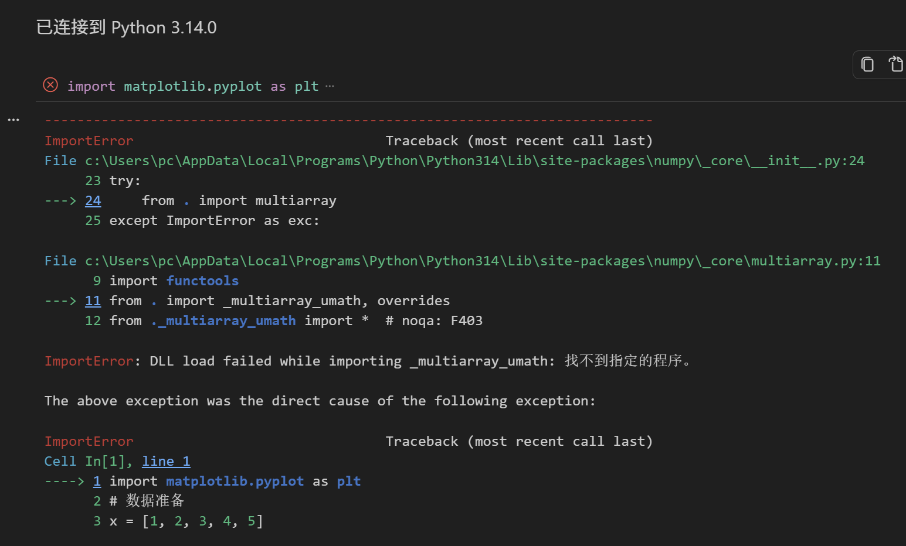
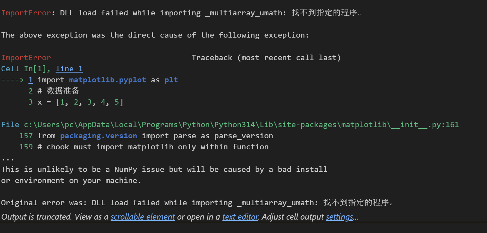

# AI 对话可续接记忆

- 后端：siliconflow
- 模型：Qwen/Qwen3-8B
- 来源：export.md
- 消息数：2
- 分块数：1
- 对话类型：编程任务

## 总览

用户在 Jupyter Notebook 中执行 import matplotlib.pyplot as plt 时遇到了 ImportError，问题被诊断为 Python 3.14 环境中的 NumPy 安装或二进制 DLL 出现了问题。AI 提供了重新安装 NumPy 和 Matplotlib 的具体命令，并建议用户检查当前 Python 版本和 NumPy 安装状态。此外，AI 提到 NumPy 已支持 Python 3.14，但用户可能在全局环境中安装了科学计算库，建议创建专门的 .venv 环境以避免冲突。用户尚未执行任何操作，当前对话仍在进行中。

## 当前对话断点与工作状态

- 当前活动：用户最近提出：image(3).png 图像 image(4).png 图像 `[来源：用户明确提供｜状态：已确认｜消息：1]`
- 已到阶段：AI 诊断用户的问题不是绘图代码的问题，而是 Python 3.14 环境里的 NumPy 安装/二进制 DLL 出了问题。 `[来源：上一 AI 陈述｜状态：上一 AI 已提供｜消息：2]`
- 下一步：AI 提供了重新安装 NumPy 和 Matplotlib 的具体命令。 `[来源：上一 AI 陈述｜状态：上一 AI 已提供｜消息：2]`
- 最后一条用户消息：消息 1；image(3).png 图像 image(4).png 图像
- 最新消息：消息 2；角色 AI；最后用户轮已获回答：是
- 断点状态：complete

### 待处理/待验证

- 重新安装 NumPy `[来源：上一 AI 陈述｜状态：上一 AI 已提供｜消息：2]`
- 重新安装 Matplotlib `[来源：上一 AI 陈述｜状态：上一 AI 已提供｜消息：2]`
- 检查当前 Python 版本和 NumPy 安装状态 `[来源：上一 AI 陈述｜状态：上一 AI 已提供｜消息：2]`

## 分主题摘要

（没有需要单独拆分的历史主题。）

## 媒体与附件说明（开发检查）

### M001｜消息 1｜image

- 来源：用户消息
- 标签：用户附件
- 图片：
- 状态：described；本地可访问，可重新验证
- 内容说明：用户上传了一张图片“用户附件”；以下为模型视觉识别结果，其中 OCR 字符可能存在误差：显示了在 Jupyter Notebook 中执行 import matplotlib.pyplot as plt 时发生的 ImportError。错误链显示 numpy 的 _multiarray_umath 模块加载失败，原因是“找不到指定的程序”。错误提示指出这不太可能是 NumPy 问题，而是由本地安装或环境问题引起。界面顶部显示已连接到 Python 3.14.0。
- 上一 AI 结论（消息 2）（unavailable）：用户上传的图片显示在 Jupyter Notebook 中执行 import matplotlib.pyplot as plt 时发生的 ImportError。

### M002｜消息 1｜image

- 来源：用户消息
- 标签：用户附件
- 图片：
- 状态：described；本地可访问，可重新验证
- 内容说明：用户上传了一张图片“用户附件”；以下为模型视觉识别结果，其中 OCR 字符可能存在误差：显示了在 Jupyter Notebook 中执行 import matplotlib.pyplot as plt 时发生的 ImportError。错误信息明确指出“DLL load failed while importing _multiarray_umath: 找不到指定的程序。”，并提示这不太可能是 NumPy 问题，而是由本地安装或环境问题引起。界面底部有“Output is truncated. View as a scrollable element or open in a text editor.”的提示。
- 上一 AI 结论（消息 2）（unavailable）：用户上传的图片显示在 Jupyter Notebook 中执行 import matplotlib.pyplot as plt 时发生的 ImportError。

### M003｜消息 2｜image

- 来源：AI 回答
- 标签：faviconV2
- 图片：
- 状态：unavailable；当前不可访问，不能重新验证
- 内容说明：AI 回答中包含一张图片，但原图片未能下载，原图当前不可重新验证。
- AI 结论绑定：（未生成）

### M004｜消息 2｜document

- 来源：AI 回答
- 标签：NumPy
- 文件：[NumPy](https://numpy.org/devdocs/release/2.5.1-notes.html?utm_source=chatgpt.com)
- 状态：unavailable；当前不可访问，不能重新验证
- 内容说明：AI 回答中包含文档“NumPy”，但远程资源没有成功下载到本地，当前导出结果无法访问文档原件，因而不能重新提取或验证其内容；这不代表历史对话中的 AI 当时未读取该文档。
- AI 结论绑定：（未生成）

## 细节记忆（可选）

以下仅保留有助于继续任务的关键细节，已合并重复内容：

- **重要事实｜用户上传了两张图片，显示在 Jupyter Notebook 中执行 import ma…**：用户上传了两张图片，显示在 Jupyter Notebook 中执行 import matplotlib.pyplot as plt 时发生的 ImportError。
- **重要建议｜AI 诊断用户的问题不是绘图代码的问题，而是 Python 3.14 环境里的 NumP…**：AI 诊断用户的问题不是绘图代码的问题，而是 Python 3.14 环境里的 NumPy 安装/二进制 DLL 出了问题。
- **重要建议｜AI 提供了重新安装 NumPy 和 Matplotlib 的建议。**：AI 提供了重新安装 NumPy 和 Matplotlib 的建议。
- **重要建议｜AI 提供了检查当前 Python 版本和 NumPy 安装状态的命令。**：AI 提供了检查当前 Python 版本和 NumPy 安装状态的命令。
- **重要建议｜AI 建议用户不要在 Python 3.14 环境中反复安装，而是安装 Python 3…**：AI 建议用户不要在 Python 3.14 环境中反复安装，而是安装 Python 3.13 并为数据科学单独创建一个环境。
- **重要建议｜AI 提到用户当前可能是在 Python 3.14 的全局环境中安装了各种科学计算库。**：AI 提到用户当前可能是在 Python 3.14 的全局环境中安装了各种科学计算库。
- **重要建议｜AI 提供了重新安装 NumPy 和 Matplotlib 的具体命令。**：AI 提供了重新安装 NumPy 和 Matplotlib 的具体命令。
- **重要建议｜AI 提供了测试 NumPy 和 Matplotlib 安装状态的命令。**：AI 提供了测试 NumPy 和 Matplotlib 安装状态的命令。
