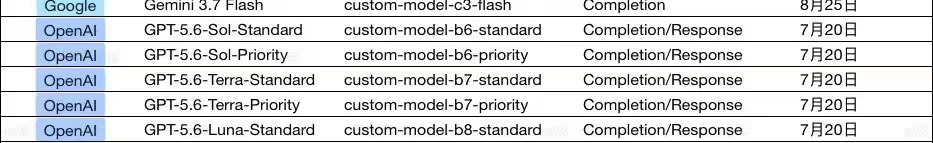

# AI 对话可续接记忆

- 后端：siliconflow
- 模型：Qwen/Qwen3-8B
- 来源：export.md
- 消息数：2
- 分块数：1
- 对话类型：媒体分析、决策讨论

## 总览

用户上传了一张表格截图，询问不同 AI 模型之间的区别。AI 已分析模型的核心区别，包括模型能力档位、速度、成本和优先级，并指出 Standard 和 Priority 是同一个模型的不同服务等级。AI 还提供了数学建模题的模型选择建议，认为 GPT-5.6 Sol-Priority 是最佳选择，但需要用户提供更多信息以进一步推荐模型。

## 当前对话断点与工作状态

- 当前活动：用户最近提出：这几个模型有什么区别 `[来源：用户明确提供｜状态：已确认｜消息：1]`
- 已到阶段：AI 已给出回答 `[来源：上一 AI 陈述｜状态：上一 AI 已提供｜消息：2]`
- 下一步：需要用户提供更多信息以进一步推荐模型 `[来源：上一 AI 陈述｜状态：建议/尚未确认采用｜消息：2]`
- 最后一条用户消息：消息 1；这几个模型有什么区别
- 最新消息：消息 2；角色 AI；最后用户轮已获回答：是
- 断点状态：complete

### 已完成/已执行

- 用户上传了一张包含不同 AI 模型及其对应自定义模型标识和完成/响应日期的表格截图。 `[来源：附件内容｜状态：已确认｜消息：1]`
- AI 分析模型区别并提供建议 `[来源：上一 AI 陈述｜状态：上一 AI 已提供｜消息：2]`

## 分主题摘要

（没有需要单独拆分的历史主题。）

## 媒体与附件说明（开发检查）

### M001｜消息 1｜image

- 来源：用户消息
- 标签：用户附件
- 图片：
- 状态：described；本地可访问，可重新验证
- 内容说明：用户上传了一张图片“用户附件”；以下为模型视觉识别结果，其中 OCR 字符可能存在误差：一张表格截图，列标题为：Google、Gemini 3.7 Flash、custom-model-c3-flash、Completion、8月25日；OpenAI、GPT-5.6-Sol-Standard、custom-model-b6-standard、Completion/Response、7月20日；OpenAI、GPT-5.6-Terra-Standard、custom-model-b7-standard、Completion/Response、7月20日；OpenAI、GPT-5.6-Terra-Priority、custom-model-b7-priority、Completion/Response、7月20日；OpenAI、GPT-5.6-Luna-Standard、custom-model-b8-standard、Completion/Response、7月20日。表格内容为不同 AI 模型及其对应的自定义模型标识和完成/响应日期。
- AI 结论绑定：（未生成）

## 细节记忆（可选）

以下仅保留有助于继续任务的关键细节，已合并重复内容：

- **附件信息｜用户上传的图片内容**：AI 识别出一张表格截图，列标题为：Google、Gemini 3.7 Flash、custom-model-c3-flash、Completion、8月25日；OpenAI、GPT-5.6-Sol-Standard、custom-model-b6-standard、Completion/Response、7月20日；OpenAI、GPT-5.6-Terr…
- **重要建议｜数学建模题模型选择**：AI 提供了模型选择建议，指出 Sol-Priority 是数学建模题的最佳选择。
- **重要建议｜进一步推荐模型**：AI 提到如果用户提供更多信息，可以进一步推荐模型。
- **重要建议｜模型区别**：AI 解释了不同模型的核心区别，包括模型能力档位、速度、成本和优先级。
- **重要建议｜模型定位与能力**：AI 提供了表格，说明了不同模型的定位、能力、速度和适合任务。
- **重要建议｜Standard 与 Priority 的关系**：AI 指出 Standard 和 Priority 是同一个模型的不同服务等级。
- **重要建议｜一句话记忆**：AI 提供了一句话记忆，帮助用户快速理解模型区别。
