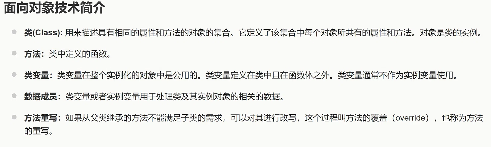

# AI 对话记忆导出

## 🔵 👤 用户提问

解释一下数据成员

## 🟣 🤖 AI 回答

当然可以。你这张图里的\*\*“数据成员”\*\*，可以把它简单理解成：

> **数据成员 = 对象用来“存数据”的变量。**

它和“方法”最大的区别就是：

* **数据成员：描述对象“有什么 / 是什么状态”**
* **方法：描述对象“能做什么”**

### 1. 举个最简单的例子

假设我们定义一个“学生”类：

Python

`class Student:
name = "张三"
age = 18
def study(self):
print("正在学习")`

这里：

Python

`name = "张三"
age = 18`

就是**数据成员**。

而：

Python

`def study(self):
print("正在学习")`

就是**方法**。

所以可以理解成：

| 类的组成 | 作用 | Student中的例子 |
| --- | --- | --- |
| 数据成员 | 存储数据 | name、age |
| 方法 | 执行操作 | study() |

---

### 2. 为什么叫“成员”？

因为 name、age 都是 **Student 类的成员**。

例如：

Python

`s1 = Student()`

这里 s1 是一个 Student 对象。

那么：

Python

`s1.name
s1.age`

就是在访问这个对象的数据。

可以想象成：

纯文本

`Student 类
│
├── 数据成员
│ ├── name
│ └── age
│
└── 方法
└── study()`

---

### 3. 数据成员有什么用？

主要就是**记录对象的状态**。

例如定义一个“汽车”类：

Python

`class Car:
color = "red"
speed = 0`

这里：

* color → 汽车是什么颜色
* speed → 汽车当前速度

它们都是汽车对象的**数据成员**。

然后方法：

Python

`def accelerate(self):
self.speed += 10`

就是改变数据成员 speed。

所以：

> **数据成员负责“保存信息”，方法负责“处理信息”。**

---

### 4. 和你图片里的定义对应起来

图片说：

> **数据成员：类变量或实例变量用于处理类及其实例对象的相关的数据。**

这里有两个重要概念：

#### 类变量

属于**整个类**，所有对象通常共享。

Python

`class Student:
school = "复旦大学"`

school 就可以作为类变量。

#### 实例变量

属于**某一个具体对象**。

例如：

Python

`class Student:
def __init__(self, name, age):
self.name = name
self.age = age`

创建两个学生：

Python

`s1 = Student("张三", 18)
s2 = Student("李四", 20)`

那么：

纯文本

`s1
├── name = 张三
└── age = 18
s2
├── name = 李四
└── age = 20`

name 和 age 就是**实例变量**，也属于数据成员。

---

### 一句话记忆

你可以把一个类想成一个“人物模板”：

> **数据成员 = 这个人有什么属性**  
> **方法 = 这个人能做什么**

例如：

纯文本

`学生类 Student
数据成员：
姓名
年龄
学号
方法：
学习()
考试()
吃饭()`

所以看到“**数据成员**”，你首先想到：

**“存储对象属性/状态的变量。”**

## 🔵 👤 用户提问

类的实例是对象吗

## 🟣 🤖 AI 回答

对，**类的实例就是对象（Object）**。

这是面向对象里一个非常核心的概念。

### 直接理解

比如我们定义一个类：

Python

`class Student:
pass`

Student 是一个**类**，它相当于一个“模板”。

然后：

Python

`s1 = Student()
s2 = Student()`

这里：

* Student → **类**
* s1 → Student 类的一个**实例**
* s2 → Student 类的另一个**实例**
* s1、s2 → **都是对象**

也就是说：

> **实例 = 根据某个类创建出来的对象。**

---

### 用生活中的例子理解

把“类”想成**汽车设计图**：

纯文本

`汽车类（Class）
↓
生产
↙ ↘
汽车A 汽车B`

汽车类是设计图，而真正生产出来的汽车 A、B 就是**实例/对象**。

所以：

> **类是模板，对象（实例）是根据模板创建出来的具体东西。**

---

### 为什么有时候说“实例”，有时候说“对象”？

因为二者强调的角度稍微不同：

* **对象（Object）**：强调“这是一个实际存在的东西”
* **实例（Instance）**：强调“这个对象是哪个类的实例”

例如：

Python

`s1 = Student()`

可以说：

> s1 是一个**对象**。

也可以说：

> s1 是 Student 类的一个**实例**。

两种说法都对。

### 记住这句话就够了

**“对象是类的实例，实例就是根据类创建出来的对象。”**

所以你图片里那句话：

> **“对象是类的实例。”**

完全可以直接理解成：

> **“对象就是由类创建出来的具体对象。”**

## 🔵 👤 用户提问

区分一下类变量、局部变量、实例变量

## 🟣 🤖 AI 回答

可以把这三个变量放在一起对比。最关键的区别是：**“属于谁、在哪里定义、能活多久、谁能访问”。**

### 先看一个例子

Python

`class Student:
school = "复旦大学" # 类变量
def __init__(self, name, age):
self.name = name # 实例变量
self.age = age # 实例变量
def study(self):
hours = 2 # 局部变量
print(self.name, hours)`

这里有三种变量：

| 类型 | 例子 | 属于谁 | 定义在哪里 |
| --- | --- | --- | --- |
| **类变量** | school | 类 | 类里面、方法外面 |
| **实例变量** | self.name、self.age | 某个对象 | 通常在方法里通过 self.xxx 定义 |
| **局部变量** | hours | 某个方法/函数 | 方法/函数内部 |

---

## ① 类变量：整个类共有

Python

`class Student:
school = "复旦大学"`

school 是**类变量**。

因为它属于 Student 这个类。

可以这样访问：

Python

`Student.school`

创建两个学生：

Python

`s1 = Student()
s2 = Student()`

通常它们都可以访问：

Python

`s1.school
s2.school`

因为学校这个信息是所有 Student **共同的**。

可以想象：

纯文本

`Student 类
│
└── school = "复旦大学"
↑
├── s1 可以使用
└── s2 可以使用`

---

## ② 实例变量：每个对象自己有一份

例如：

Python

`class Student:
def __init__(self, name, age):
self.name = name
self.age = age`

创建两个对象：

Python

`s1 = Student("张三", 18)
s2 = Student("李四", 20)`

那么：

纯文本

`s1
├── name = "张三"
└── age = 18
s2
├── name = "李四"
└── age = 20`

name 和 age 就是**实例变量**。

因为它们属于**具体的对象**，每个对象可以有不同的值。

所以：

Python

`s1.name # 张三
s2.name # 李四`

这就是实例变量最重要的特点：

> **每个实例都有自己独立的一份。**

---

## ③ 局部变量：方法里面临时使用

例如：

Python

`class Student:
def study(self):
hours = 2
print(hours)`

这里：

Python

`hours = 2`

就是**局部变量**。

它只在 study() 方法执行期间使用。

例如：

Python

`s = Student()
s.study()`

执行 study()：

纯文本

`study() 开始
↓
hours = 2
↓
使用 hours
↓
study() 结束
↓
hours 不再存在`

所以不能在外面直接：

Python

`print(hours) # 错误`

因为 hours 是 study() 的**局部变量**。

---

# 最重要的区别

你可以用下面这个表记：

|  | 类变量 | 实例变量 | 局部变量 |
| --- | --- | --- | --- |
| **属于** | 类 | 对象 | 方法/函数 |
| **定义位置** | 类中、方法外 | 通常方法中 self.xxx | 方法/函数内部 |
| **是否每个对象独立** | ❌ 通常共享 | ✅ 独立 | ❌ 不属于对象 |
| **生命周期** | 类存在期间 | 对象存在期间 | 方法执行期间 |
| **典型写法** | school = ... | self.name = ... | x = ... |

---

### 一个非常好记的口诀

> **类变量：大家共有**  
> **实例变量：一人一份**  
> **局部变量：方法临时用**

比如一个学生类：

Python

`class Student:
school = "复旦大学" # 类变量：大家的学校一样
def __init__(self, name):
self.name = name # 实例变量：每个人名字不同
def study(self):
hours = 2 # 局部变量：这次学习临时使用`

你可以把它理解成：

纯文本

`Student 类
│
┌───────┴───────┐
↓ ↓
类变量 创建对象
school ↙ ↘
s1 s2
│ │
name=张三 name=李四
│ │
调用 study() 调用 study()
↓ ↓
hours=2 hours=2
局部变量 局部变量`

**尤其注意：self.name 是实例变量，而单纯的 name 如果写在方法内部，则通常是局部变量。** 这个区别在 Python 面向对象里非常重要。

## 🔵 👤 用户提问

区分一下类变量、局部变量、实例变量

## 🟣 🤖 AI 回答

可以。这次我用\*\*“属于谁”\*\*这个角度给你彻底区分，最容易记。

先看一个例子：

Python

`class Student:
school = "复旦大学" # 类变量
def __init__(self, name, age):
self.name = name # 实例变量
self.age = age # 实例变量
def study(self):
hours = 2 # 局部变量
print(self.name, hours)`

这里一共有三种变量。

---

## 1. 类变量：属于“类”

Python

`class Student:
school = "复旦大学"`

school 是**类变量**。

它属于 Student 这个类，而不是某一个具体学生。

例如：

Python

`Student.school`

可以访问。

创建：

Python

`s1 = Student("张三", 18)
s2 = Student("李四", 20)`

那么 s1、s2 都可以使用 school：

Python

`s1.school
s2.school`

因为：

> **所有 Student 通常共享同一个类变量 school。**

可以理解成：

纯文本

`Student 类
│
└── school = "复旦大学"
↑
┌──┴──┐
s1 s2`

---

## 2. 实例变量：属于“对象”

看：

Python

`class Student:
def __init__(self, name, age):
self.name = name
self.age = age`

这里的：

Python

`self.name
self.age`

是**实例变量**。

为什么叫“实例变量”？

因为它属于**某一个具体的实例（对象）**。

例如：

Python

`s1 = Student("张三", 18)
s2 = Student("李四", 20)`

实际上相当于：

纯文本

`s1 对象
├── name = "张三"
└── age = 18
s2 对象
├── name = "李四"
└── age = 20`

所以：

Python

`s1.name # 张三
s2.name # 李四`

两个对象各自拥有自己的 name。

因此最重要的一句话：

> **实例变量 = 每个对象自己独立拥有的数据。**

---

## 3. 局部变量：属于“方法/函数”

看：

Python

`def study(self):
hours = 2`

这里：

Python

`hours = 2`

是**局部变量**。

它只在 study() 这个方法里面有效。

Python

`def study(self):
hours = 2
print(hours)`

当 study() 执行结束后，这个 hours 的局部作用域也结束了。

所以外面不能直接：

Python

`print(hours) # 错误`

因此：

> **局部变量 = 在函数/方法内部临时使用的变量。**

---

# 三者放在一起

|  | 类变量 | 实例变量 | 局部变量 |
| --- | --- | --- | --- |
| **属于谁？** | 类 | 对象 | 函数/方法 |
| **例子** | school | self.name | hours |
| **定义位置** | 类中、方法外 | 通常在方法中用 self.xxx | 方法/函数内部 |
| **每个对象是否独立？** | ❌ 通常共享 | ✅ 独立 | 不属于对象 |
| **作用范围** | 整个类 | 某个对象 | 当前函数/方法 |
| **典型用途** | 所有对象共有的信息 | 每个对象自己的信息 | 临时计算 |

---

## 最好记的口诀

你可以直接记：

> **类变量：大家共有**  
> **实例变量：一人一份**  
> **局部变量：函数临时使用**

比如：

Python

`class Student:
school = "复旦大学" # 类变量：大家共有
def __init__(self, name):
self.name = name # 实例变量：每个人不同
def study(self):
hours = 2 # 局部变量：临时使用`

对应：

纯文本

`Student 类
│
school = 复旦大学
（类变量）
│
┌──────────┴──────────┐
↓ ↓
s1对象 s2对象
name = 张三 name = 李四
（实例变量） （实例变量）
│ │
study() study()
↓ ↓
hours = 2 hours = 2
（局部变量） （局部变量）`

### 一个特别容易考的点

看到：

Python

`self.xxx`

**优先想到“实例变量”。**

看到：

Python

`class Student:
xxx = ...`

而且是在**方法外面**，优先想到**类变量**。

看到：

Python

`def xxx():
yyy = ...`

那么 yyy 通常就是**局部变量**。

**核心就是三个“属于”：**

**类变量 → 属于类**  
**实例变量 → 属于对象**  
**局部变量 → 属于函数/方法的局部作用域**

## 🔵 👤 用户提问

介绍一下Python 之禅（import this）

## 🟣 🤖 AI 回答

当然。\*\*Python 之禅（The Zen of Python）\*\*是 Python 设计哲学的一组原则，一共 **19 条**，由 Tim Peters 总结。

在 Python 中输入：

Python

`import this`

就会看到它。

---

## 一、Python 之禅全文

纯文本

`The Zen of Python, by Tim Peters
Beautiful is better than ugly.
Explicit is better than implicit.
Simple is better than complex.
Complex is better than complicated.
Flat is better than nested.
Sparse is better than dense.
Readability counts.
Special cases aren't special enough to break the rules.
Although practicality beats purity.
Errors should never pass silently.
Unless explicitly silenced.
In the face of ambiguity, refuse the temptation to guess.
There should be one-- and preferably only one --obvious way to do it.
Although that way may not be obvious at first unless you're Dutch.
Now is better than never.
Although never is often better than *right* now.
If the implementation is hard to explain, it's a bad idea.
If the implementation is easy to explain, it may be a good idea.
Namespaces are one honking great idea -- let's do more of those!`

下面不用死记，我们逐条理解。

---

# 二、最重要的几条

### 1. Beautiful is better than ugly.

> **优美胜于丑陋。**

代码不仅要能运行，还应该写得漂亮、清晰。

例如：

Python

`x=[1,2,3,4,5]`

相比：

Python

`x = [1, 2, 3, 4, 5]`

后者更符合 Python 的代码风格。

---

### 2. Explicit is better than implicit.

> **明确胜于隐晦。**

Python 希望代码的含义尽可能清楚。

例如：

Python

`result = a + b`

看到就知道是什么意思。

而如果使用大量复杂的隐式行为，让别人需要猜代码在干什么，就不符合这个原则。

这也是为什么 Python 很强调**可读性**。

---

### 3. Simple is better than complex.

> **简单胜于复杂。**

如果一个问题可以用简单的方法解决，就不要故意搞复杂。

例如：

Python

`total = sum(numbers)`

如果能这样解决，就没必要自己写一大堆循环。

---

### 4. Complex is better than complicated.

> **复杂胜于晦涩。**

这里比较容易混淆。

\*\*Complex（复杂）\*\*和 \*\*Complicated（繁琐、难以理解）\*\*不是完全一样。

例如：

纯文本

`复杂：
问题本身很复杂，但代码结构清楚。
繁琐：
本来简单的问题，被写成了一团乱麻。`

Python 并不是说：

> “所有代码都必须简单。”

而是说：

> **如果事情本身很复杂，可以复杂；但不要把代码写得莫名其妙。**

---

# 三、Flat is better than nested.

> **扁平胜于嵌套。**

尽量不要产生太多层嵌套。

例如：

Python

`if a:
if b:
if c:
if d:
do_something()`

这种代码很难读。

Python 更鼓励通过提前返回等方式减少嵌套：

Python

`if not a:
return
if not b:
return
if not c:
return
do_something()`

这样结构更加清楚。

---

# 四、Sparse is better than dense.

> **疏朗胜于密集。**

代码不要挤成一团。

例如：

Python

`if age >= 18:
print("adult")`

比把大量逻辑压缩到一行更容易阅读。

这也是 Python 为什么比较重视：

**空格、换行、缩进和代码格式。**

---

# 五、Readability counts.

> **可读性很重要。**

这是 Python 最核心的理念之一。

代码首先是**给人看的**，其次才是给计算机执行的。

例如：

Python

`student_age = 18`

明显比：

Python

`sa = 18`

更容易理解。

所以 Python 很强调：

> **代码应该让别人容易读懂。**

---

# 六、Special cases aren't special enough to break the rules.

> **特殊情况也不应该特殊到可以破坏规则。**

不要因为某个特殊情况，就随便写出一套完全不同的规则。

也就是说：

> **保持代码风格和设计的一致性。**

---

# 七、Although practicality beats purity.

> **实用性胜过纯粹性。**

这一句非常重要。

Python 并不是一个“为了理论完美而牺牲实际使用”的语言。

如果：

纯文本

`理论上最优的方法
↓
但是特别难用`

而：

纯文本

`稍微没那么“纯粹”
↓
但是非常实用`

Python 通常会倾向于后者。

所以 Python 是一种非常强调**实用主义**的语言。

---

# 八、Errors should never pass silently.

> **错误不应该悄悄地被忽略。**

例如程序发生错误，最好让程序员知道。

这也是为什么 Python 经常使用：

Python

`try:
...
except Exception as e:
print(e)`

来明确处理异常。

而不是：

Python

`try:
...
except:
pass`

后者可能把真正的问题直接吞掉。

---

# 九、Unless explicitly silenced.

> **除非你明确要求它被忽略。**

上一条说：

> 错误不应该悄悄消失。

但如果程序员**明确知道这个错误可以忽略**，那当然可以。

例如：

Python

`try:
os.remove("test.txt")
except FileNotFoundError:
pass`

这里明确告诉 Python：

> 文件不存在没关系，我知道这个情况。

这就是**显式忽略**。

---

# 十、In the face of ambiguity, refuse the temptation to guess.

> **面对歧义时，不要自作主张地猜。**

这是非常重要的编程思想。

如果程序无法确定用户想要什么：

纯文本

`A？
还是 B？`

不要偷偷猜一个。

应该让问题变得明确。

这和 Python 的：

> **Explicit is better than implicit**

是相互呼应的。

---

# 十一、There should be one-- and preferably only one --obvious way to do it.

> **解决问题应该有一种，而且最好只有一种明显的方法。**

这是 Python 和一些其他语言非常不同的一种理念。

Python 希望：

> **代码应该有明显、统一、推荐的写法。**

这会让团队协作更加容易。

---

# 十二、Now is better than never.

> **现在做胜过永远不做。**

很好理解：

纯文本

`开始做
↓
逐渐改进`

通常比：

纯文本

`等到完美
↓
一直没开始`

更好。

---

# 十三、Although never is often better than *right* now.

> **不过，有时候永远不做又胜过马上去做。**

这一句是故意和上一句形成反差。

意思是：

> **不要因为“现在做”很好，就完全不考虑时机。**

如果现在做某件事会造成严重问题，那么：

> **暂时不做可能比立刻做更好。**

所以 Python 之禅并不是机械规则，而是一种思考方式。

---

# 十四、If the implementation is hard to explain, it's a bad idea.

> **如果一个实现很难解释，那可能不是一个好主意。**

这是非常实用的一条。

如果你写了一段代码，然后别人问：

> “这段代码为什么这么写？”

你需要解释：

> “这个地方先这样，然后绕过去，再通过这个特殊条件……”

如果解释半天还是很复杂：

**很可能代码设计本身就有问题。**

---

# 十五、If the implementation is easy to explain, it may be a good idea.

> **如果一个实现很容易解释，它可能就是一个好主意。**

注意这里用的是：

> **may be**

而不是：

> **must be**

也就是说：

**容易解释 ≠ 一定正确。**

但至少说明它的设计可能比较合理。

---

# 十六、Namespaces are one honking great idea.

> **命名空间是一个非常棒的想法。**

这句话和你刚才学习的**类、变量**其实已经产生联系了。

例如：

Python

`math.sqrt()`

这里 math 就提供了一个命名空间。

不同模块可以拥有相同名字的变量：

Python

`module_a.name
module_b.name`

它们不会轻易发生冲突。

Python 非常重视这种\*\*命名空间（Namespace）\*\*的思想。

---

# 三、考试/学习最值得记的核心

如果你现在正在学 Python，我不建议你把 19 条全部死记。

先记住这 **6 个核心思想**：

### ① 优美

> Beautiful is better than ugly.

代码要漂亮。

### ② 明确

> Explicit is better than implicit.

不要让别人猜你的代码是什么意思。

### ③ 简单

> Simple is better than complex.

能简单解决，就不要复杂化。

### ④ 可读

> Readability counts.

**代码是写给人看的。**

### ⑤ 实用

> Practicality beats purity.

不要为了理论完美牺牲实际使用。

### ⑥ 不要猜

> In the face of ambiguity, refuse the temptation to guess.

遇到歧义，要明确，而不是自作主张。

---

## 最后给你一个整体理解

其实 **Python 之禅不是在教你 Python 语法**，而是在告诉你：

> **“写 Python 代码时，应该用什么样的思维方式。”**

可以浓缩成一句话：

> **Python 崇尚清晰、简单、明确、可读、实用的代码。**

所以你以后看到 Python 代码时，可以经常问自己：

**“这段代码是不是足够清晰？是不是能更简单？别人能不能一眼看懂？”**

这其实就是在践行 **Python 之禅**。

