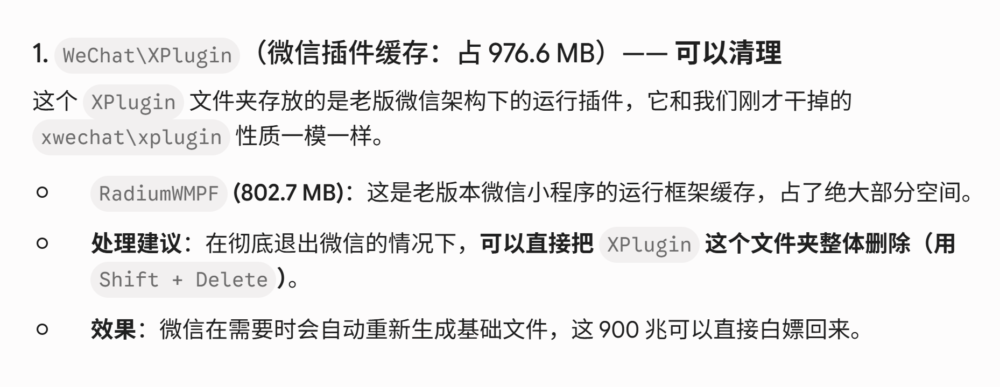

# AI 对话记忆导出

## 🔵 👤 用户提问

image.png
图像
他说的对吗

## 🟣 🤖 AI 回答

**大体上是对的，但这张图里有几个地方说得太绝对，我不建议你直接照着“全部 Shift + Delete”。**

我查了一下目前 Windows 微信 4.x 的目录结构和相关资料，结论如下：

| 目录 | 图中说法 | 我的判断 |
| --- | --- | --- |
| radium | 小程序运行环境/网页缓存，可删除 | ✅ **基本正确** |
| xplugin | 插件、OCR、视频解码等，删除后会重新下载 | ⚠️ **基本正确，但不建议无脑整个删除** |
| log | 运行日志，可以删除 | ✅ **基本正确** |
| 删除后重新下载几十 MB | 基本正确 | ✅ |
| 三个加起来一定能释放 2.7GB | ❌ | **取决于你的电脑，不能保证** |
| “这三个文件夹全部都可以删” | ⚠️ | **需要区分目录和内容** |

目前能观察到的 Windows 微信 4.x 结构中，%APPDATA%\Tencent\xwechat 确实包含 radium、xplugin、log 等目录；其中 radium 与小程序运行时有关，xplugin 下包含 RadiumWMPF、OCR、播放器等插件。[🖼️ **[图片]** `faviconV2`（原图片未能下载）Wener Live & Life+1](https://wener.me/notes/platform/wechat/inside?utm_source=chatgpt.com)

### 最重要的一点

**不要把它和微信聊天记录目录混为一谈。**

现在微信 4.x 的核心用户数据通常在：

纯文本

`%USERPROFILE%\xwechat_files`

里面可能包含聊天数据库、聊天附件、图片、视频、文件等。**这个目录千万不要因为看到占空间就整个删除。** [Wener Live & Life](https://wener.me/notes/platform/wechat/inside?utm_source=chatgpt.com)

而你图片里这几个：

纯文本

`%APPDATA%\Tencent\xwechat\radium
%APPDATA%\Tencent\xwechat\xplugin
%APPDATA%\Tencent\xwechat\log`

主要属于运行时、插件和日志一类的数据，和聊天记录核心数据库不是一回事。

### 如果你只是想安全释放空间

我更推荐：

**1. 完全退出微信**

不只是关窗口，要确认任务栏右下角微信也退出，必要时任务管理器确认没有 Weixin.exe / 微信相关进程。

**2. 优先清 log**

这个基本没什么问题：

纯文本

`%APPDATA%\Tencent\xwechat\log`

日志本身可以重新生成。

**3. radium 可以清，但代价是小程序重新下载**

它主要对应小程序/运行时缓存。删除后，第一次重新打开小程序时重新生成缓存是正常的。[Wener Live & Life+1](https://wener.me/notes/platform/wechat/inside?utm_source=chatgpt.com)

**4. xplugin 要谨慎一点**

它确实是插件体系，里面可以有 OCR、播放器、小程序运行时等组件，而且旧版本插件可能长期残留，占用不少空间。[Wener Live & Life+1](https://wener.me/notes/platform/wechat/inside?utm_source=chatgpt.com)

删除后重新下载插件是可能发生的，甚至有资料明确把删除 XPlugin 作为微信小程序故障排查手段。[🖼️ **[图片]** `faviconV2`（原图片未能下载）腾讯云开发者平台+1](https://developer.cloud.tencent.com.cn/article/2369961?utm_source=chatgpt.com)

所以：

> **删除这三个目录通常不会把你的微信聊天记录删掉，但会让微信重新下载/重建一部分运行环境和插件。**

---

### 我给你的建议

如果你的目的只是\*\*“微信占了好几个 GB，想安全清理”\*\*，不要直接照图里的“一键全删”。

你可以先把这三个目录的**实际大小和里面的文件夹结构**发给我，我可以帮你判断：

纯文本

`radium：xxx GB
xplugin：xxx GB
log：xxx GB`

尤其是如果 xplugin 有 **几百 MB～几个 GB**，我可以进一步告诉你**里面哪些子文件夹可以删、哪些最好保留**。

**另外，这张图最后一句“完美甩掉近 2.7GB 历史包袱”并不是普遍结论**——如果你电脑上这三个目录只有 500 MB，那么删完当然不可能凭空得到 2.7 GB。🙂

## 🔵 👤 用户提问

image(1).png
图像
他说得对吗

## 🟣 🤖 AI 回答

这张图**核心方向基本对，但“可以直接把整个 XPlugin 文件夹删掉，900 MB 白嫖回来”这个说法不够严谨**。

我查了目前 Windows 微信的小程序运行环境资料。RadiumWMPF 确实是微信 PC 端小程序运行环境的一部分，而且现在的微信版本仍会在类似下面的位置使用它：

纯文本

`%APPDATA%\Tencent\xwechat\xplugin\Plugins\RadiumWMPF\<版本号>\...`

不同资料都能看到 RadiumWMPF 下按版本号保存运行组件；在较新的微信 4.x 中也是如此。📎 **[上传文档]** `tools.md`（原文件未能下载）

### 逐条判断

**“RadiumWMPF 是老版微信小程序运行框架缓存”**

✅ **基本正确。**

不过说成“老版”容易让人误解成“现在已经不用了”。实际上现在的微信 PC 端仍然使用 WMPF/RadiumWMPF 相关运行环境，只是具体版本号会随着微信更新变化。📎 **[上传文档]** `ADAPTATION.md`（原文件未能下载）

---

**“可以直接把整个 XPlugin 文件夹删掉”**

⚠️ **可以作为清理/故障排查手段，但不建议把它说成无条件安全。**

确实有第三方工具直接删除 RadiumWMPF 下旧版本目录的做法，也有资料把删除 WMPF 目录作为重新生成运行环境的办法。📎 **[上传文档]** `rwmpf.py`（原文件未能下载）

但注意：

纯文本

`XPlugin
└── Plugins
└── RadiumWMPF
├── 旧版本
├── 当前版本
└── ...`

这里面并不是单纯的“垃圾文件夹”。它包含微信实际运行小程序所需要的组件。

因此更准确的说法应该是：

> **退出微信后，可以清理 RadiumWMPF 中的旧版本/缓存；删除后微信可能重新下载或重建当前运行环境。**

而不是：

> “整个 XPlugin 都是垃圾，随便删。”

---

**“删除后微信会自动重新生成基础文件”**

✅ **这个逻辑是成立的。**

WMPF 本身需要随微信版本匹配；相关资料也显示，新的 WMPF 可以随新版微信安装包重新提供/更新，所以删除后重新启动或使用小程序时出现重新下载/重新生成是符合其工作方式的。📎 **[上传文档]** `rwmpf.py`（原文件未能下载）

---

**“这 900 MB 可以直接白嫖回来”**

⚠️ **这里最容易误导。**

如果你当前：

纯文本

`XPlugin = 976.6 MB
RadiumWMPF = 802.7 MB`

那么删除以后，**理论上的即时释放空间确实接近这个目录当前占用量**。

但是微信之后可能重新生成其中一部分，所以：

> **“现在能释放 900 MB” ≠ “永久少占 900 MB”。**

尤其是你经常使用微信小程序，RadiumWMPF 很可能会再次出现。

---

### 我建议你这样处理

如果你的目的只是**清理微信占用，而不是解决小程序故障**：

**不要直接删整个 XPlugin。**

优先检查：

纯文本

`%APPDATA%\Tencent\xwechat\xplugin\Plugins\RadiumWMPF`

看看里面是不是有**多个数字版本目录**。

例如：

纯文本

`RadiumWMPF
├── 16389
├── 17127
├── 19339
├── 19881`

这种情况下，**旧版本目录通常比把整个 XPlugin 一锅端更适合清理**。目前公开资料也能看到这些版本目录的实际存在。[GitHub+1](https://github.com/evi0s/WMPFDebugger/issues/218?utm_source=chatgpt.com)

### 最终结论

**这张图不是“完全错误”，但它把“可清理”说成了“整个目录放心删除”，把“会重新下载”说成了“900 MB 白嫖”，这两个表述都过于绝对。**

我给它的准确度大概是 **7/10**。

如果你把你电脑里 XPlugin 文件夹**打开后的截图**发我，我可以直接帮你标出：**哪些能删、哪些别碰、最多能安全释放多少 GB。**

---

如果你愿意，我可以：

* 帮我分析一下XPlugin文件夹内的子目录及大小，以便判断哪些安全删除
* 帮我分析radium、xplugin和log三个目录的大小和结构
* 根据我给出的XPlugin目录截图帮我区分可删和不可删内容

